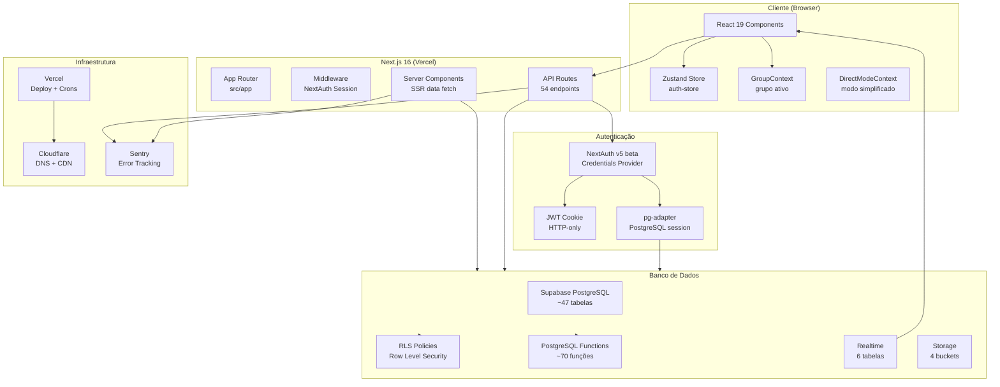
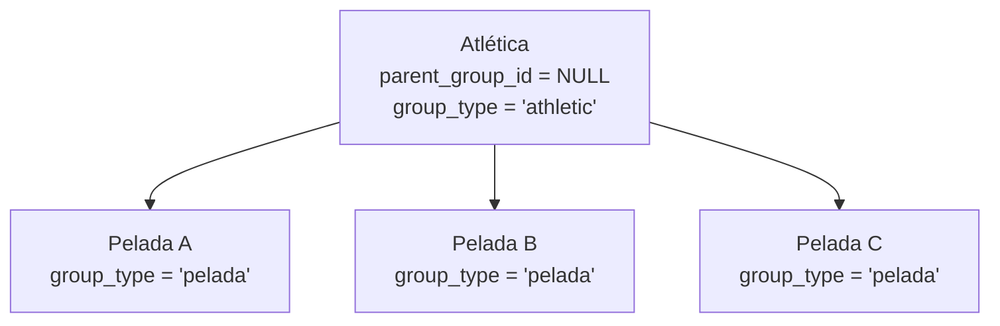

# ResenhApp V2.0 — Arquitetura (do Código)
> FATO (do código) — extraído de src/, supabase/, vercel.json

## Visão Geral



## Padrões de Roteamento

### App Router (Next.js 16)
- **Route Groups**: `(dashboard)` — agrupa rotas com layout compartilhado sem afetar URL
- **Dynamic Routes**: `[groupId]`, `[eventId]`, `[id]`, `[userId]`, `[chargeId]`, `[modalityId]`, `[inviteId]`
- **API Routes**: Convenção `route.ts` dentro de `src/app/api/`
- **Layouts**: Cascata de layouts (`layout.tsx`) aplicados automaticamente

### Tipos de Componentes
| Tipo | Indicador | Uso |
|------|-----------|-----|
| Server Component | sem "use client" | Data fetching, SSR, páginas |
| Client Component | "use client" no topo | Interatividade, hooks, contextos |

## Camadas da Aplicação

```
┌─────────────────────────────────────────────────────┐
│ CAMADA DE APRESENTAÇÃO                               │
│ src/components/ (105 arquivos)                       │
│ shadcn/ui + Tailwind CSS + Design System UzzAI       │
├─────────────────────────────────────────────────────┤
│ CAMADA DE ESTADO                                     │
│ Zustand (auth-store) + GroupContext + DirectMode     │
├─────────────────────────────────────────────────────┤
│ CAMADA DE ROTEAMENTO                                 │
│ Next.js App Router (src/app/)                        │
│ Server Components + Client Components                │
├─────────────────────────────────────────────────────┤
│ CAMADA DE API                                        │
│ API Routes (src/app/api/) — 54 endpoints             │
│ Validação Zod + Auth NextAuth + Rate Limiting        │
├─────────────────────────────────────────────────────┤
│ CAMADA DE NEGÓCIO                                    │
│ src/lib/ (auth, pix, credits, permissions, etc.)     │
├─────────────────────────────────────────────────────┤
│ CAMADA DE DADOS                                      │
│ src/db/client.ts — postgres@3.4.8                    │
│ SQL direto (template literals)                       │
├─────────────────────────────────────────────────────┤
│ BANCO DE DADOS                                       │
│ Supabase PostgreSQL (~47 tabelas, ~70 functions)     │
│ RLS Policies + Triggers + Realtime                   │
└─────────────────────────────────────────────────────┘
```

## Hierarquia de Grupos



- Máximo 2 níveis
- Atlética pode ter múltiplas peladas filhas
- Admin da Atlética gerencia todas as filhas

## Design System
- **Paleta**: UzzAI Retrofuturista
  - Mint #1ABC9C (CTAs, destaques)
  - Black #1C1C1C (fundos)
  - Silver #B0B0B0 (textos secundários)
  - Blue #2E86AB (suporte)
  - Gold #FFD700 (premium)
- **Fontes**: Poppins (títulos), Inter (corpo), Exo 2 (métricas), Fira Code (código)
- **Dark Mode**: Suporte via CSS classes (tema padrão dark)
