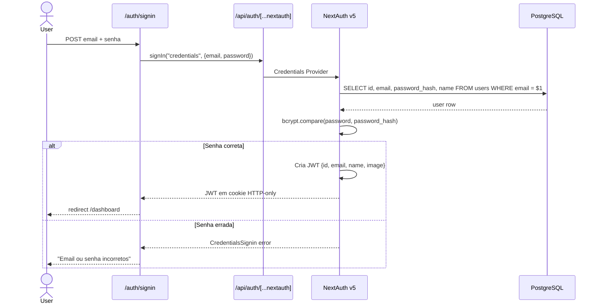

# ResenhApp V2.0 — Autenticação e Sessão

> FATO (do código) — src/lib/auth.ts, src/lib/auth-helpers.ts, src/types/next-auth.d.ts

---

## Stack de Autenticação

| Componente | Detalhe |
|-----------|---------|
| **Biblioteca** | NextAuth.js v5.0.0-beta.25 (versão BETA) |
| **Adapter** | @auth/pg-adapter (PostgreSQL direto) |
| **Provider** | Credentials (email + senha) |
| **Estratégia de sessão** | JWT em cookie HTTP-only |
| **Hash de senha** | bcryptjs (salt rounds: 10) |
| **Duração da sessão** | 30 dias (2.592.000 segundos) |
| **Cookie de sessão** | `__Secure-authjs.session-token` em produção |

---

## Fluxo de Autenticação



---

## Configuração (src/lib/auth.ts)

### Estratégia de Sessão

```typescript
session: {
  strategy: "jwt",
  maxAge: 30 * 24 * 60 * 60,  // 30 dias em segundos
}
```

### Configuração de Cookies

```typescript
cookies: {
  sessionToken: {
    name: process.env.NODE_ENV === "production"
      ? "__Secure-authjs.session-token"
      : "authjs.session-token",
    options: {
      httpOnly: true,
      sameSite: "lax",
      path: "/",
      secure: process.env.NODE_ENV === "production",
    },
  },
}
```

### Credentials Provider

O provider valida credenciais da seguinte forma:

1. Busca usuário pelo email: `SELECT id, email, password_hash, name, image FROM users WHERE email = $1`
2. Verifica se usuário existe — retorna `null` se não encontrado
3. Compara senha com `bcrypt.compare(password, user.password_hash)`
4. Retorna `null` se senha incorreta (NextAuth interpreta como falha de credenciais)
5. Retorna objeto `{ id, email, name, image }` se autenticado com sucesso

### Dual Schema Support

A configuração suporta dois schemas de banco:
- **Schema NextAuth** (`users` table): gerenciado pelo `@auth/pg-adapter`
- **Schema Supabase** (`auth.users`): referenciado por FK em `profiles`

O adapter usa a tabela `users` do schema `public` para compatibilidade com NextAuth.

### Callbacks JWT e Session

```typescript
callbacks: {
  jwt: async ({ token, user }) => {
    if (user) {
      token.id = user.id  // Persiste o ID no JWT
    }
    return token
  },
  session: async ({ session, token }) => {
    if (token.id) {
      session.user.id = token.id as string  // Expõe ID na sessão
    }
    return session
  },
}
```

### Conexão com Banco

O módulo tenta usar `SUPABASE_DB_URL` como preferência, com fallback para `DATABASE_URL`:

```typescript
const connectionString = process.env.SUPABASE_DB_URL ?? process.env.DATABASE_URL
```

---

## Signup Flow

**Rota**: `POST /api/auth/signup`

### Etapas de Processamento

1. **Validação Zod**:
   ```typescript
   z.object({
     name: z.string().min(1, "Nome é obrigatório"),
     email: z.string().email("Email inválido"),
     password: z.string().min(6, "Senha deve ter no mínimo 6 caracteres"),
   })
   ```

2. **Rate Limiting**: Máximo de 5 tentativas por minuto por IP. Retorna `429 Too Many Requests` se excedido.

3. **Verificação de Email Duplicado**:
   ```sql
   SELECT id FROM users WHERE email = $1
   ```
   Retorna `409 Conflict` se email já cadastrado.

4. **Hash da Senha**:
   ```typescript
   const passwordHash = await bcrypt.hash(password, 10)
   ```

5. **Inserção no Banco**:
   ```sql
   INSERT INTO users (name, email, password_hash, created_at, updated_at)
   VALUES ($1, $2, $3, NOW(), NOW())
   RETURNING id, name, email, created_at
   ```

6. **Resposta**: `201 Created` com objeto user (sem `password_hash`).

---

## Tipos Estendidos (next-auth.d.ts)

O projeto estende os tipos padrão do NextAuth para incluir o `id` do usuário:

```typescript
import NextAuth, { DefaultSession } from "next-auth"

declare module "next-auth" {
  interface Session {
    user: {
      id: string
    } & DefaultSession["user"]
  }

  interface User {
    id: string
    email: string
    name?: string | null
    image?: string | null
  }
}

declare module "next-auth/jwt" {
  interface JWT {
    id: string
  }
}
```

**Efeito**: `session.user.id` fica disponível em qualquer Server Component ou API route que use `auth()` ou `getServerSession()`.

---

## Auth Helpers (src/lib/auth-helpers.ts)

### `getCurrentUser()`

Retorna o usuário atual sem lançar erro. Para uso em layouts e componentes que podem ser acessados sem autenticação.

```typescript
const getCurrentUser = async (): Promise<User | null> => {
  const session = await auth()
  if (!session?.user?.id) return null
  return {
    id: session.user.id,
    name: session.user.name ?? null,
    email: session.user.email ?? "",
    image: session.user.image ?? null,
  }
}
```

**Fonte dos dados**: Campos `id`, `name`, `email`, `image` vindos diretamente do JWT (não faz query adicional ao banco).

### `requireAuth()`

Retorna o usuário autenticado ou lança erro. Para uso em Server Actions e API routes que requerem autenticação.

```typescript
const requireAuth = async (): Promise<User> => {
  const user = await getCurrentUser()
  if (!user) throw new Error("Unauthorized")
  return user
}
```

**Uso típico em API routes**:
```typescript
const user = await requireAuth()
// se não autenticado, lança Error("Unauthorized")
// que deve ser capturado pelo error handler da rota
```

---

## Database Connection (src/db/client.ts)

### Configuração do Pool

```typescript
const connectionString = process.env.SUPABASE_DB_URL ?? process.env.DATABASE_URL

const db = postgres(connectionString, {
  max: 10,                    // máximo de conexões simultâneas
  idle_timeout: 20,           // fecha conexões idle após 20s
  connect_timeout: 10,        // timeout de conexão: 10s
  ssl: "require",             // SSL obrigatório
  prepare: false,             // prepared statements desabilitados (Supabase Pooler)
})
```

### Por que `prepare: false`

O Supabase usa o **PgBouncer em Transaction mode** como pooler. Transaction mode não suporta prepared statements (que são sessão-based). Desabilitar prepared statements é obrigatório para compatibilidade.

### Implicações de Segurança

Com `prepare: false`, as queries usam **query parameters posicionais** (`$1`, `$2`) para prevenir SQL injection. O driver `postgres` ainda parametriza corretamente mesmo sem prepared statements.

---

## Páginas de Auth

| Rota | Tipo de Componente | Propósito | Comportamento |
|------|--------------------|-----------|---------------|
| `/auth/signin` | Client Component | Formulário de login | Redireciona para `/dashboard` após sucesso; exibe erro de credenciais |
| `/auth/signup` | Client Component | Formulário de cadastro | Chama `POST /api/auth/signup`, depois faz login automático |
| `/auth/error` | Client Component + Suspense | Exibição de erros de auth | Lê `?error=` da URL e exibe mensagem amigável |

### Mapa de Erros NextAuth

| Código de Erro | Mensagem Exibida |
|----------------|-----------------|
| `CredentialsSignin` | "Email ou senha incorretos" |
| `SessionRequired` | "Faça login para continuar" |
| `OAuthAccountNotLinked` | "Conta já existe com outro método" |
| `default` | "Ocorreu um erro. Tente novamente." |

### Rotas Personalizadas

```typescript
pages: {
  signIn: "/auth/signin",
  error: "/auth/error",
}
```

---

## Proteção de Rotas

### Situação Atual

**Nenhum `middleware.ts` foi encontrado** no projeto. A proteção é feita individualmente:

**Em Server Components / Pages**:
```typescript
const user = await requireAuth()
// se não autenticado, lança erro — mas sem redirect automático
```

**Em API Routes**:
```typescript
const user = await requireAuth()
if (!user) return NextResponse.json({ error: "Unauthorized" }, { status: 401 })
```

### Padrão Ausente

Um `middleware.ts` centralizado protegeria automaticamente todas as rotas sob `/dashboard/**` e `/api/**`, redirecionando para `/auth/signin` sem depender de verificação individual em cada arquivo.

---

## Riscos

| Risco | Descrição | Impacto |
|-------|-----------|---------|
| NextAuth v5 BETA | API pode ter breaking changes sem aviso | Medio — monitorar releases |
| Sem middleware global | Proteção de rotas depende de cada dev lembrar de adicionar `requireAuth()` | Alto — rota esquecida = dados expostos |
| RLS não aplicado via NextAuth | `auth.uid()` retorna NULL para queries via postgres direto; RLS pode ser ineficaz | Critico — verificar se SUPABASE_DB_URL usa role com RLS |
| Tokens JWT sem rotação | JWT válido por 30 dias sem rotação; revogação requer invalidação de sessão | Medio — considerar rotação de tokens |
| Signup sem verificação de email | Usuário pode criar conta com email de terceiro | Baixo — `email_verified` está na tabela mas não é verificado no fluxo atual |
