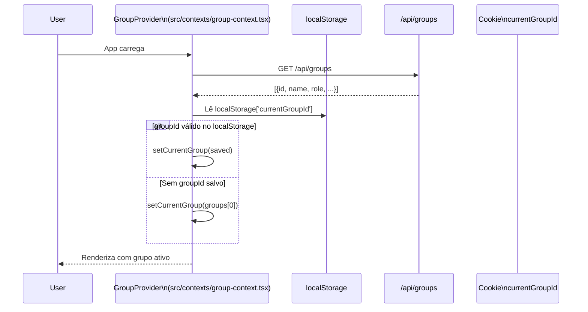
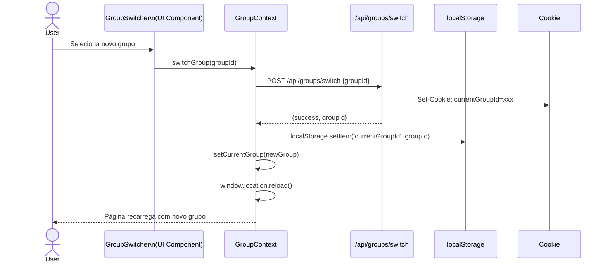
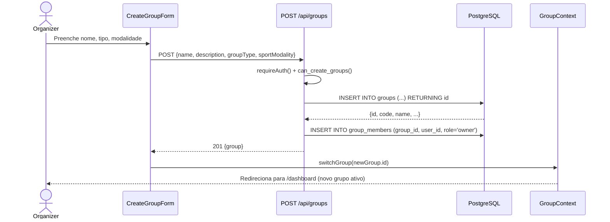

# ResenhApp V2.0 — Contexto de Grupo (Multi-Group)

> FATO (do código) — src/contexts/group-context.tsx, src/lib/group-helpers.ts, src/app/api/groups/switch/route.ts

---

## Modelo de Dados de Grupo

Um usuário pode pertencer a múltiplos grupos simultaneamente. O "grupo ativo" determina qual contexto está sendo usado para exibir dados de eventos, membros, estatísticas e pagamentos. Não há isolamento de dados entre grupos — o grupo ativo age como filtro de contexto, não como tenant isolado.

### Hierarquia de Grupos

```
Athletic (group_type = 'athletic')
  └── Pelada A (group_type = 'pelada', parent_group_id = athletic.id)
  └── Pelada B (group_type = 'pelada', parent_group_id = athletic.id)
```

Admins da atlética mãe podem gerenciar peladas filhas. Peladas sem `parent_group_id` são grupos independentes.

---

## Fluxo de Inicialização do Grupo



### Detalhes do GET /api/groups

A rota retorna todos os grupos do usuário autenticado:

```sql
SELECT
  g.id,
  g.name,
  g.description,
  g.logo_url,
  g.group_type,
  g.parent_group_id,
  gm.role,
  COUNT(gm2.id) AS member_count
FROM groups g
JOIN group_members gm ON gm.group_id = g.id AND gm.user_id = $1 AND gm.is_active = true
LEFT JOIN group_members gm2 ON gm2.group_id = g.id AND gm2.is_active = true
WHERE g.deleted_at IS NULL
GROUP BY g.id, gm.role
ORDER BY g.created_at DESC
```

---

## Troca de Grupo



### Implementação de /api/groups/switch

```typescript
// src/app/api/groups/switch/route.ts
const switchGroupHandler = async (request: Request): Promise<Response> => {
  const user = await requireAuth()
  const { groupId } = await request.json()

  const membershipRecord = await db`
    SELECT id FROM group_members
    WHERE group_id = ${groupId}
    AND user_id = ${user.id}
    AND is_active = true
  `

  if (membershipRecord.length === 0) {
    return NextResponse.json(
      { error: "Você não é membro deste grupo" },
      { status: 403 }
    )
  }

  const response = NextResponse.json({ success: true, groupId })
  response.cookies.set("currentGroupId", String(groupId), {
    httpOnly: false,    // acessível ao JavaScript do cliente
    sameSite: "lax",
    path: "/",
    maxAge: 30 * 24 * 60 * 60,  // 30 dias
  })

  return response
}
```

**Nota**: O cookie `currentGroupId` é `httpOnly: false` intencionalmente — o client-side precisa ler este valor para sincronizar o contexto sem um round-trip adicional ao servidor.

---

## GroupContext API

```typescript
interface GroupContextType {
  currentGroup: Group | null       // grupo ativo atual
  groups: Group[]                  // todos os grupos do usuário autenticado
  isLoading: boolean               // true enquanto carrega da API
  error: string | null             // mensagem de erro de carregamento
  setCurrentGroup: (group: Group) => void  // troca grupo localmente (sem API call)
  loadGroups: () => Promise<void>          // recarrega grupos da API
  switchGroup: (groupId: string) => Promise<void>  // troca e sincroniza (API + cookie + localStorage)
  userGroups: Group[]              // alias para `groups` (compatibilidade)
  fetchUserGroups: () => Promise<void>     // alias para `loadGroups` (compatibilidade)
}
```

### Implementação do Provider

```typescript
const GroupProvider = ({ children }: { children: React.ReactNode }) => {
  const [groups, setGroups] = useState<Group[]>([])
  const [currentGroup, setCurrentGroup] = useState<Group | null>(null)
  const [isLoading, setIsLoading] = useState(true)
  const [error, setError] = useState<string | null>(null)

  const loadGroups = async (): Promise<void> => {
    setIsLoading(true)
    setError(null)
    const response = await fetch("/api/groups")
    const data = await response.json()
    setGroups(data)

    const savedGroupId = localStorage.getItem("currentGroupId")
    const savedGroup = data.find((g: Group) => String(g.id) === savedGroupId)
    setCurrentGroup(savedGroup ?? data[0] ?? null)
    setIsLoading(false)
  }

  const switchGroup = async (groupId: string): Promise<void> => {
    await fetch("/api/groups/switch", {
      method: "POST",
      headers: { "Content-Type": "application/json" },
      body: JSON.stringify({ groupId }),
    })
    localStorage.setItem("currentGroupId", groupId)
    const newGroup = groups.find((g) => String(g.id) === groupId) ?? null
    setCurrentGroup(newGroup)
    window.location.reload()
  }

  useEffect(() => { loadGroups() }, [])

  return (
    <GroupContext.Provider value={{
      currentGroup, groups, isLoading, error,
      setCurrentGroup, loadGroups, switchGroup,
      userGroups: groups, fetchUserGroups: loadGroups,
    }}>
      {children}
    </GroupContext.Provider>
  )
}
```

---

## Obtenção do Grupo no Server-Side (src/lib/group-helpers.ts)

### `getUserCurrentGroup(userId)`

Função usada em Server Components e API routes para determinar o grupo ativo no contexto server-side:

```
getUserCurrentGroup(userId):
  1. Lê cookie 'currentGroupId' via cookies() (Next.js server)
  2. Se cookie presente:
     a. Valida se usuário é membro ativo: SELECT FROM group_members WHERE group_id = cookieValue AND user_id = userId AND is_active = true
     b. Se válido: retorna o grupo completo
     c. Se inválido (foi removido do grupo): continua para fallback
  3. Se sem cookie válido:
     a. Busca primeiro grupo do usuário: SELECT FROM groups WHERE id IN (SELECT group_id FROM group_members WHERE user_id = userId AND is_active = true) ORDER BY created_at DESC LIMIT 1
  4. Se sem grupos: retorna null
```

### Uso Típico em Server Components

```typescript
const DashboardPage = async () => {
  const user = await requireAuth()
  const currentGroup = await getUserCurrentGroup(user.id)

  if (!currentGroup) {
    redirect("/groups/create")
  }

  const events = await getGroupEvents(currentGroup.id)
  return <DashboardView group={currentGroup} events={events} />
}
```

---

## DirectMode (src/contexts/direct-mode-context.tsx)

### Propósito

Interface simplificada para jogadores que participam de peladas mas não são organizadores. Esconde funcionalidades de administração e apresenta layout minimalista.

### Configuração

| Aspecto | Detalhe |
|---------|---------|
| **Storage** | `localStorage['directMode']` (persiste entre sessões) |
| **Valor** | `"true"` ou `"false"` (string) |
| **Default** | `false` (modo completo) |
| **Trigger** | `DirectModeToggle` component no layout |

### Efeitos no Layout

| DirectMode | Comportamento |
|-----------|---------------|
| `false` (padrão) | Sidebar completa com gerenciamento, layout admin |
| `true` | Sem sidebar, apenas topbar, visão de jogador |

### Context API

```typescript
interface DirectModeContextType {
  isDirectMode: boolean
  toggleDirectMode: () => void
  enableDirectMode: () => void
  disableDirectMode: () => void
}
```

---

## Invariantes de Grupo

Estas regras devem ser mantidas em todo o código que trabalha com grupos:

1. **Toda query de dados de grupo deve incluir `group_id = currentGroup.id`** — o banco não isola grupos automaticamente sem RLS funcional.

2. **A API route `/api/groups/switch` valida membership antes de trocar** — não é possível trocar para um grupo do qual o usuário não é membro, mesmo manipulando o localStorage.

3. **Group admins têm `role IN ('owner', 'admin')` em `group_members`** — moderators existem no enum mas têm permissões customizadas via JSONB.

4. **Hierarquia**: Admin da atlética (`group_type = 'athletic'`) pode gerenciar peladas filhas (`parent_group_id = athletic.id`) — esta lógica é implementada nas API routes, não no banco.

5. **Soft delete**: Grupos com `deleted_at IS NOT NULL` não aparecem em nenhuma listagem — sempre filtrar por `deleted_at IS NULL`.

6. **`window.location.reload()` após troca de grupo** — garante que Server Components server-side reprocessem com o novo cookie antes de renderizar. Esta é uma decisão intencional de simplicidade sobre UX.

---

## Estrutura do Objeto Group

```typescript
interface Group {
  id: string                                      // BIGSERIAL convertido para string
  name: string                                    // Nome do grupo
  description?: string | null                     // Descrição opcional
  logo_url?: string | null                        // URL do logo
  group_type?: "athletic" | "pelada"              // Tipo de grupo
  parent_group_id?: string | null                 // ID do grupo pai (atlética)
  role?: "owner" | "admin" | "moderator" | "member"  // Papel do usuário atual
  member_count?: number                           // Contagem de membros ativos
}
```

**Nota sobre `id`**: A coluna `id` em `groups` é `BIGSERIAL` (número inteiro). O JavaScript converte para string ao processar o JSON, evitando problemas de precisão com inteiros grandes. Sempre comparar como string (`String(group.id) === savedGroupId`).

---

## Fluxo de Criação de Grupo



---

## Diagrama de Estados do Contexto de Grupo

```
[Inicial]
    |
    v
[isLoading: true] ---(GET /api/groups falha)---> [error: "mensagem", isLoading: false]
    |
    v (sucesso)
[groups: [...], isLoading: false]
    |
    |---(localStorage tem groupId válido)---> [currentGroup: savedGroup]
    |
    '---(sem localStorage ou groupId inválido)---> [currentGroup: groups[0]]
                                                        |
                                                        '---(sem grupos)---> [currentGroup: null]
                                                                                    |
                                                                                    v
                                                                         [redirect /groups/create]
```
