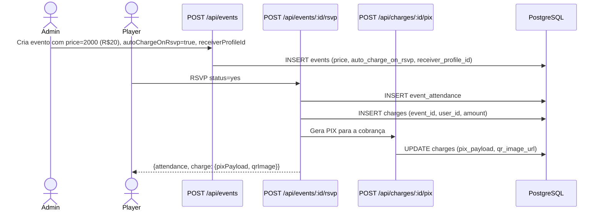

# ResenhApp V2.0 — Sistema Financeiro e PIX
> FATO (do código) — src/lib/pix.ts, src/lib/pix-helpers.ts, src/lib/credits.ts, src/app/api/charges/, src/app/api/credits/

## Visão Geral do Sistema Financeiro

O sistema financeiro do ResenhApp tem 3 subsistemas:
1. **Cobranças (Charges)**: Criação e controle de cobranças por evento/mensalidade
2. **PIX**: Geração de QR Code BR Code (EMV) para pagamento
3. **Créditos**: Moeda interna para funcionalidades premium

## Sistema de Cobranças

### Fluxo de Cobrança por Evento



### Tabelas Envolvidas
- `charges`: Cobrança principal (group_id, event_id, description, amount)
- `charge_splits`: Parcela por usuário (user_id, status, paid_at)
- `receiver_profiles`: Conta PIX do recebedor (pix_key, pix_type, name, city)
- `wallets`: Carteira do grupo (saldo)
- `transactions`: Histórico de movimentações

### Types de Cobrança
- monthly (mensalidade)
- daily (diária)
- fine (multa)
- other (outro)

## Sistema PIX (src/lib/pix.ts)

### Geração de QR Code BR Code (EMV)
FATO: implementação customizada do padrão EMV QR Code Pix do Banco Central

```
Estrutura do payload EMV:
- ID 00: Payload Format Indicator ("01")
- ID 26: Merchant Account Information
  - ID 00: GUI ("BR.GOV.BCB.PIX")
  - ID 01: Chave PIX
- ID 52: Merchant Category Code ("0000")
- ID 53: Transaction Currency ("986" = BRL)
- ID 54: Transaction Amount (opcional)
- ID 58: Country Code ("BR")
- ID 59: Merchant Name
- ID 60: Merchant City
- ID 62: Additional Data (TXID)
- ID 63: CRC16 checksum
```

### Tipos de Chave PIX Suportados
| Tipo | Formato | Validação |
|------|---------|-----------|
| cpf | 000.000.000-00 ou 00000000000 | 11 dígitos |
| cnpj | 00.000.000/0000-00 ou 14 dígitos | 14 dígitos |
| email | user@domain.com | regex email |
| phone | +55XXXXXXXXXXX | 13 dígitos com +55 |
| random | UUID format | UUID regex |

### Funções principais (src/lib/pix.ts)
- `generatePixPayload(data)` → string — cria payload EMV
- `validatePixKey(key, type)` → boolean — valida formato
- `formatPixKey(key, type)` → string — formata para exibição
- `generatePixQRImage(payload)` → Promise<string> — base64 QR image
- `generatePixQRCode(data)` → Promise<{payload, qrImage}> — completo
- `calculateCRC16(data)` → string — checksum CRC16-CCITT

### Fluxo de Geração (src/lib/pix-helpers.ts)
```
generatePixForCharge(chargeId):
1. SELECT charge com receiver_profile (JOIN)
2. Verifica se já gerou (pix_payload IS NOT NULL) → retorna cached
3. Valida receiver_profile configurado
4. Chama generatePixQRCode({pixKey, pixType, amount, merchantName, merchantCity})
5. UPDATE charges SET pix_payload, qr_image_url, pix_generated_at
6. Retorna {success, payload, qrImage}
```

## Sistema de Créditos (src/lib/credits.ts)

### Custo por Feature
| Feature | Créditos |
|---------|---------|
| recurring_training | 5 |
| qrcode_checkin | 2 |
| convocation | 3 |
| analytics | 10/mês |
| split_pix | 15/evento |
| tactical_board | 1/save |

### Funções Principais
- `getCreditBalance(groupId)` → balance atual do grupo
- `hasEnoughCredits(groupId, feature)` → boolean
- `checkAndConsumeCredits(groupId, feature, userId, eventId?, description?)` → atomic consumption
- `getCreditPackages()` → pacotes disponíveis
- `validateCoupon(code, groupId, packagePrice?)` → validação de cupom
- `purchaseCredits(groupId, packageId, userId, couponCode?)` → compra completa

### Tabelas do Sistema de Créditos
- `credit_transactions`: Histórico de compras e consumos
- `credit_packages`: Pacotes à venda
- `promo_coupons`: Cupons promocionais (discount_type: percentage/fixed_credits/fixed_amount)
- `coupon_usages`: Registro de uso de cupons (UNIQUE coupon+group = 1 uso por grupo)

### Credits Middleware (src/lib/credits-middleware.ts)
Wrapper para API routes que consomem créditos:
```typescript
withCreditsCheck(request, handler, {
  feature: "recurring_training",
  autoConsume: true,
  requireAdmin: true
})
```
