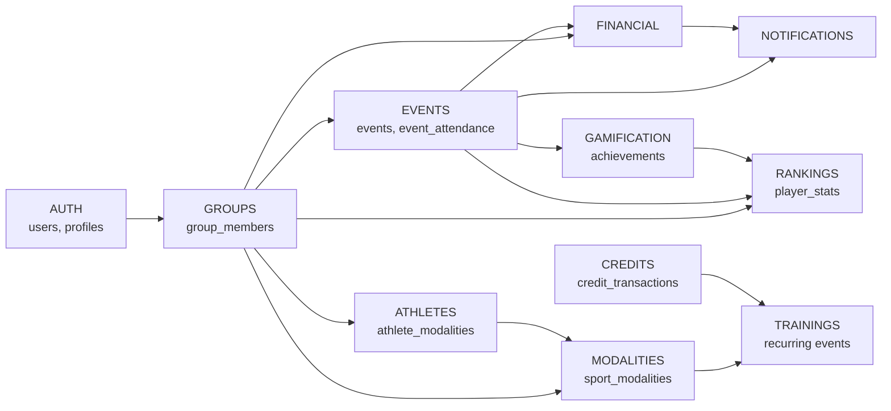

# ResenhApp V2.0 — Mapa de Dependências entre Módulos
> FATO + INFERÊNCIA (do código) — análise de imports e uso de API

## Dependências de Dados (Tabelas Compartilhadas)

## Dependências por Módulo

### AUTH
- Depende de: PostgreSQL (users table)
- Depende para: TODOS os módulos (autenticação base)

### GROUPS
- Depende de: AUTH (user_id), FINANCIAL (wallets criada junto)
- Usado por: EVENTS, ATHLETES, MODALITIES, RANKINGS, NOTIFICATIONS, FINANCIAL

### EVENTS
- Depende de: GROUPS (group_id), AUTH (created_by), FINANCIAL (receiver_profile, charges)
- Usado por: RANKINGS (event_actions), GAMIFICATION (triggers), NOTIFICATIONS (triggers)

### FINANCIAL
- Depende de: GROUPS (group_id), EVENTS (event_id), AUTH (user_id), PIX (receiver_profiles)
- Usado por: NOTIFICATIONS (charge_created trigger)

### CREDITS
- Depende de: GROUPS (group_id), AUTH (user_id)
- Usado por: TRAININGS (5 créditos para criar), MODALITIES futuramente

### ATHLETES
- Depende de: AUTH (user_id), GROUPS (group_id), MODALITIES (modality_id)
- Usado por: RANKINGS, EVENTS (team draw)

### MODALITIES
- Depende de: GROUPS (group_id)
- Usado por: ATHLETES, TRAININGS (modality_id em events), EVENTS

### RANKINGS
- Depende de: EVENTS (event_actions, attendance), GROUPS, AUTH
- Cálculo: games_played*1 + goals*3 + assists*2 + wins*5 + mvp*10

### GAMIFICATION
- Depende de: AUTH, GROUPS, EVENTS (triggers)
- Usado por: NOTIFICATIONS (achievement_unlocked)

### NOTIFICATIONS
- Depende de: AUTH (user_id), GROUPS (group_id)
- Usado por: Módulos que disparam eventos (FINANCIAL, EVENTS)
