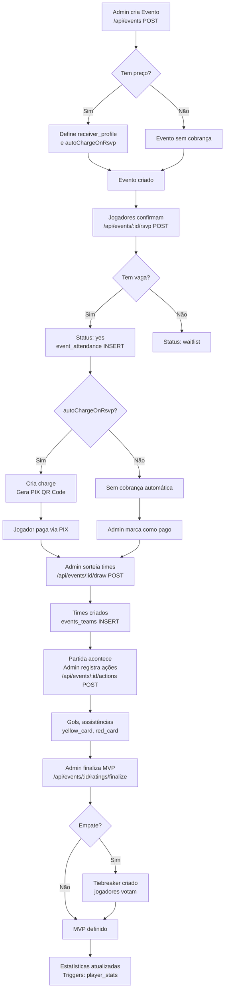
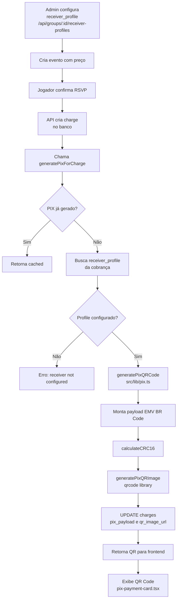
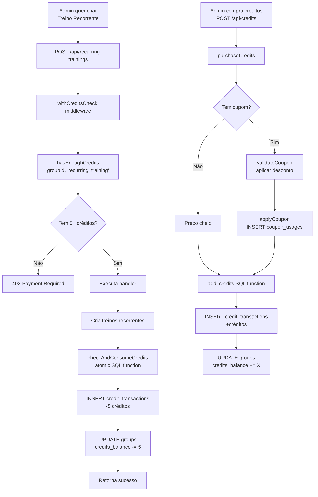

# ResenhApp V2.0 — Fluxos Principais
> FATO (do código) — fluxogramas dos processos críticos

## Fluxo 1: Criação e Execução de Pelada



## Fluxo 2: Autenticação

```mermaid
flowchart TD
    A[Usuário acessa app] --> B{Tem sessão?}
    B -- Sim --> C[Dashboard]
    B -- Não --> D[Landing page /]
    D --> E[Clica Entrar]
    E --> F[/auth/signin]
    F --> G[Preenche email+senha]
    G --> H[POST signIn credentials]
    H --> I[NextAuth Credentials Provider]
    I --> J[SELECT users WHERE email]
    J --> K{Usuário existe?}
    K -- Não --> L[Erro: credenciais inválidas]
    K -- Sim --> M[bcrypt.compare senha]
    M --> N{Senha correta?}
    N -- Não --> L
    N -- Sim --> O[Cria JWT token]
    O --> P[Set-Cookie HTTP-only]
    P --> Q[Redirect /dashboard]
    Q --> R{Tem grupos?}
    R -- Não --> S[Tela criar/entrar grupo]
    R -- Sim --> T[Carrega GroupContext]
    T --> U[Dashboard com grupo ativo]
```

## Fluxo 3: Sistema PIX



## Fluxo 4: Sistema de Créditos


