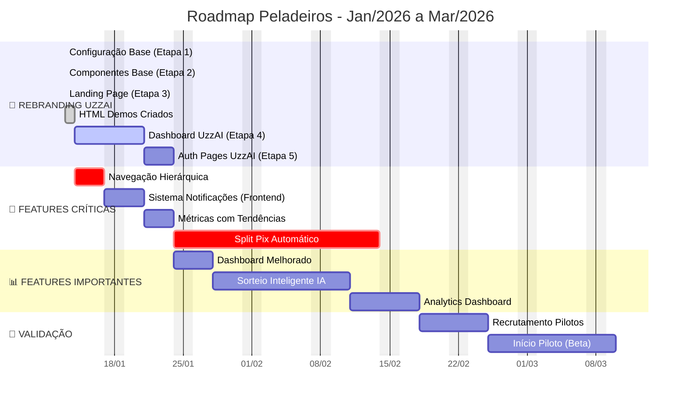

# ⚽ **PELADEIROS (EM REBRANDING) - PROJECT DASHBOARD**

> [!danger] **ALERTA CRÍTICO: REBRANDING OBRIGATÓRIO**
> O nome "Peladeiros" **JÁ EXISTE** (App concorrente com 100k+ downloads).
> **Ação Imediata**: Migrar marca para **RESENHAFC**.
> **Status**: 🔴 Bloqueado para lançamento público até resolução.

---

## 🎯 **STATUS EXECUTIVO (14/01/2026)**

```dataviewjs
const status = {
  fase: "Rebranding UzzAI em Andamento | Identidade Visual Aplicada",
  mvp: "100% funcional (MVP completo)",
  rebranding: "Etapas 1-3 concluídas (Configuração, Componentes, Landing)",
  desenvolvimento: "HTML demos criados, features identificadas",
  validacao: "Estratégia definida: 2-3 pilotos após rebranding completo",
  risco: "MÉDIO (Rebranding em progresso, features pendentes)",
  proxima_meta: "Implementar UI/UX críticas → Features Premium → Validação"
};

dv.paragraph(`
| Métrica | Valor | Status |
|---------|-------|--------|
| **Fase Atual** | ${status.fase} | 🟢 |
| **Progresso MVP** | 100% (MVP completo) | ✅ |
| **Rebranding** | 60% (3/5 etapas concluídas) | 🟡 |
| **Desenvolvimento** | HTML demos + análise gap | 🔄 |
| **Validação** | Estratégia definida (2-3 pilotos) | ⏳ |
| **Risco Principal** | ${status.risco} | 🟡 |
| **Próxima Meta** | ${status.proxima_meta} | 🎯 |
`);
```

> [!success] **DECISÃO ESTRATÉGICA (18/01/2026) — REUNIÃO GERAL Q1**
> 
> **🔴 DESENVOLVIMENTO PAUSADO ATÉ Q2 2026:**
> - ✅ **Decisão:** Pausar desenvolvimento de novas features até Q2 2026
> - ✅ **Foco Q1:** Chatbot (5 clientes) + Peladeiros (validação com pilotos)
> - ✅ **Justificativa:** "Melhor validar 2 produtos bem feitos que 4 pela metade"
> - ✅ **Retomada:** Após validar Chatbot com clientes pagantes (Q2 2026)
> 
> **🎯 META Q1 2026 (AJUSTADA):**
> - **Objetivo Original:** 10 grupos piloto
> - **Estratégia Ajustada:** **2-3 pilotos iniciais** (não muitos)
> - **Grupos Identificados:** Grupo do Vitor, Engenharia (atlética)
> - **Estratégia QR Code:** Vitor conversar com Christian (Lazzaroto)
> - **Pricing:** Gratis inicial, depois mensalidade (a definir)
> 
> **📋 Atas de Reunião:**
> - [[40-Reunioes/42 - Reunião Geral 18_01/ATA-2026-01-18-Reuniao-Geral-Planejamento-Q1-2026|18/01/2026 — Planejamento Q1 2026]]
> - [[40-Reunioes/41 - Reunião geral 12_02_26/2026-01-12-Reuniao-Semanal-Geral-UzzAI#D-003|12/01/2026 — Validação + Estratégia Pilotos]]

### 👥 **EQUIPE E ALOCAÇÃO**

| Papel | Responsável | Carga | Atividade Principal Agora |
|-------|-------------|-------|---------------------------|
| **Product Owner** | **Pedro Vitor** | 🟡 Média | Coordenar desenvolvimento final + estratégia pilotos |
| **Tech Lead** | **Luis Fernando** | 🟡 Média | Finalizar 7 correções pendentes (prazo: 19/01) |
| **Comercial** | **Vitor Pirolli** | 🟡 Média | Conversar com Christian (Lazzaroto) sobre QR Code + recrutar pilotos |
| **Branding** | **Arthur Brandalise**| 🟢 Baixa | (Rebranding em pausa, foco em correções primeiro) |

---

## 📅 **TIMELINE DE REBRANDING E LANÇAMENTO**

```mermaid
gant
    title Roadmap Peladeiros - Jan/2026 a Jun/2026 (ATUALIZADO 18/01)
    dateFormat  YYYY-MM-DD
    axisFormat  %d/%m
    excludes    weekends
    
    section 🔴 DESENVOLVIMENTO PAUSADO
    Pausa Desenvolvimento (Q1)      :crit, pause1, 2026-01-18, 2026-04-01
    Foco: Chatbot + Validação      :pause2, 2026-01-18, 2026-04-01
    
    section 🧪 VALIDAÇÃO PILOTOS (Q1)
    Recrutar 2-3 Pilotos            :active, val1, 2026-01-19, 2026-01-31
    Conversa Christian (Lazzaroto)  :val2, 2026-01-20, 2026-01-25
    Início Piloto Beta (2-3 grupos) :val3, 2026-02-01, 2026-03-31
    Coletar Feedback                :val4, 2026-02-01, 2026-03-31
    
    section 🔄 RETOMADA DESENVOLVIMENTO (Q2)
    Retomar Features (após Chatbot) :dev1, 2026-04-01, 2026-06-30
    Implementar Feedback Pilotos    :dev2, 2026-04-01, 2026-05-15
    Escalar para 10 Grupos          :dev3, 2026-05-15, 2026-06-30
```

---

## 📦 **STATUS DO PRODUTO (MVP)**

### **✅ FUNCIONALIDADES PRONTAS (100%)**
1. **Gestão de Grupos**: Criação, convites, roles (admin/membro).
2. **Sorteio Justo**: Algoritmo que separa goleiros e nivela times.
3. **Financeiro**: Carteira do grupo, controle de quem pagou.
4. **Gamificação**: Rankings de artilharia, assistências e "Destaque da Partida".
5. **Ações em Tempo Real**: Registrar gols e cartões durante a partida.

### **🆕 NOVAS FEATURES IMPLEMENTADAS (13-14/01/2026)**

#### **6. Planilhas de Treino** ✅ NOVA FEATURE
- **Status**: ✅ Componente criado, backend pendente
- **Arquivos**:
  - `src/components/training/tactical-board.tsx` - Prancheta tática interativa
  - `src/app/groups/[groupId]/training/page.tsx` - Página de planilhas
  - `PLANILHAS-TREINO-UZZAI-DEMO.html` - Demo HTML interativo
- **Funcionalidades**:
  - Campo de futsal visual interativo
  - Arrastar e soltar jogadores e bola
  - Criar linhas de movimento (passe, movimento, finalização)
  - Gravar e reproduzir jogadas
  - Exportar/importar JSON
  - Jogada de exemplo pré-carregada (falta/ensaio)
- **Identidade Visual**: UzzAI aplicada (cores, fonts, componentes)
- **Pendente**: Backend (migration, API routes, integração banco)
- **Documentação**: `FEATURE-PLANILHAS-TREINO.md`

### **🚧 AJUSTES NECESSÁRIOS (PÓS-REBRANDING)**
- [ ] Alterar nome do app em todas as telas.
- [ ] Atualizar ícones e splash screen.
- [ ] Alterar textos de emails transacionais.
- [ ] Atualizar Termos de Uso e Política de Privacidade.

### **🔄 REBRANDING UZZAI - STATUS**

#### **✅ Concluído (60%)**
- [x] Etapa 1: Configuração base (fonts, cores, CSS variables)
- [x] Etapa 2: Componentes base (Logo, Badge, Separator, SEO helper)
- [x] Etapa 3: Landing page completa (`/resenhafc`)
- [x] Etapa 4: HTML demos criados (7 demos)
- [x] Feature Planilhas de Treino (frontend)

#### **🔄 Em Andamento**
- [ ] Etapa 5: Dashboard com identidade UzzAI
- [ ] Etapa 6: Páginas de autenticação
- [ ] Etapa 7: Páginas de grupos/eventos

#### **⏳ Pendente**
- [ ] Backend Planilhas de Treino (migration, API routes)
- [ ] UI/UX críticas (navegação hierárquica, notificações, gráficos)
- [ ] Features Premium (Split Pix, Analytics)

---

## ⚠️ **MATRIZ DE RISCOS ATUALIZADA**

```dataviewjs
const riscos = [
  {id:"R-PEL-001", prob:5, impact:5, nota:"Conflito Marca 'Peladeiros' (Processo/Remoção Loja)", owner:"PV + Arthur", status:"🔴 CRÍTICO"},
  {id:"R-PEL-002", prob:3, impact:4, nota:"Baixa adesão organizadores (Inércia WhatsApp)", owner:"Vitor", status:"🟡 Ativo"},
  {id:"R-PEL-003", prob:2, impact:3, nota:"Custo infraestrutura (Vercel) escalar rápido demais", owner:"Luis", status:"🟢 Monitorando"}
];

dv.table(
  ["ID", "Prob", "Impact", "Descrição", "Owner", "Status"],
  riscos.map(r => [r.id, r.prob, r.impact, r.nota, r.owner, r.status])
);
```

> [!danger] **AÇÃO MITIGADORA R-PEL-001**
> **Solução**: Abandonar nome "Peladeiros". Adotar **ResenhApp**.
> **Prazo**: Imediato.
> **Owner**: Arthur Brandalise (Design) + Pedro Vitor (Registro).

---

## 💡 **INSIGHTS DA PESQUISA DE MERCADO**

> [!info] **POR QUE MUDAR PARA RESENHAFC?**
> - **Disponibilidade**: Domínio .com.br livre.
> - **Apelo**: "Resenha" conecta com o público jovem/boleiro.
> - **Segurança**: Foge do litígio com o app concorrente.

> [!tip] **MODELO DE NEGÓCIO VALIDADO**
> - **Freemium**: Entrada grátis para virulência.
> - **Sweet Spot**: R$ 30-50/grupo para funcionalidade Premium (Rateio automático Pix).
> - **Diferencial**: O concorrente (Chega+) cobra R$ 100/mês e irritou a base.

**🔗 Documento Completo:** [[3-Mercado/Pesquisa Mercado PELADEIROS/PESQUISA_MERCADO_CONSOLIDADA]]

---

---

## 🎨 **REBRANDING UZZAI - TRABALHO REALIZADO (13-14/01/2026)**

### **✅ ETAPAS CONCLUÍDAS**

#### **ETAPA 1: CONFIGURAÇÃO BASE** ✅
- ✅ Fonts configuradas (Poppins, Inter, Exo 2, Fira Code)
- ✅ Cores UzzAI no Tailwind (`uzzai-mint`, `uzzai-black`, `uzzai-silver`, `uzzai-blue`, `uzzai-gold`)
- ✅ CSS Variables atualizadas
- ✅ Arquivos modificados: `layout.tsx`, `tailwind.config.ts`, `globals.css`

#### **ETAPA 2: COMPONENTES BASE** ✅
- ✅ `UzzaiLogo` component criado
- ✅ `UzzaiBadge` component criado (variantes: new, beta, premium, admin, dev)
- ✅ `GradientSeparator` component criado
- ✅ `lib/seo.ts` helper criado
- ✅ Arquivos criados: 4 componentes novos

#### **ETAPA 3: LANDING PAGE** ✅
- ✅ Landing page completa (`/resenhafc`)
- ✅ 8 seções implementadas (Hero, Problem, Solution, Results, How It Works, Pricing, FAQ, CTA)
- ✅ FeatureCarousel atualizado com cores UzzAI
- ✅ Identidade visual UzzAI aplicada

#### **ETAPA 4: HTML DEMOS CRIADOS** ✅
- ✅ `DASHBOARD-PRINCIPAL-UZZAI-DEMO.html` - Dashboard principal
- ✅ `MEUS-GRUPOS-UZZAI-DEMO.html` - Página de grupos
- ✅ `GRUPO-POKER-UZZAI-DEMO.html` - Dashboard do grupo POKER
- ✅ `GRUPO-FUTEBOL-QUINTA-UZZAI-DEMO.html` - Dashboard do grupo Futebol de Quinta
- ✅ `RANKINGS-UZZAI-DEMO.html` - Página de rankings
- ✅ `CRIAR-GRUPO-UZZAI-DEMO.html` - Formulário de criação
- ✅ `PLANILHAS-TREINO-UZZAI-DEMO.html` - Feature Planilhas de Treino (interativo)

**Total**: 7 HTML demos criados com identidade visual UzzAI aplicada

---

### **📋 DOCUMENTAÇÃO CRIADA**

1. **`PLANO-REBRANDING-UZZAI-NOVAS-FEATURES.md`**
   - Análise comparativa de identidade visual
   - Boas práticas UX/UI dos guias Chatbot
   - 10 novas features sugeridas com priorização
   - Plano de implementação em 4 etapas

2. **`REBRANDING-UZZAI-IMPLEMENTADO.md`**
   - Resumo técnico das etapas 1-3
   - Checklist de implementação
   - Como usar os componentes criados

3. **`RESUMO-COMPLETO-REBRANDING-UZZAI.md`**
   - Documentação completa do trabalho realizado
   - Código de exemplo
   - Referências utilizadas
   - Estatísticas do rebranding

4. **`FEATURES-UI-UX-FALTANTES.md`** ⭐ NOVO
   - Análise gap completa
   - 8 melhorias UI/UX faltantes
   - 10 features documentadas para desenvolver
   - 5 componentes avançados faltantes
   - Priorização por sprints

---

## 🚀 **FEATURES IDENTIFICADAS PARA DESENVOLVER**

### **🔴 CRÍTICAS (Prioridade Alta)**

#### **1. Split Pix Automático** ⭐ CRÍTICO
- **Status**: 🔴 Não implementado
- **Features**:
  - Integração com API Pix (Banco ou Gateway)
  - Geração de QR Code individual por jogador
  - Rastreamento de pagamentos
  - Notificações de confirmação de pagamento
- **Prioridade**: 🔴 CRÍTICA (Feature Premium)
- **Estimativa**: 3-4 semanas
- **Dependências**: Conta bancária/Gateway Pix

#### **2. Sistema de Notificações**
- **Status**: 🔴 Não existe
- **Features**:
  - Notificações de confirmações pendentes
  - Lembretes de eventos (2 dias antes)
  - Notificações de pagamentos
  - Badge de contador funcional no header
  - Dropdown de notificações
- **Prioridade**: 🟢 Alta
- **Estimativa**: 5-7 dias (frontend) + backend

#### **3. Dashboard Melhorado (Completo)**
- **Status**: 🟡 Parcial
- **Faltando**:
  - Métricas com tendências (↑↓)
  - Gráficos de atividade semanal
  - Quick actions (criar grupo, criar evento)
  - Widgets customizáveis
- **Prioridade**: 🟢 Alta
- **Estimativa**: 3-4 dias

---

### **🟢 ALTAS (Próximas 2 Semanas)**

#### **4. Sorteio Inteligente por IA**
- **Status**: 🟡 Básico existe (aleatório)
- **Melhorias**:
  - Usar `base_rating` para balancear
  - Considerar histórico de gols/assistências
  - Evitar panelinhas (mesmos times sempre)
  - Algoritmo de otimização
- **Prioridade**: 🟢 Alta
- **Estimativa**: 1-2 semanas

#### **5. Navegação Hierárquica**
- **Status**: ❌ Não implementado
- **Features**:
  - Sidebar com seções organizadas (Principal, Gestão, Análise)
  - Headers de seção no menu
  - Indicador de página ativa
  - Collapse/expand
- **Prioridade**: 🟢 Alta
- **Estimativa**: 2-3 dias

#### **6. Analytics Dashboard**
- **Status**: 🔴 Não existe
- **Features**:
  - Gráfico de frequência de jogos
  - Estatísticas pessoais detalhadas
  - Comparação com outros jogadores
  - Evolução ao longo do tempo
- **Prioridade**: 🟡 Média
- **Estimativa**: 1 semana

---

### **🟡 MÉDIAS (Próximo Mês)**

#### **7. Filtros e Busca Avançada**
- **Status**: 🔴 Não existe
- **Features**:
  - Buscar grupos por nome
  - Filtrar eventos por status
  - Filtrar por data/período
  - Ordenação (mais recente, alfabética)
- **Prioridade**: 🟡 Média
- **Estimativa**: 3-4 dias

#### **8. Campo Visual Interativo**
- **Status**: 🔴 Planejado
- **Features**:
  - Campo de futebol SVG
  - Posições clicáveis visualmente
  - Drag & drop de jogadores
  - Preview dos times antes de confirmar
- **Prioridade**: 🟡 Média
- **Estimativa**: 2 semanas

#### **9. Tooltips de Ajuda**
- **Status**: ❌ Não implementado
- **Features**:
  - Tooltips em botões de ação
  - Explicações contextuais em ícones
  - Help text em campos de formulário
- **Prioridade**: 🟡 Média
- **Estimativa**: 1-2 dias

#### **10. Integração WhatsApp Business API**
- **Status**: 🔴 Não existe
- **Features**:
  - Notificações automáticas via WhatsApp
  - Confirmação via WhatsApp
  - Compartilhamento de resultados
- **Prioridade**: 🟡 Média
- **Estimativa**: 2-3 semanas

---

### **⚪ BAIXAS (Futuro)**

#### **11. Sistema de Conquistas/Gamificação**
- Badges por marcos (10 jogos, 50 gols)
- Níveis de jogador (Bronze, Prata, Ouro)
- Leaderboards temáticos
- **Prioridade**: 🟡 Baixa
- **Estimativa**: 2-3 semanas

#### **12. App Mobile Nativo**
- iOS e Android via Capacitor
- Notificações push nativas
- Offline mode básico
- **Prioridade**: 🟡 Baixa
- **Estimativa**: 6-8 semanas

---

## 🎨 **UI/UX MELHORIAS FALTANTES**

### **🔴 Críticas (Fazer Primeiro)**
1. **Navegação Hierárquica** - Sidebar com seções organizadas
2. **Sistema de Notificações Visual** - Dropdown funcional, badge contador
3. **Métricas com Tendências** - Indicadores ↑↓, comparação período anterior
4. **Gráficos de Atividade** - Frequência semanal, heatmaps
5. **Tooltips de Ajuda** - Explicações contextuais

### **🟡 Importantes (Próxima Semana)**
6. **Quick Actions** - Botões rápidos, FAB, atalhos
7. **Filtros e Busca Avançada** - Busca funcional, filtros por status/data
8. **Loading States** - Skeletons, spinners, feedback visual

---

## 📊 **ESTATÍSTICAS DO REBRANDING**

### **Arquivos Criados**
- ✅ 4 componentes UI (`uzzai-logo`, `uzzai-badge`, `gradient-separator`, `seo.ts`)
- ✅ 1 landing page completa (`/resenhafc`)
- ✅ 7 HTML demos interativos
- ✅ 4 documentos de documentação

### **Arquivos Modificados**
- ✅ `src/app/layout.tsx` (fonts)
- ✅ `tailwind.config.ts` (cores UzzAI)
- ✅ `src/app/globals.css` (CSS variables)
- ✅ `FeatureCarousel.tsx` (cores atualizadas)

### **Métricas**
- **Linhas de código**: ~500 novas + ~200 modificadas
- **Componentes**: 4 novos componentes
- **Demos HTML**: 7 demos criados
- **Documentação**: 4 documentos completos

---

## 📋 **PLANO DE IMPLEMENTAÇÃO - PRÓXIMOS SPRINTS**

### **Sprint 1 (2 semanas) - UI/UX Críticas**
1. [ ] Navegação hierárquica (Sidebar)
2. [ ] Sistema de notificações visual (frontend)
3. [ ] Métricas com tendências
4. [ ] Tooltips de ajuda
5. [ ] Gráficos básicos (Chart.js ou Recharts)

### **Sprint 2 (2 semanas) - Features Visuais**
6. [ ] Quick actions no dashboard
7. [ ] Filtros básicos
8. [ ] Loading states e skeletons
9. [ ] Empty states melhorados
10. [ ] Dashboard melhorado completo

### **Sprint 3 (3-4 semanas) - Features Críticas**
11. [ ] Split Pix Automático (backend + frontend)
12. [ ] Sistema de notificações (backend)
13. [ ] Analytics Dashboard básico
14. [ ] Sorteio inteligente por IA

### **Sprint 4 (2 semanas) - Features Importantes**
15. [ ] Campo visual interativo
16. [ ] Busca avançada
17. [ ] Integração WhatsApp (opcional)

---

## 🔗 **LINKS RÁPIDOS**

### **Documentação**
- **Plano Rebranding**: `02 - DOCS (dev)/peladeiros-main/UI/UX/PLANO-REBRANDING-UZZAI-NOVAS-FEATURES.md`
- **Rebranding Implementado**: `02 - DOCS (dev)/peladeiros-main/UI/UX/REBRANDING-UZZAI-IMPLEMENTADO.md`
- **Resumo Completo**: `02 - DOCS (dev)/peladeiros-main/UI/UX/RESUMO-COMPLETO-REBRANDING-UZZAI.md`
- **Features Faltantes**: `02 - DOCS (dev)/peladeiros-main/UI/UX/FEATURES-UI-UX-FALTANTES.md` ⭐

### **HTML Demos**
- **Dashboard Principal**: `UI/UX/DASHBOARD-PRINCIPAL-UZZAI-DEMO.html`
- **Meus Grupos**: `UI/UX/MEUS-GRUPOS-UZZAI-DEMO.html`
- **Grupo POKER**: `UI/UX/GRUPO-POKER-UZZAI-DEMO.html`
- **Rankings**: `UI/UX/RANKINGS-UZZAI-DEMO.html`
- **Criar Grupo**: `UI/UX/CRIAR-GRUPO-UZZAI-DEMO.html`
- **Planilhas Treino**: `PLANILHAS-TREINO-UZZAI-DEMO.html`

### **Projeto**
- **Protótipo/Prod**: [Link Vercel] (Desativar público até rebranding)
- **Repositório**: GitHub `uzzai/peladeiros-web` (Renomear para `uzzai/resenha-fc`)
- **Design System**: Figma `UzzAI Design System`

---

## 📈 **ROADMAP ATUALIZADO**



---

---

## 📊 **RESUMO EXECUTIVO - TRABALHO REALIZADO**

### **✅ O QUE FOI FEITO (13-14/01/2026)**

#### **Rebranding UzzAI**
- ✅ **3 etapas concluídas** (Configuração, Componentes, Landing)
- ✅ **4 componentes UI** criados (Logo, Badge, Separator, SEO helper)
- ✅ **1 landing page** completa com 8 seções
- ✅ **7 HTML demos** interativos criados
- ✅ **4 documentos** de documentação completos

#### **Nova Feature**
- ✅ **Planilhas de Treino** (frontend completo, backend pendente)
  - Prancheta tática interativa
  - Arrastar jogadores e bola
  - Gravar jogadas
  - Exportar/importar JSON

#### **Análise e Planejamento**
- ✅ **Análise gap completa** (features e UI/UX faltantes)
- ✅ **10 features** documentadas para desenvolver
- ✅ **8 melhorias UI/UX** identificadas
- ✅ **Plano de sprints** definido (4 sprints)

### **📈 MÉTRICAS**

| Categoria | Implementado | Faltando | % Completo |
|-----------|--------------|----------|------------|
| **Rebranding** | 3/5 etapas | 2 etapas | 60% |
| **Features MVP** | 6 features | 0 | 100% |
| **Novas Features** | 1 feature | 11 features | 8% |
| **UI/UX** | 30% | 70% | 30% |
| **Componentes** | 4 criados | 5 faltantes | 44% |

### **🎯 PRÓXIMOS PASSOS IMEDIATOS**

1. **Esta Semana**:
   - [ ] Implementar navegação hierárquica (sidebar)
   - [ ] Adicionar sistema de notificações visual
   - [ ] Criar métricas com tendências
   - [ ] Adicionar tooltips de ajuda

2. **Próximas 2 Semanas**:
   - [ ] Completar rebranding (Dashboard, Auth, Grupos)
   - [ ] Implementar gráficos básicos
   - [ ] Quick actions no dashboard
   - [ ] Filtros básicos

3. **Próximo Mês**:
   - [ ] Split Pix Automático (backend + frontend)
   - [ ] Analytics Dashboard
   - [ ] Sorteio inteligente por IA
   - [ ] Backend Planilhas de Treino

---

**Gerado em:** 14/01/2026 | **Responsável:** Pedro Vitor Pagliarin  
**Última Atualização:** 14/01/2026 00:00  
**Status:** Rebranding UzzAI em andamento (60% concluído)  
**Progresso Geral:** 85% (MVP 100% + Rebranding 60% + Novas Features 8%)
