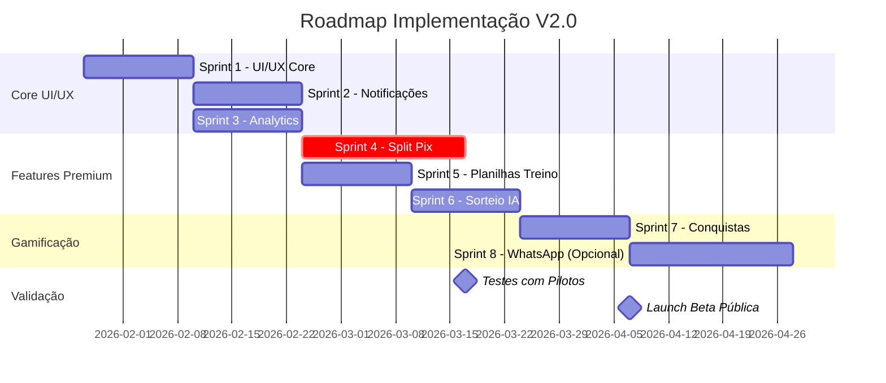

# ARQUITETURA COMPLETA - RESENHAPP V2.0 (RESENHAFC)

**Documento de Planejamento Arquitetural**
**Versão:** 2.0
**Data:** 2026-01-21
**Status:** Planejamento
**Responsável:** Pedro Vitor Pagliarin

---

## 📋 ÍNDICE

1. [Visão Geral](#1-visão-geral)
2. [Análise da Situação Atual](#2-análise-da-situação-atual)
3. [Visão do Sistema Futuro](#3-visão-do-sistema-futuro)
4. [Arquitetura de Dados](#4-arquitetura-de-dados)
5. [Arquitetura de Frontend](#5-arquitetura-de-frontend)
6. [Arquitetura de Backend](#6-arquitetura-de-backend)
7. [Design System UzzAI](#7-design-system-uzzai)
8. [Roadmap de Implementação](#8-roadmap-de-implementação)
9. [Decisões Técnicas](#9-decisões-técnicas)
10. [Riscos e Mitigações](#10-riscos-e-mitigações)

---

## 1. VISÃO GERAL

### 1.1 Objetivos do Projeto

**Transformar o Peladeiros** de um MVP funcional de gestão de peladas em um **sistema completo de gestão esportiva** focado inicialmente em futebol, com potencial expansão para múltiplas modalidades (atléticas).

### 1.2 Pilares da V2.0

1. **Identidade Visual UzzAI** - Aplicar completamente o design system UzzAI
2. **UX/UI Profissional** - Interface moderna, intuitiva e responsiva
3. **Features Premium** - Split Pix automático, analytics avançados, notificações
4. **Escalabilidade** - Preparar para suportar múltiplas modalidades esportivas
5. **Performance** - Otimizar para alta disponibilidade e baixa latência

### 1.3 Stakeholders

| Papel | Nome | Responsabilidade |
|-------|------|------------------|
| Product Owner | Pedro Vitor Pagliarin | Visão do produto, priorização |
| Tech Lead | Luis Fernando Boff | Arquitetura técnica, código |
| Comercial | Vitor Reis Pirolli | Validação com pilotos, pricing |
| Branding | Arthur Brandalise | Identidade visual, UX/UI |

---

## 2. ANÁLISE DA SITUAÇÃO ATUAL

### 2.1 Stack Atual (MVP)

```yaml
Frontend:
  - Framework: Next.js 15 (App Router)
  - UI Library: React 19
  - Styling: Tailwind CSS
  - UI Components: shadcn/ui (Radix UI)
  - State: Zustand
  - Validation: Zod

Backend:
  - API: Next.js API Routes
  - Database: Neon PostgreSQL Serverless
  - DB Client: @neondatabase/serverless (raw SQL)
  - Auth: NextAuth v5 (credentials)
  - Password: bcrypt

DevOps:
  - Deploy: Vercel
  - Package Manager: pnpm
  - Logging: Pino
```

### 2.2 Funcionalidades Implementadas (MVP - 100%)

✅ **Autenticação**
- SignUp/SignIn com email e senha
- Sessão JWT com NextAuth v5
- Middleware de proteção de rotas

✅ **Gestão de Grupos**
- CRUD completo de grupos
- Roles (admin/member)
- Convites com código
- Criação de usuários pelo admin

✅ **Gestão de Eventos**
- CRUD de eventos/peladas
- Sistema de RSVP (confirmação, recusa, waitlist)
- Check-in de jogadores
- Gestão de locais (venues)

✅ **Sorteio de Times**
- Algoritmo de sorteio aleatório
- Separação de goleiros
- Configurações customizáveis por grupo
- Swap de jogadores entre times

✅ **Ações de Jogo**
- Registro de gols e assistências
- Sistema de cartões (amarelo/vermelho)
- Materialized View para scoreboard

✅ **Sistema de Votação**
- Votação pós-jogo
- Substituição de ratings tradicionais

✅ **Rankings e Estatísticas**
- Artilharia
- Assistências
- Frequência
- "Destaque da Partida"
- Estatísticas pessoais e do grupo

✅ **Financeiro**
- Wallets (carteira do grupo e usuários)
- Charges (cobranças)
- Transactions (pagamentos)
- Rastreamento de quem pagou

### 2.3 Arquitetura de Dados Atual

**Tabelas Principais:**
- `users` - Usuários do sistema
- `groups` - Grupos/peladas
- `group_members` - Membros dos grupos (com roles)
- `events` - Eventos/partidas
- `event_attendance` - RSVP e check-in
- `teams` - Times sorteados
- `team_members` - Jogadores dos times
- `event_actions` - Ações (gols, assists, cartões)
- `votes` - Sistema de votação
- `wallets` - Carteiras
- `charges` - Cobranças
- `transactions` - Transações financeiras
- `invites` - Convites para grupos
- `venues` - Locais de jogo

**Views Materializadas:**
- `mv_event_scoreboard` - Placar em tempo real

### 2.4 Gaps Identificados (vs. HTML Demos)

#### UI/UX Faltantes (CRÍTICO)
- ❌ Sidebar com navegação hierárquica
- ❌ Sistema de notificações visual (dropdown + badge)
- ❌ Métricas com tendências (↑↓)
- ❌ Gráficos de atividade (semanal, mensal)
- ❌ Quick actions no dashboard
- ❌ Filtros e busca avançada
- ❌ Tooltips de ajuda contextual
- ❌ Loading states e skeletons
- ❌ Empty states melhorados

#### Features Faltantes (ALTO IMPACTO)
- ❌ **Split Pix Automático** (Feature Premium #1)
- ❌ Sistema de notificações (backend + push)
- ❌ Analytics Dashboard avançado
- ❌ Sorteio inteligente por IA (balanceamento por skill)
- ❌ Campo visual interativo (drag & drop)
- ❌ Sistema de conquistas/badges
- ❌ Integração WhatsApp Business API
- ❌ Planilhas de treino (backend pendente)

#### Componentes Avançados Faltantes
- ❌ Chart components (gráficos)
- ❌ Notification center (dropdown)
- ❌ Advanced filters (multi-select, date range)
- ❌ Data tables (ordenação, paginação)
- ❌ File upload (avatares, documentos)

---

## 3. VISÃO DO SISTEMA FUTURO

### 3.1 Proposta de Valor (V2.0)

**Para Organizadores:**
- Automatizar 100% da organização (confirmações, sorteio, pagamentos)
- Reduzir cancelamentos de última hora via notificações
- Facilitar cobrança com Split Pix automático
- Analytics para entender comportamento do grupo

**Para Jogadores:**
- Interface mobile-first intuitiva
- Confirmação rápida (1 clique)
- Acompanhar estatísticas e rankings
- Receber lembretes automáticos
- Pagar via Pix com QR code individual

### 3.2 Modelo de Negócio

**Freemium:**
- **Grátis:** Funcionalidades básicas (confirmações, sorteio, rankings)
- **Premium (R$ 30-50/grupo/mês):**
  - Split Pix Automático
  - Analytics Avançado
  - Notificações WhatsApp
  - Planilhas de treino
  - Histórico ilimitado
  - Suporte prioritário

### 3.3 Expansão Futura: Multi-Modalidades (Atléticas)

**Visão de Longo Prazo (Q3-Q4 2026):**
- Suportar múltiplas modalidades esportivas (futebol, vôlei, basquete, etc.)
- Dashboard por modalidade
- Calendário unificado de eventos
- Rankings por modalidade
- Estatísticas comparativas entre modalidades

---

## 4. ARQUITETURA DE DADOS

### 4.1 Modelo de Dados Atual (Manter)

O modelo atual é **sólido e bem estruturado**. Não requer alterações significativas nas tabelas core.

### 4.2 Novas Tabelas Necessárias

#### 4.2.1 Sistema de Notificações

```sql
-- Tabela de notificações
CREATE TABLE notifications (
  id BIGSERIAL PRIMARY KEY,
  user_id BIGINT NOT NULL REFERENCES users(id) ON DELETE CASCADE,
  type VARCHAR(50) NOT NULL, -- 'rsvp_reminder', 'payment_due', 'event_update', etc.
  title VARCHAR(255) NOT NULL,
  message TEXT NOT NULL,
  link VARCHAR(500), -- Link para ação
  read BOOLEAN DEFAULT FALSE,
  created_at TIMESTAMPTZ DEFAULT NOW(),
  read_at TIMESTAMPTZ,

  INDEX idx_notifications_user_id (user_id),
  INDEX idx_notifications_read (user_id, read, created_at)
);

-- Preferências de notificação
CREATE TABLE notification_preferences (
  id BIGSERIAL PRIMARY KEY,
  user_id BIGINT NOT NULL UNIQUE REFERENCES users(id) ON DELETE CASCADE,
  email_enabled BOOLEAN DEFAULT TRUE,
  push_enabled BOOLEAN DEFAULT TRUE,
  whatsapp_enabled BOOLEAN DEFAULT FALSE,
  rsvp_reminders BOOLEAN DEFAULT TRUE,
  payment_reminders BOOLEAN DEFAULT TRUE,
  event_updates BOOLEAN DEFAULT TRUE,
  created_at TIMESTAMPTZ DEFAULT NOW(),
  updated_at TIMESTAMPTZ DEFAULT NOW()
);
```

#### 4.2.2 Split Pix (Pagamentos)

```sql
-- Tabela de configuração Pix do grupo
CREATE TABLE group_pix_config (
  id BIGSERIAL PRIMARY KEY,
  group_id BIGINT NOT NULL UNIQUE REFERENCES groups(id) ON DELETE CASCADE,
  pix_key VARCHAR(255) NOT NULL, -- Chave Pix do organizador
  pix_key_type VARCHAR(20) NOT NULL, -- 'cpf', 'cnpj', 'email', 'phone', 'random'
  merchant_name VARCHAR(255), -- Nome do recebedor
  merchant_city VARCHAR(100),
  enabled BOOLEAN DEFAULT FALSE,
  created_at TIMESTAMPTZ DEFAULT NOW(),
  updated_at TIMESTAMPTZ DEFAULT NOW()
);

-- Tabela de QR Codes Pix gerados por evento
CREATE TABLE pix_qr_codes (
  id BIGSERIAL PRIMARY KEY,
  event_id BIGINT NOT NULL REFERENCES events(id) ON DELETE CASCADE,
  user_id BIGINT NOT NULL REFERENCES users(id) ON DELETE CASCADE,
  amount DECIMAL(10,2) NOT NULL,
  qr_code_payload TEXT NOT NULL, -- EMV do Pix Copia e Cola
  qr_code_image_url TEXT, -- URL da imagem do QR Code (se armazenada)
  status VARCHAR(20) DEFAULT 'pending', -- 'pending', 'paid', 'expired'
  paid_at TIMESTAMPTZ,
  expires_at TIMESTAMPTZ,
  created_at TIMESTAMPTZ DEFAULT NOW(),

  UNIQUE(event_id, user_id),
  INDEX idx_pix_status (event_id, status)
);
```

#### 4.2.3 Analytics e Métricas

```sql
-- Tabela de métricas agregadas (cache)
CREATE TABLE group_metrics (
  id BIGSERIAL PRIMARY KEY,
  group_id BIGINT NOT NULL REFERENCES groups(id) ON DELETE CASCADE,
  metric_date DATE NOT NULL,
  total_events INT DEFAULT 0,
  total_players INT DEFAULT 0,
  avg_attendance DECIMAL(5,2) DEFAULT 0,
  total_goals INT DEFAULT 0,
  total_revenue DECIMAL(10,2) DEFAULT 0,
  created_at TIMESTAMPTZ DEFAULT NOW(),

  UNIQUE(group_id, metric_date),
  INDEX idx_metrics_group_date (group_id, metric_date DESC)
);

-- Tabela de tendências (comparação período anterior)
CREATE TABLE metric_trends (
  id BIGSERIAL PRIMARY KEY,
  group_id BIGINT NOT NULL REFERENCES groups(id) ON DELETE CASCADE,
  metric_type VARCHAR(50) NOT NULL, -- 'attendance', 'revenue', 'frequency', etc.
  current_value DECIMAL(10,2) NOT NULL,
  previous_value DECIMAL(10,2) NOT NULL,
  change_percent DECIMAL(5,2) NOT NULL,
  period_start DATE NOT NULL,
  period_end DATE NOT NULL,
  created_at TIMESTAMPTZ DEFAULT NOW(),

  INDEX idx_trends_group_type (group_id, metric_type, created_at DESC)
);
```

#### 4.2.4 Sistema de Conquistas/Badges

```sql
-- Tabela de tipos de conquistas
CREATE TABLE achievement_types (
  id BIGSERIAL PRIMARY KEY,
  code VARCHAR(50) UNIQUE NOT NULL, -- 'first_goal', 'hat_trick', 'streak_5', etc.
  name VARCHAR(100) NOT NULL,
  description TEXT NOT NULL,
  icon VARCHAR(50) NOT NULL, -- Ícone Lucide
  rarity VARCHAR(20) DEFAULT 'common', -- 'common', 'rare', 'epic', 'legendary'
  points INT DEFAULT 0,
  created_at TIMESTAMPTZ DEFAULT NOW()
);

-- Tabela de conquistas dos usuários
CREATE TABLE user_achievements (
  id BIGSERIAL PRIMARY KEY,
  user_id BIGINT NOT NULL REFERENCES users(id) ON DELETE CASCADE,
  group_id BIGINT NOT NULL REFERENCES groups(id) ON DELETE CASCADE,
  achievement_type_id BIGINT NOT NULL REFERENCES achievement_types(id),
  unlocked_at TIMESTAMPTZ DEFAULT NOW(),

  UNIQUE(user_id, group_id, achievement_type_id),
  INDEX idx_achievements_user_group (user_id, group_id)
);
```

#### 4.2.5 Planilhas de Treino (Tactical Board)

```sql
-- Tabela de planilhas de treino
CREATE TABLE training_plans (
  id BIGSERIAL PRIMARY KEY,
  group_id BIGINT NOT NULL REFERENCES groups(id) ON DELETE CASCADE,
  created_by BIGINT NOT NULL REFERENCES users(id),
  title VARCHAR(255) NOT NULL,
  description TEXT,
  drill_data JSONB NOT NULL, -- JSON com posições de jogadores, linhas, etc.
  is_template BOOLEAN DEFAULT FALSE,
  created_at TIMESTAMPTZ DEFAULT NOW(),
  updated_at TIMESTAMPTZ DEFAULT NOW(),

  INDEX idx_training_group (group_id, created_at DESC)
);
```

#### 4.2.6 Multi-Modalidades (Futuro)

```sql
-- Tabela de modalidades esportivas
CREATE TABLE sport_modalities (
  id BIGSERIAL PRIMARY KEY,
  code VARCHAR(50) UNIQUE NOT NULL, -- 'football', 'volleyball', 'basketball', etc.
  name VARCHAR(100) NOT NULL,
  icon VARCHAR(50) NOT NULL,
  default_players INT NOT NULL, -- Número padrão de jogadores
  enabled BOOLEAN DEFAULT TRUE,
  created_at TIMESTAMPTZ DEFAULT NOW()
);

-- Alterar tabela groups para suportar modalidade
ALTER TABLE groups ADD COLUMN modality_id BIGINT REFERENCES sport_modalities(id);
-- Default para futebol
UPDATE groups SET modality_id = (SELECT id FROM sport_modalities WHERE code = 'football');
```

### 4.3 Migrations Necessárias

**Ordem de Implementação:**
1. Sistema de Notificações (Semana 1)
2. Split Pix (Semana 2-3)
3. Analytics e Métricas (Semana 4)
4. Planilhas de Treino (Semana 5)
5. Sistema de Conquistas (Semana 6)
6. Multi-Modalidades (Q2 2026)

---

## 5. ARQUITETURA DE FRONTEND

### 5.1 Estrutura de Diretórios (Proposta)

```
src/
├── app/                          # Next.js App Router
│   ├── (auth)/                  # Grupo de rotas de autenticação
│   │   ├── layout.tsx           # Layout de auth (centralizado)
│   │   ├── signin/
│   │   │   └── page.tsx
│   │   └── signup/
│   │       └── page.tsx
│   │
│   ├── (dashboard)/             # Grupo de rotas protegidas
│   │   ├── layout.tsx           # Layout com sidebar + topbar
│   │   ├── dashboard/           # Dashboard principal
│   │   │   └── page.tsx
│   │   ├── groups/              # Gestão de grupos
│   │   │   ├── page.tsx         # Lista de grupos
│   │   │   ├── new/
│   │   │   │   └── page.tsx     # Criar grupo
│   │   │   └── [groupId]/
│   │   │       ├── page.tsx     # Dashboard do grupo
│   │   │       ├── settings/
│   │   │       │   └── page.tsx # Configurações
│   │   │       ├── members/
│   │   │       │   └── page.tsx # Membros
│   │   │       ├── events/
│   │   │       │   ├── page.tsx # Lista de eventos
│   │   │       │   ├── new/
│   │   │       │   │   └── page.tsx
│   │   │       │   └── [eventId]/
│   │   │       │       ├── page.tsx # Detalhes evento
│   │   │       │       ├── draw/
│   │   │       │       │   └── page.tsx
│   │   │       │       └── live/
│   │   │       │           └── page.tsx
│   │   │       ├── rankings/
│   │   │       │   └── page.tsx
│   │   │       ├── stats/
│   │   │       │   └── page.tsx # Analytics
│   │   │       ├── training/
│   │   │       │   └── page.tsx # Planilhas treino
│   │   │       └── financial/
│   │   │           └── page.tsx # Gestão financeira
│   │   │
│   │   ├── notifications/       # Central de notificações
│   │   │   └── page.tsx
│   │   │
│   │   └── profile/             # Perfil do usuário
│   │       └── page.tsx
│   │
│   ├── (landing)/               # Landing page
│   │   ├── layout.tsx
│   │   └── page.tsx             # Landing page pública
│   │
│   ├── api/                     # API Routes
│   │   ├── auth/
│   │   ├── groups/
│   │   ├── events/
│   │   ├── notifications/       # NOVO
│   │   ├── pix/                 # NOVO
│   │   ├── analytics/           # NOVO
│   │   ├── achievements/        # NOVO
│   │   └── training/            # NOVO
│   │
│   ├── layout.tsx               # Root layout
│   └── globals.css
│
├── components/
│   ├── ui/                      # shadcn/ui components
│   │   ├── button.tsx
│   │   ├── card.tsx
│   │   ├── input.tsx
│   │   ├── ...
│   │   └── chart.tsx            # NOVO - Gráficos
│   │
│   ├── layout/                  # Layout components
│   │   ├── sidebar.tsx          # NOVO - Sidebar hierárquica
│   │   ├── topbar.tsx           # NOVO - Topbar com search + notifications
│   │   ├── dashboard-layout.tsx
│   │   └── auth-layout.tsx
│   │
│   ├── common/                  # Componentes comuns
│   │   ├── uzzai-logo.tsx       # ✅ Já existe
│   │   ├── uzzai-badge.tsx      # ✅ Já existe
│   │   ├── gradient-separator.tsx # ✅ Já existe
│   │   ├── metric-card.tsx      # NOVO
│   │   ├── stat-card.tsx        # NOVO
│   │   ├── trend-indicator.tsx  # NOVO - Indicador ↑↓
│   │   ├── loading-skeleton.tsx # NOVO
│   │   ├── empty-state.tsx      # NOVO
│   │   └── quick-actions.tsx    # NOVO - FAB/Quick actions
│   │
│   ├── notifications/           # NOVO - Sistema de notificações
│   │   ├── notification-dropdown.tsx
│   │   ├── notification-item.tsx
│   │   └── notification-badge.tsx
│   │
│   ├── analytics/               # NOVO - Analytics
│   │   ├── activity-chart.tsx
│   │   ├── trend-chart.tsx
│   │   ├── frequency-heatmap.tsx
│   │   └── stats-overview.tsx
│   │
│   ├── pix/                     # NOVO - Split Pix
│   │   ├── pix-qr-code.tsx
│   │   ├── pix-payment-status.tsx
│   │   └── pix-config-form.tsx
│   │
│   ├── training/                # Planilhas de treino
│   │   └── tactical-board.tsx   # ✅ Já existe (frontend)
│   │
│   ├── groups/                  # Componentes de grupos
│   │   ├── group-card.tsx
│   │   ├── group-list.tsx
│   │   ├── member-list.tsx
│   │   └── invite-modal.tsx
│   │
│   ├── events/                  # Componentes de eventos
│   │   ├── event-card.tsx
│   │   ├── event-list.tsx
│   │   ├── rsvp-button.tsx
│   │   └── scoreboard.tsx
│   │
│   └── providers/               # React providers
│       ├── auth-provider.tsx
│       ├── notification-provider.tsx # NOVO
│       └── theme-provider.tsx   # NOVO (dark/light)
│
├── lib/
│   ├── auth.ts                  # NextAuth config
│   ├── auth-helpers.ts          # requireAuth, getCurrentUser
│   ├── logger.ts                # Pino logger
│   ├── validations.ts           # Zod schemas
│   ├── utils.ts                 # Utility functions
│   ├── seo.ts                   # ✅ Já existe
│   ├── pix.ts                   # NOVO - Pix helpers
│   ├── notifications.ts         # NOVO - Notification helpers
│   └── stores/                  # Zustand stores
│       ├── use-auth-store.ts
│       ├── use-notification-store.ts # NOVO
│       └── use-theme-store.ts   # NOVO
│
├── db/
│   ├── client.ts                # Neon client
│   └── migrations/
│       ├── schema.sql           # Schema atual
│       ├── 001_notifications.sql # NOVO
│       ├── 002_pix.sql          # NOVO
│       ├── 003_analytics.sql    # NOVO
│       ├── 004_training.sql     # NOVO
│       ├── 005_achievements.sql # NOVO
│       └── 006_modalities.sql   # NOVO (futuro)
│
└── types/                       # TypeScript types
    ├── database.ts              # Database types
    ├── api.ts                   # API types
    └── app.ts                   # App types
```

### 5.2 Design System UzzAI - Componentes

#### 5.2.1 Componentes Já Criados ✅
- `UzzaiLogo` - Logo UzzAI
- `UzzaiBadge` - Badges (new, beta, premium, admin, dev)
- `GradientSeparator` - Separador com gradiente
- `SEO Helper` - Helper para metadados

#### 5.2.2 Componentes a Criar 🔨

**Layout:**
- `Sidebar` - Navegação hierárquica com seções
- `Topbar` - Header com search, notificações, user profile
- `DashboardLayout` - Layout completo (Sidebar + Topbar + Content)

**Métricas:**
- `MetricCard` - Card de métrica com trend
- `StatCard` - Card de estatística simples
- `TrendIndicator` - Indicador visual de tendência (↑↓)

**Gráficos:**
- `ActivityChart` - Gráfico de atividade semanal
- `TrendChart` - Gráfico de linha com tendências
- `FrequencyHeatmap` - Mapa de calor de frequência
- `BarChart` - Gráfico de barras customizado

**Notificações:**
- `NotificationDropdown` - Dropdown de notificações
- `NotificationItem` - Item de notificação
- `NotificationBadge` - Badge contador

**Pix:**
- `PixQRCode` - Exibição de QR Code Pix
- `PixPaymentStatus` - Status do pagamento
- `PixConfigForm` - Formulário de configuração Pix

**UI/UX:**
- `LoadingSkeleton` - Loading states
- `EmptyState` - Estados vazios
- `QuickActions` - Ações rápidas (FAB)
- `FilterBar` - Barra de filtros
- `SearchBar` - Busca avançada
- `Tooltip` - Tooltips contextuais

### 5.3 Rotas e Navegação

#### 5.3.1 Estrutura de Navegação (Sidebar)

```
📊 PRINCIPAL
├── Dashboard
├── Notificações

⚽ GESTÃO
├── Meus Grupos
├── Próximos Eventos
├── Calendário

📈 ANÁLISE
├── Estatísticas
├── Rankings
├── Histórico

⚙️ CONFIGURAÇÕES
├── Perfil
├── Preferências
└── Sair
```

#### 5.3.2 Navegação do Grupo (Submenu)

```
Grupo: [Nome do Grupo]
├── Dashboard
├── Eventos
│   ├── Próximos
│   └── Histórico
├── Membros
├── Rankings
├── Estatísticas
├── Planilhas de Treino
├── Financeiro
└── Configurações
```

### 5.4 States e Loading

**Loading States:**
- Skeleton para listas
- Spinner para ações
- Progress bar para uploads

**Empty States:**
- Ilustração + mensagem + CTA
- Diferentes para cada contexto (sem grupos, sem eventos, etc.)

**Error States:**
- Toast notifications para erros
- Error boundaries para crashes
- Fallback UI para componentes

---

## 6. ARQUITETURA DE BACKEND

### 6.1 API Routes (Organização)

```
/api/
├── auth/
│   ├── [...nextauth]/route.ts   # NextAuth handler
│   └── signup/route.ts          # Signup endpoint
│
├── groups/
│   ├── route.ts                 # GET (list), POST (create)
│   ├── join/route.ts            # POST (join with invite)
│   ├── [groupId]/
│   │   ├── route.ts             # GET, PATCH, DELETE
│   │   ├── members/
│   │   │   ├── route.ts
│   │   │   ├── create-user/route.ts
│   │   │   └── [userId]/route.ts
│   │   ├── invites/
│   │   │   ├── route.ts
│   │   │   └── [inviteId]/route.ts
│   │   ├── stats/route.ts
│   │   ├── my-stats/route.ts
│   │   ├── rankings/route.ts
│   │   ├── draw-config/route.ts
│   │   ├── event-settings/route.ts
│   │   ├── analytics/route.ts   # NOVO
│   │   ├── trends/route.ts      # NOVO
│   │   ├── charges/
│   │   │   ├── route.ts
│   │   │   └── [chargeId]/route.ts
│   │   └── pix/
│   │       ├── config/route.ts  # NOVO
│   │       └── qr-codes/route.ts # NOVO
│
├── events/
│   ├── route.ts                 # GET (list), POST (create)
│   ├── [eventId]/
│   │   ├── route.ts             # GET, PATCH, DELETE
│   │   ├── rsvp/route.ts
│   │   ├── admin-rsvp/route.ts
│   │   ├── draw/route.ts
│   │   ├── teams/
│   │   │   ├── route.ts
│   │   │   └── swap/route.ts
│   │   ├── actions/route.ts
│   │   ├── ratings/route.ts
│   │   └── pix/
│   │       └── generate/route.ts # NOVO
│
├── notifications/               # NOVO
│   ├── route.ts                 # GET (list), POST (mark read)
│   ├── unread-count/route.ts   # GET
│   ├── preferences/route.ts     # GET, PATCH
│   └── send/route.ts            # POST (admin/system)
│
├── training/                    # NOVO
│   ├── route.ts                 # GET (list), POST (create)
│   └── [planId]/
│       └── route.ts             # GET, PATCH, DELETE
│
├── achievements/                # NOVO
│   ├── types/route.ts           # GET (list achievement types)
│   └── [userId]/
│       └── [groupId]/route.ts   # GET (user achievements in group)
│
└── users/
    └── search/route.ts          # GET (search users)
```

### 6.2 Padrão de API Route (Manter)

```typescript
import { requireAuth } from "@/lib/auth-helpers";
import { sql } from "@/db/client";
import logger from "@/lib/logger";
import { NextResponse } from "next/server";

export async function GET() {
  try {
    const user = await requireAuth();

    const result = await sql`
      SELECT * FROM table WHERE user_id = ${user.id}
    `;

    return NextResponse.json({ data: result });
  } catch (error) {
    if (error instanceof Error && error.message === "Não autenticado") {
      return NextResponse.json({ error: "Não autenticado" }, { status: 401 });
    }
    logger.error(error, "Error in GET /api/endpoint");
    return NextResponse.json({ error: "Erro ao processar" }, { status: 500 });
  }
}
```

### 6.3 Novos Endpoints Críticos

#### 6.3.1 Notificações

**GET /api/notifications**
- Lista notificações do usuário
- Suporta paginação
- Filtra por `read`/`unread`

**POST /api/notifications**
- Marca notificações como lidas
- Body: `{ notificationIds: number[] }`

**GET /api/notifications/unread-count**
- Retorna contador de não lidas
- Usado para badge no header

**PATCH /api/notifications/preferences**
- Atualiza preferências de notificação
- Body: `{ emailEnabled, pushEnabled, whatsappEnabled, ... }`

#### 6.3.2 Split Pix

**POST /api/events/[eventId]/pix/generate**
- Gera QR Code Pix para um usuário
- Valida configuração Pix do grupo
- Retorna payload EMV e imagem do QR Code
- Body: `{ userId, amount }`

**GET /api/groups/[groupId]/pix/config**
- Retorna configuração Pix do grupo
- Apenas admins

**PATCH /api/groups/[groupId]/pix/config**
- Atualiza configuração Pix
- Valida chave Pix
- Body: `{ pixKey, pixKeyType, merchantName, merchantCity }`

**GET /api/groups/[groupId]/pix/qr-codes**
- Lista QR Codes gerados para eventos do grupo
- Filtra por evento ou status

#### 6.3.3 Analytics

**GET /api/groups/[groupId]/analytics**
- Retorna métricas agregadas do grupo
- Query params: `?startDate&endDate&period=week|month|year`
- Response:
  ```json
  {
    "totalEvents": 12,
    "totalPlayers": 45,
    "avgAttendance": 18.5,
    "totalGoals": 156,
    "totalRevenue": 2400.00,
    "trends": {
      "attendanceChange": 12.5,
      "revenueChange": -5.3
    }
  }
  ```

**GET /api/groups/[groupId]/trends**
- Retorna séries temporais para gráficos
- Query params: `?metric=attendance|revenue|goals&period=week|month`
- Response: array de `{ date, value }`

---

## 7. DESIGN SYSTEM UZZAI

### 7.1 Cores (Já Definidas)

```typescript
colors: {
  uzzai: {
    mint: '#1ABC9C',      // Cor primária
    black: '#1C1C1C',     // Background principal
    silver: '#B0B0B0',    // Texto secundário
    blue: '#2E86AB',      // Acento
    gold: '#FFD700',      // Destaque/Premium
  },
  status: {
    success: '#10B981',
    warning: '#F59E0B',
    danger: '#EF4444',
    info: '#3B82F6',
  },
}
```

### 7.2 Tipografia (Já Definida)

```typescript
fontFamily: {
  poppins: ['Poppins', 'sans-serif'],  // Títulos
  inter: ['Inter', 'sans-serif'],      // Corpo
  exo2: ['Exo 2', 'sans-serif'],       // Logo AI
  fira: ['Fira Code', 'monospace'],    // Code
}
```

### 7.3 Componentes Base (shadcn/ui)

**Já instalados:**
- button, card, input, label, select, textarea
- dialog, dropdown-menu, popover, toast
- tabs, separator, badge, avatar

**A instalar:**
- `chart` - Para gráficos (Recharts)
- `data-table` - Para tabelas avançadas
- `skeleton` - Para loading states
- `tooltip` - Para ajuda contextual
- `command` - Para search/command palette

### 7.4 Padrões Visuais

**Cards:**
- Background: `linear-gradient(180deg, #1e2530 0%, #1a1f26 100%)`
- Border: `1px solid rgba(255, 255, 255, 0.1)`
- Border radius: `16px`
- Top gradient bar: `linear-gradient(90deg, #1ABC9C, #2E86AB)`

**Hover Effects:**
- Transform: `translateY(-4px)`
- Shadow: `0 12px 24px rgba(26, 188, 156, 0.15)`

**Loading:**
- Skeleton: `bg-white/5` com pulse animation
- Spinner: Mint color com border animation

---

## 8. ROADMAP DE IMPLEMENTAÇÃO

### 8.1 Sprint 1 - UI/UX Core (2 semanas)

**Objetivo:** Implementar componentes base de UI/UX

✅ **Tarefas:**
1. Criar Sidebar com navegação hierárquica
2. Criar Topbar com search e user profile
3. Implementar DashboardLayout
4. Criar MetricCard com TrendIndicator
5. Implementar LoadingSkeleton
6. Criar EmptyState components
7. Adicionar Tooltips contextuais
8. Implementar FilterBar e SearchBar

**Dependências:**
- Nenhuma (pode começar já)

**Entregáveis:**
- Componentes UI base funcionais
- Layout aplicado nas páginas principais

---

### 8.2 Sprint 2 - Sistema de Notificações (2 semanas)

**Objetivo:** Sistema completo de notificações

✅ **Tarefas:**
1. Criar migrations (notifications, notification_preferences)
2. Implementar API routes de notificações
3. Criar NotificationDropdown component
4. Implementar NotificationBadge no Topbar
5. Criar página de central de notificações
6. Implementar preferências de notificação
7. Criar job de envio de notificações (lembretes)

**Dependências:**
- Sprint 1 (Topbar component)

**Entregáveis:**
- Sistema de notificações funcional
- Lembretes automáticos (2 dias antes do evento)
- Preferências configuráveis

---

### 8.3 Sprint 3 - Analytics Dashboard (2 semanas)

**Objetivo:** Dashboard de analytics avançado

✅ **Tarefas:**
1. Criar migrations (group_metrics, metric_trends)
2. Implementar API routes de analytics
3. Instalar Recharts e criar Chart components
4. Criar ActivityChart (gráfico de atividade)
5. Criar TrendChart (gráficos de linha)
6. Implementar FrequencyHeatmap
7. Criar página de analytics do grupo
8. Implementar job de cálculo de métricas

**Dependências:**
- Sprint 1 (Layout)

**Entregáveis:**
- Dashboard de analytics funcional
- Gráficos de atividade, frequência, revenue
- Tendências com comparação período anterior

---

### 8.4 Sprint 4 - Split Pix Automático (3-4 semanas)

**Objetivo:** Feature Premium #1 - Split Pix

✅ **Tarefas:**
1. Criar migrations (group_pix_config, pix_qr_codes)
2. Implementar biblioteca de geração Pix EMV
3. Criar API routes de configuração Pix
4. Criar API de geração de QR Codes
5. Implementar PixConfigForm (configuração grupo)
6. Criar PixQRCode component
7. Implementar PixPaymentStatus
8. Integrar com eventos (gerar QR após RSVP)
9. Criar página de gestão financeira melhorada

**Dependências:**
- Nenhuma (pode rodar em paralelo)

**Entregáveis:**
- Sistema de Split Pix funcional
- QR Codes individuais por jogador
- Tracking de pagamentos
- Configuração por grupo

**Riscos:**
- Validação de chave Pix pode ser complexa
- Geração de QR Code pode precisar biblioteca externa

---

### 8.5 Sprint 5 - Planilhas de Treino (2 semanas)

**Objetivo:** Feature de planilhas táticas

✅ **Tarefas:**
1. Criar migration (training_plans)
2. Implementar API routes de training
3. Integrar TacticalBoard component (já existe frontend)
4. Criar página de listagem de planilhas
5. Implementar salvamento em JSON no banco
6. Criar sistema de templates
7. Adicionar compartilhamento entre membros

**Dependências:**
- Sprint 1 (Layout)

**Entregáveis:**
- Sistema de planilhas táticas funcional
- Salvar/carregar jogadas
- Templates pré-definidos

---

### 8.6 Sprint 6 - Sorteio Inteligente por IA (2 semanas)

**Objetivo:** Melhorar algoritmo de sorteio

✅ **Tarefas:**
1. Criar algoritmo de balanceamento por skill
2. Usar base_rating + histórico de gols/assists
3. Implementar otimização para evitar panelinhas
4. Criar configurações de "inteligência" do sorteio
5. Adicionar preview dos times antes de confirmar
6. Implementar sugestão de ajustes (swap)

**Dependências:**
- Nenhuma (melhoria do existente)

**Entregáveis:**
- Sorteio balanceado automaticamente
- Configurações de estratégia (aleatório vs balanceado)
- Preview antes de confirmar

---

### 8.7 Sprint 7 - Sistema de Conquistas (2 semanas)

**Objetivo:** Gamificação e badges

✅ **Tarefas:**
1. Criar migrations (achievement_types, user_achievements)
2. Definir conquistas iniciais (primeira pelada, hat-trick, streak 5x, etc.)
3. Implementar API routes de achievements
4. Criar lógica de unlock automático (triggers/jobs)
5. Implementar AchievementBadge component
6. Criar página de conquistas do usuário
7. Adicionar notificação de conquista desbloqueada

**Dependências:**
- Sprint 2 (sistema de notificações para unlock)

**Entregáveis:**
- Sistema de conquistas funcional
- 10-15 conquistas iniciais
- Notificações de unlock
- Página de visualização

---

### 8.8 Sprint 8 - Integração WhatsApp (Opcional - 2-3 semanas)

**Objetivo:** Notificações via WhatsApp Business API

✅ **Tarefas:**
1. Configurar WhatsApp Business API
2. Criar API route de envio WhatsApp
3. Integrar com sistema de notificações
4. Criar templates de mensagens
5. Implementar opt-in/opt-out
6. Configurar webhooks para confirmação

**Dependências:**
- Sprint 2 (sistema de notificações)
- Aprovação comercial (custo da API)

**Entregáveis:**
- Notificações via WhatsApp funcionais
- Templates aprovados pela Meta
- Sistema de opt-in

**Riscos:**
- Custo da WhatsApp Business API
- Aprovação de templates pela Meta pode demorar

---

### 8.9 Cronograma Geral (14-16 semanas)



**Datas Estimadas:**
- Início: 27/01/2026
- Sprint 1-3: 27/01 - 07/03 (6 semanas)
- Sprint 4-6: 08/03 - 02/05 (8 semanas)
- Sprint 7-8: 03/05 - 13/06 (6 semanas)
- **Launch Beta:** ~15/06/2026

---

## 9. DECISÕES TÉCNICAS

### 9.1 Decisões Confirmadas

✅ **Manter Stack Atual**
- Next.js 15 + React 19
- Neon PostgreSQL (raw SQL, sem ORM)
- NextAuth v5
- Tailwind CSS + shadcn/ui
- Vercel deploy

✅ **Design System**
- UzzAI como identidade visual
- Componentes shadcn/ui como base
- Customização via Tailwind

✅ **Banco de Dados**
- PostgreSQL com raw SQL
- Migrations manuais via SQL files
- Materialized Views para performance

### 9.2 Decisões Pendentes

⚠️ **Biblioteca de Gráficos**
- Opções: Recharts vs Chart.js vs Victory
- **Recomendação:** Recharts (integração React, flexível, bem mantido)

⚠️ **Geração de QR Code Pix**
- Opções: Biblioteca externa vs implementação própria
- **Recomendação:** Usar biblioteca `pix-utils` ou `qrcode-pix` (npm)

⚠️ **Push Notifications**
- Opções: Firebase Cloud Messaging vs OneSignal vs Pusher
- **Recomendação:** Firebase (gratuito até certo limite, bem documentado)

⚠️ **WhatsApp Integration**
- Depende de aprovação comercial (custo)
- **Recomendação:** Deixar para Sprint 8 (opcional)

⚠️ **Multi-Tenancy (Atléticas)**
- Decisão sobre quando implementar
- **Recomendação:** Q3 2026 (após validação com pilotos)

### 9.3 Princípios de Desenvolvimento

1. **Mobile-First:** Toda UI deve funcionar perfeitamente em mobile
2. **Progressive Enhancement:** Funcionalidades básicas sempre funcionam, extras são bonus
3. **Performance:** Lazy loading, code splitting, otimização de imagens
4. **Acessibilidade:** ARIA labels, keyboard navigation, contraste adequado
5. **SEO:** Metadados corretos, SSR onde necessário
6. **Segurança:** Validação server-side, sanitização de inputs, rate limiting

---

## 10. RISCOS E MITIGAÇÕES

### 10.1 Riscos Técnicos

| Risco | Probabilidade | Impacto | Mitigação |
|-------|---------------|---------|-----------|
| **Performance com muitos usuários** | Média | Alto | Implementar caching (Redis), otimizar queries, usar CDN para assets |
| **Complexidade do Split Pix** | Alta | Alto | Começar com MVP simples (QR Code estático), iterar baseado em feedback |
| **Integração WhatsApp cara** | Alta | Médio | Tornar feature opcional, avaliar ROI antes de implementar |
| **Bugs em produção** | Média | Médio | Testes automatizados, staging environment, rollback strategy |
| **Escalabilidade do Neon** | Baixa | Alto | Monitorar uso, planejar upgrade de plano se necessário |

### 10.2 Riscos de Produto

| Risco | Probabilidade | Impacto | Mitigação |
|-------|---------------|---------|-----------|
| **Baixa adoção do Split Pix** | Média | Alto | Validar com pilotos antes de desenvolver completo |
| **Usuários preferem WhatsApp direto** | Alta | Médio | Integrar com WhatsApp em vez de competir |
| **Pricing errado (muito caro)** | Média | Alto | Testar múltiplos preços com pilotos, oferecer trial gratuito |
| **Complexidade demais para organizadores** | Baixa | Alto | Simplificar UX, criar onboarding guiado, vídeos tutoriais |

### 10.3 Riscos de Negócio

| Risco | Probabilidade | Impacto | Mitigação |
|-------|---------------|---------|-----------|
| **Conflito marca "Peladeiros"** | Alta | Crítico | ✅ **RESOLVIDO:** Migrar para "ResenhApp" |
| **Concorrentes copiam features** | Média | Médio | Foco em execução e UX superior, iterar rápido |
| **Regulação Pix muda** | Baixa | Alto | Acompanhar mudanças Banco Central, adaptar rápido |
| **Custo infraestrutura alto** | Média | Médio | Monitorar custos Vercel/Neon, otimizar onde possível |

---

## 11. PRÓXIMOS PASSOS IMEDIATOS

### 11.1 Esta Semana (22-26 Jan)

1. ✅ **Aprovar este documento de arquitetura**
2. **Criar issues no GitHub** para cada sprint
3. **Setup de ambiente de desenvolvimento**
   - Criar branch `v2-development`
   - Configurar Vercel preview deployments
4. **Começar Sprint 1:**
   - Criar Sidebar component
   - Criar Topbar component
   - Implementar DashboardLayout

### 11.2 Próximas 2 Semanas (27 Jan - 07 Fev)

1. **Completar Sprint 1** (UI/UX Core)
2. **Iniciar Sprint 2** (Notificações)
3. **Recrutar primeiros pilotos** (2-3 grupos)
4. **Preparar apresentação** para validação

### 11.3 Decisões Necessárias

**Para Product Owner (Pedro):**
- [ ] Aprovar roadmap e priorização
- [ ] Definir pricing final (Premium)
- [ ] Aprovar investimento em WhatsApp API (sim/não)
- [ ] Definir critérios de sucesso para pilotos

**Para Tech Lead (Luis):**
- [ ] Escolher biblioteca de gráficos (Recharts?)
- [ ] Definir estratégia de testes (unitários, E2E)
- [ ] Planejar setup de staging environment

**Para Comercial (Vitor):**
- [ ] Recrutar 2-3 grupos piloto
- [ ] Preparar pitch de vendas
- [ ] Definir estratégia de onboarding

**Para Branding (Arthur):**
- [ ] Finalizar logo/marca "ResenhApp"
- [ ] Criar assets visuais (ilustrações, ícones)
- [ ] Definir guidelines de comunicação

---

## 12. MÉTRICAS DE SUCESSO

### 12.1 Métricas Técnicas

- **Performance:**
  - Lighthouse Score > 90
  - Time to Interactive < 3s
  - First Contentful Paint < 1.5s

- **Qualidade:**
  - Code coverage > 70%
  - Zero critical bugs em produção
  - Uptime > 99.5%

### 12.2 Métricas de Produto

- **Adoção:**
  - 10 grupos ativos em 2 meses
  - 50% dos grupos usam Premium após trial
  - NPS > 50

- **Engajamento:**
  - 3+ eventos por grupo/mês
  - 70% taxa de confirmação (RSVP)
  - 60% dos jogadores voltam após 30 dias

- **Revenue:**
  - R$ 500 MRR em 3 meses (10 grupos x R$ 50)
  - CAC < R$ 100
  - LTV > R$ 600 (12 meses retenção)

### 12.3 Métricas de UX

- **Satisfação:**
  - Task completion rate > 90%
  - Tempo médio para criar evento < 2 min
  - Suporte tickets < 5/semana

---

## 13. CONCLUSÃO

Este documento estabelece a **arquitetura completa** para a V2.0 do Peladeiros (ResenhApp), transformando-o de um MVP funcional em um **produto profissional e escalável**.

**Principais Realizações Planejadas:**
- ✅ Identidade visual UzzAI aplicada completamente
- ✅ UI/UX moderna e intuitiva
- ✅ Features Premium (Split Pix, Analytics)
- ✅ Sistema de notificações robusto
- ✅ Gamificação e conquistas
- ✅ Preparação para multi-modalidades

**Timeline Estimado:** 14-16 semanas
**Investimento:** Principalmente tempo (desenvolvimento interno)
**ROI Esperado:** Validação com 10 grupos + R$ 500 MRR em 3 meses

**Próximo Milestone:** Sprint 1 completo em 2 semanas (09/02/2026)

---

**Documento criado por:** Claude Code (Anthropic)
**Revisado por:** [Pendente]
**Aprovado por:** [Pendente]
**Última Atualização:** 2026-01-21
