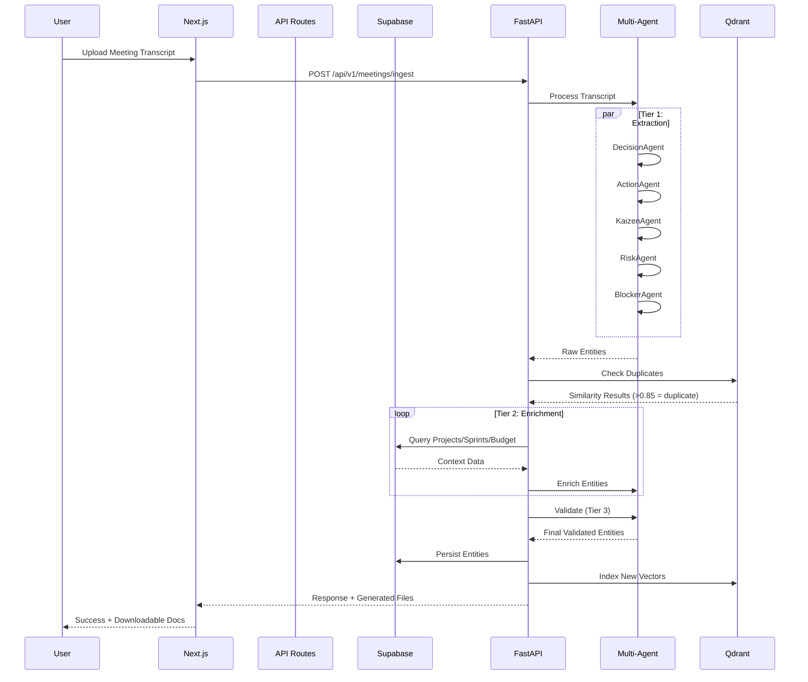

# 🏗️ ARQUITETURA COMPLETA — ERP-UzzAI v4.0-R02

> **"Think Smart, Think Uzz.Ai"**
>
> Sistema ERP Multi-Tenant com IA integrada + Framework de Gestão de Projetos Ágil
> Documento que unifica arquitetura técnica com metodologias de gestão e boas práticas

---

## 📑 SUMÁRIO EXECUTIVO

### Visão do Sistema

O **ERP-UzzAI** é uma plataforma empresarial completa que integra:

1. **Software de Gestão Empresarial** — ERP Multi-Tenant com IA
2. **Framework Metodológico** — Scrum + Design Thinking + Customer Development
3. **Sistema de Boas Práticas** — Ferramentas e templates operacionais embutidos
4. **Inteligência Artificial** — 13 agentes especializados + RAG

### Diferencial Competitivo

| Aspecto | ERPs Tradicionais | ERP-UzzAI |
|---------|-------------------|-----------|
| **Gestão de Projetos** | Básica, genérica | Scrum nativo com cerimônias embutidas |
| **Decisões** | Não rastreado | ADRs com anti-duplicação via RAG |
| **Reuniões** | Manual | Automação de atas com 13 agentes IA |
| **Priorização** | Subjetiva | Matriz GUT, Planning Poker BV/W automático |
| **Produto** | Sem metodologia | Diamante Duplo + MVP Canvas embutidos |
| **Pessoas** | RH básico | Avaliação 360° híbrida (70% objetiva) |
| **Conhecimento** | Isolado | Knowledge Base com backlinks automáticos |

---

## 📐 ÍNDICE COMPLETO

### PARTE I: ARQUITETURA TÉCNICA
1. [Arquitetura de Alto Nível](#1-arquitetura-de-alto-nível)
2. [Stack Tecnológico](#2-stack-tecnológico)
3. [Frontend Architecture](#3-frontend-architecture)
4. [Backend Architecture](#4-backend-architecture)
5. [Multi-Tenancy Design](#5-multi-tenancy-design)
6. [Sistema Multi-Agente (IA)](#6-sistema-multi-agente)
7. [RAG System](#7-rag-system)
8. [Database Schema](#8-database-schema)
9. [API Design](#9-api-design)
10. [Security Architecture](#10-security-architecture)

### PARTE II: MÓDULOS FUNCIONAIS DE GESTÃO
11. [Módulo 1: Priorização e Tomada de Decisão](#11-módulo-1-priorização-e-tomada-de-decisão)
12. [Módulo 2: Execução Ágil (Scrum Operacional)](#12-módulo-2-execução-ágil)
13. [Módulo 3: Design de Produto e Inovação](#13-módulo-3-design-de-produto-e-inovação)
14. [Módulo 4: Governança e Segundo Cérebro](#14-módulo-4-governança-e-segundo-cérebro)
15. [Módulo 5: Gestão de Pessoas e Performance](#15-módulo-5-gestão-de-pessoas-e-performance)
16. [Módulo 6: Comercial e Vendas B2B](#16-módulo-6-comercial-e-vendas-b2b)
17. [Módulo 7: Integrações Bidirecionais](#17-módulo-7-integrações-bidirecionais)
18. [Módulo 8: Mobile App Nativo](#18-módulo-8-mobile-app-nativo)
19. [Módulo 9: AI Real-time & Copilot](#19-módulo-9-ai-real-time--copilot)
20. [Módulo 10: Executive Dashboard & CEO Features](#20-módulo-10-executive-dashboard--ceo-features)
21. [Módulo 11: Compliance & Segurança Avançada](#21-módulo-11-compliance--segurança-avançada)
22. [Módulo 12: Customização No-Code](#22-módulo-12-customização-no-code)
23. [Módulo 13: Behavioral Analytics & Padrões](#23-módulo-13-behavioral-analytics--padrões)

### PARTE III: IMPLEMENTAÇÃO E OPERAÇÃO
17. [Features Completas do Sistema](#17-features-completas-do-sistema)
18. [Estrutura de Código](#18-estrutura-de-código)
19. [DevOps & CI/CD](#19-devops-cicd)
20. [Roadmap de Desenvolvimento](#20-roadmap-de-desenvolvimento)

---

# PARTE I: ARQUITETURA TÉCNICA

## 1. ARQUITETURA DE ALTO NÍVEL

### 1.1 Diagrama de Camadas

```
┌──────────────────────────────────────────────────────────────────────┐
│                     ERP-UZZAI v4.0 ARCHITECTURE                       │
├──────────────────────────────────────────────────────────────────────┤
│                                                                        │
│  ┌──────────────────────────────────────────────────────────────────┐ │
│  │                    PRESENTATION LAYER                            │ │
│  │  ┌────────────┐  ┌────────────┐  ┌────────────┐                 │ │
│  │  │  Web App   │  │ Mobile App │  │  CLI Tool  │                 │ │
│  │  │ (Next.js)  │  │(Capacitor) │  │  (Python)  │                 │ │
│  │  └────────────┘  └────────────┘  └────────────┘                 │ │
│  └──────────────────────────────────────────────────────────────────┘ │
│                              │                                         │
│  ┌──────────────────────────▼──────────────────────────────────────┐ │
│  │                     API GATEWAY LAYER                            │ │
│  │  • Next.js API Routes (/api/*)                                   │ │
│  │  • FastAPI (Python) - AI Processing                              │ │
│  │  • Multi-tenant context injection                                │ │
│  │  • JWT validation                                                │ │
│  └──────────────────────────────────────────────────────────────────┘ │
│                              │                                         │
│  ┌──────────────────────────▼──────────────────────────────────────┐ │
│  │                   APPLICATION LAYER                              │ │
│  │                                                                   │ │
│  │  ┌──────────┐  ┌──────────┐  ┌──────────┐  ┌──────────┐        │ │
│  │  │  Gestão  │  │   ERP    │  │Financeiro│  │    IA    │        │ │
│  │  │ Interna  │  │ Comercial│  │  /Fiscal │  │  Engine  │        │ │
│  │  │          │  │          │  │          │  │          │        │ │
│  │  │• Projetos│  │• Vendas  │  │• Caixa   │  │• Agents  │        │ │
│  │  │• Sprints │  │• Estoque │  │• Contas  │  │• RAG     │        │ │
│  │  │• Reuniões│  │• PDV     │  │• DRE     │  │• Extract │        │ │
│  │  │• Tasks   │  │• Clientes│  │• NF-e    │  │• Enrich  │        │ │
│  │  │• ADRs    │  │• Produtos│  │• Budget  │  │• Validate│        │ │
│  │  └──────────┘  └──────────┘  └──────────┘  └──────────┘        │ │
│  └──────────────────────────────────────────────────────────────────┘ │
│                              │                                         │
│  ┌──────────────────────────▼──────────────────────────────────────┐ │
│  │                  INTELLIGENCE LAYER (AI)                         │ │
│  │                                                                   │ │
│  │  ┌────────────────────────────────────────────────────────────┐ │ │
│  │  │       MULTI-AGENT ORCHESTRATOR (13 Agents)                 │ │ │
│  │  │                                                             │ │ │
│  │  │  TIER 1: EXTRACTION (Parallel, No DB)                      │ │ │
│  │  │  • DecisionAgent  • ActionAgent  • KaizenAgent             │ │ │
│  │  │  • RiskAgent  • BlockerAgent                               │ │ │
│  │  │                                                             │ │ │
│  │  │  TIER 2: ENRICHMENT (Sequential, With DB)                  │ │ │
│  │  │  • ProjectAgent  • DeadlineAgent  • PriorityAgent          │ │ │
│  │  │  • SprintAgent  • FinancialAgent  • TeamHealthAgent        │ │ │
│  │  │                                                             │ │ │
│  │  │  TIER 3: VALIDATION                                        │ │ │
│  │  │  • ValidatorAgent (Deduplication + Consistency)            │ │ │
│  │  └────────────────────────────────────────────────────────────┘ │ │
│  │                                                                   │ │
│  │  ┌────────────┐  ┌─────────────┐  ┌───────────────┐            │ │
│  │  │RAG Context │  │  Embedding  │  │  LLM Client   │            │ │
│  │  │ Enricher   │  │   Service   │  │ (GPT-4o-mini) │            │ │
│  │  └────────────┘  └─────────────┘  └───────────────┘            │ │
│  └──────────────────────────────────────────────────────────────────┘ │
│                              │                                         │
│  ┌──────────────────────────▼──────────────────────────────────────┐ │
│  │                       DATA LAYER                                 │ │
│  │                                                                   │ │
│  │  ┌────────────────────────────────────────────────────────────┐ │ │
│  │  │            SUPABASE (PostgreSQL 15+)                       │ │ │
│  │  │  • Row Level Security (RLS)                                │ │ │
│  │  │  • Multi-tenant isolation (tenant_id)                      │ │ │
│  │  │  • 40+ tabelas                                             │ │ │
│  │  └────────────────────────────────────────────────────────────┘ │ │
│  │                                                                   │ │
│  │  ┌────────────────────────────────────────────────────────────┐ │ │
│  │  │            QDRANT (Vector Database)                        │ │ │
│  │  │  • decisions_vectors (3072 dims)                           │ │ │
│  │  │  • actions_vectors                                         │ │ │
│  │  │  • kaizens_vectors                                         │ │ │
│  │  └────────────────────────────────────────────────────────────┘ │ │
│  └──────────────────────────────────────────────────────────────────┘ │
│                                                                        │
└──────────────────────────────────────────────────────────────────────┘
```

### 1.2 Fluxo de Dados Principal



---

## 2. STACK TECNOLÓGICO

### 2.1 Frontend Stack

| Tecnologia | Versão | Propósito |
|------------|--------|-----------|
| **Next.js** | 15.0.3 | Framework React com App Router |
| **React** | 19.0.0 | UI Library |
| **TypeScript** | 5.6.3 | Type Safety |
| **Tailwind CSS** | 3.4.15 | Estilização |
| **Shadcn/ui** | latest | Component Library |
| **Zustand** | 5.0.1 | State Management |
| **@dnd-kit** | 6.3.1 | Drag and Drop (Kanban) |
| **Zod** | 3.23.8 | Schema Validation |
| **React Hook Form** | 7.53.2 | Form Handling |
| **Lucide React** | 0.460.0 | Icons |

### 2.2 Backend Stack

| Tecnologia | Versão | Propósito |
|------------|--------|-----------|
| **Supabase** | latest | BaaS (Auth + Database + Storage) |
| **PostgreSQL** | 15+ | Banco de dados relacional |
| **FastAPI** | 0.104+ | API Python para IA |
| **Pydantic** | 2.0+ | Validação de dados |

### 2.3 AI/ML Stack

| Tecnologia | Propósito |
|------------|-----------|
| **OpenAI API** | LLM (GPT-4o-mini) |
| **text-embedding-3-large** | Embeddings (3072 dims) |
| **Qdrant** | Vector Database |

### 2.4 DevOps

| Tecnologia | Propósito |
|------------|-----------|
| **pnpm** | Package Manager |
| **Jest** | Testing Framework |
| **GitHub Actions** | CI/CD |
| **Docker** | Containerization |

---

## 3. FRONTEND ARCHITECTURE

### 3.1 App Router Structure

```
src/app/
├── (auth)/                     # Protected Routes
│   ├── layout.tsx              # Sidebar + Topbar
│   ├── dashboard/page.tsx
│   ├── projetos/               # Gestão de Projetos
│   ├── kanban/                 # Kanban Board
│   ├── reunioes/               # Reuniões + IA
│   ├── acoes/                  # Tasks/Actions
│   ├── bullet-journal/         # Daily Logs
│   ├── equipe/                 # Team Management
│   ├── performance/            # OKRs + Avaliação 360°
│   ├── produtos/               # ERP Produtos
│   ├── estoque/                # ERP Estoque
│   ├── vendas/                 # ERP Vendas
│   ├── pdv/                    # Point of Sale
│   ├── clientes/               # CRM
│   ├── financeiro/             # Financeiro
│   ├── notas-fiscais/          # NF-e/NFS-e
│   └── admin/                  # Admin Panel
│
├── (public)/                   # Public Routes
│   ├── login/
│   ├── registro/
│   └── accept-invitation/
│
└── api/                        # API Routes
    ├── projects/
    ├── tasks/
    ├── sprints/
    ├── users/
    └── tenants/
```

### 3.2 Component Architecture

```
src/components/
├── ui/                         # Shadcn/ui
├── layout/                     # Sidebar, Topbar
├── kanban/                     # Kanban Components
├── projects/                   # Project Components
├── meetings/                   # Meeting Components
├── scrum/                      # 🆕 Scrum Ceremonies
│   ├── sprint-planning.tsx     # Planning Poker
│   ├── daily-standup.tsx       # Daily com Nariz do Scrum
│   ├── sprint-review.tsx       # Review + Demo
│   └── retrospective.tsx       # Retro + Kaizens
├── decision-tools/             # 🆕 Decision Tools
│   ├── gut-matrix.tsx          # Matriz GUT
│   ├── impact-effort.tsx       # Matriz Impacto x Esforço
│   ├── planning-poker.tsx      # Planning Poker BV/W
│   └── adr-editor.tsx          # ADR Editor
├── product/                    # 🆕 Product Design
│   ├── diamond-double.tsx      # Diamante Duplo
│   ├── mvp-canvas.tsx          # MVP Canvas
│   └── customer-dev.tsx        # Customer Development
└── people/                     # 🆕 People Management
    ├── performance-360.tsx     # Avaliação 360°
    └── empathy-map.tsx         # Mapa de Empatia
```

---

## 4. BACKEND ARCHITECTURE

### 4.1 API Routes (Next.js)

Todas as rotas implementam **isolamento multi-tenant** automaticamente.

| Método | Endpoint | Descrição |
|--------|----------|-----------|
| `GET` | `/api/projects` | Lista projetos do tenant |
| `POST` | `/api/projects` | Cria novo projeto |
| `GET` | `/api/tasks` | Lista tarefas (filtros: project_id, status) |
| `POST` | `/api/tasks` | Cria nova tarefa |
| `PATCH` | `/api/tasks` | Atualiza tarefa |
| `GET` | `/api/sprints` | Lista sprints |
| `POST` | `/api/sprints` | Cria sprint |
| `GET` | `/api/users` | Lista usuários do tenant |
| `POST` | `/api/decisions` | 🆕 Cria ADR |
| `GET` | `/api/kaizens` | 🆕 Lista Kaizens |
| `POST` | `/api/risks` | 🆕 Cria Risk |

### 4.2 FastAPI Endpoints (Python AI)

| Método | Endpoint | Descrição |
|--------|----------|-----------|
| `POST` | `/api/v1/meetings/ingest` | Processa transcrição de reunião |
| `POST` | `/api/v1/entities/extract` | Extrai entidades |
| `GET` | `/api/v1/rag/search` | Busca similaridade RAG |
| `POST` | `/api/v1/rag/check-duplicate` | Verifica duplicação |

---

## 5. MULTI-TENANCY DESIGN

### 5.1 Arquitetura Multi-Tenant

```
┌─────────────────────────────────────────────────────────────┐
│                   MULTI-TENANT ARCHITECTURE                  │
├─────────────────────────────────────────────────────────────┤
│                                                               │
│  ┌───────────┐  ┌───────────┐  ┌───────────┐               │
│  │ Tenant A  │  │ Tenant B  │  │ Tenant C  │               │
│  │ (Empresa1)│  │ (Empresa2)│  │ (Empresa3)│               │
│  └─────┬─────┘  └─────┬─────┘  └─────┬─────┘               │
│        │              │              │                       │
│        └──────────────┼──────────────┘                       │
│                       │                                      │
│  ┌────────────────────▼──────────────────────┐              │
│  │         API Gateway (Next.js)             │              │
│  │  getTenantContext() → tenant_id           │              │
│  └────────────────────┬──────────────────────┘              │
│                       │                                      │
│  ┌────────────────────▼──────────────────────┐              │
│  │         PostgreSQL + RLS                  │              │
│  │                                            │              │
│  │  SELECT * FROM tasks                       │              │
│  │  WHERE tenant_id = 'tenant-a'              │              │
│  │  AND RLS Policy (auth.uid() = user_id)    │              │
│  └────────────────────────────────────────────┘              │
│                                                               │
│  Isolamento Garantido:                                       │
│  ✅ tenant_id em todas as tabelas                            │
│  ✅ RLS no PostgreSQL                                        │
│  ✅ Validação na API                                         │
│  ✅ Sem cross-tenant queries possíveis                       │
└─────────────────────────────────────────────────────────────┘
```

### 5.2 Tenant Context Pattern

```typescript
// SEMPRE usar em todas as API routes
import { getTenantContext } from '@/lib/supabase/tenant';

export async function GET() {
  const { tenantId, userId } = await getTenantContext();

  const { data } = await supabase
    .from('tasks')
    .select('*')
    .eq('tenant_id', tenantId); // OBRIGATÓRIO

  return NextResponse.json({ success: true, data });
}
```

---

## 6. SISTEMA MULTI-AGENTE

### 6.1 Arquitetura de 13 Agentes

```
┌──────────────────────────────────────────────────────────────┐
│              MULTI-AGENT ORCHESTRATOR (13 Agents)            │
├──────────────────────────────────────────────────────────────┤
│                                                                │
│  ┌────────────────────────────────────────────────────────┐  │
│  │  TIER 1: EXTRACTION (Parallel, No DB Access)          │  │
│  │  Objetivo: Extrair entidades da transcrição            │  │
│  │                                                         │  │
│  │  ┌─────────────┐  ┌─────────────┐  ┌─────────────┐   │  │
│  │  │  Decision   │  │   Action    │  │   Kaizen    │   │  │
│  │  │   Agent     │  │   Agent     │  │   Agent     │   │  │
│  │  │             │  │             │  │             │   │  │
│  │  │ Extrai ADRs │  │Extrai Tasks │  │Extrai Lições│   │  │
│  │  └─────────────┘  └─────────────┘  └─────────────┘   │  │
│  │                                                         │  │
│  │  ┌─────────────┐  ┌─────────────┐                     │  │
│  │  │    Risk     │  │   Blocker   │                     │  │
│  │  │   Agent     │  │   Agent     │                     │  │
│  │  │             │  │             │                     │  │
│  │  │Extrai Riscos│  │Extrai Blocks│                     │  │
│  │  └─────────────┘  └─────────────┘                     │  │
│  └────────────────────────────────────────────────────────┘  │
│                           │                                   │
│  ┌────────────────────────▼───────────────────────────────┐  │
│  │  TIER 2: ENRICHMENT (Sequential, With DB)             │  │
│  │  Objetivo: Enriquecer com contexto do banco            │  │
│  │                                                         │  │
│  │  ┌─────────────┐  ┌─────────────┐  ┌─────────────┐   │  │
│  │  │  Project    │  │  Deadline   │  │  Priority   │   │  │
│  │  │   Agent     │  │   Agent     │  │   Agent     │   │  │
│  │  │             │  │             │  │             │   │  │
│  │  │Link Projetos│  │Infere Prazos│  │Calc GUT     │   │  │
│  │  └─────────────┘  └─────────────┘  └─────────────┘   │  │
│  │                                                         │  │
│  │  ┌─────────────┐  ┌─────────────┐  ┌─────────────┐   │  │
│  │  │   Sprint    │  │ Financial   │  │ TeamHealth  │   │  │
│  │  │   Agent     │  │   Agent     │  │   Agent     │   │  │
│  │  │             │  │             │  │             │   │  │
│  │  │Link Sprints │  │Calc ROI     │  │Analisa Time │   │  │
│  │  └─────────────┘  └─────────────┘  └─────────────┘   │  │
│  └────────────────────────────────────────────────────────┘  │
│                           │                                   │
│  ┌────────────────────────▼───────────────────────────────┐  │
│  │  TIER 3: VALIDATION                                    │  │
│  │  Objetivo: Deduplica e valida entidades finais         │  │
│  │                                                         │  │
│  │  ┌─────────────────────────────────────────────────┐   │  │
│  │  │           VALIDATOR AGENT                       │   │  │
│  │  │                                                  │   │  │
│  │  │  • RAG Deduplication (Qdrant Similarity)       │   │  │
│  │  │  • Schema Validation (Pydantic)                │   │  │
│  │  │  • Consistency Check (Cross-entity)            │   │  │
│  │  │  • ID Generation (D-2025-042, A-2025-123)      │   │  │
│  │  └─────────────────────────────────────────────────┘   │  │
│  └────────────────────────────────────────────────────────┘  │
└──────────────────────────────────────────────────────────────┘
```

### 6.2 Exemplo de Prompt de Agente

```python
# DecisionAgent Prompt Template
DECISION_AGENT_PROMPT = """
Você é o DecisionAgent. Sua missão: extrair DECISÕES técnicas da reunião.

FORMATO DE SAÍDA (JSON):
{
  "decisions": [
    {
      "title": "Título conciso da decisão",
      "context": "Por que essa decisão foi necessária?",
      "decision": "O que foi decidido?",
      "consequences": ["Consequência 1", "Consequência 2"],
      "alternatives_considered": ["Alt 1", "Alt 2"],
      "stakeholders": ["@pessoa1", "@pessoa2"],
      "status": "accepted",
      "tags": ["arquitetura", "backend"]
    }
  ]
}

REGRAS:
1. Apenas decisões TÉCNICAS (não operacionais)
2. Decisões devem ter consequências mensuráveis
3. Identificar todos os stakeholders mencionados
4. Status: "proposed", "accepted", "rejected", "deprecated"

TRANSCRIÇÃO DA REUNIÃO:
{transcript}
"""
```

---

## 7. RAG SYSTEM

### 7.1 Arquitetura RAG

```
┌──────────────────────────────────────────────────────────┐
│                  RAG ANTI-DUPLICATION SYSTEM             │
├──────────────────────────────────────────────────────────┤
│                                                            │
│  ┌────────────────────────────────────────────────────┐  │
│  │  1. NOVA DECISÃO (D-2025-042)                      │  │
│  │  "Migrar de REST para GraphQL"                     │  │
│  └──────────────────┬─────────────────────────────────┘  │
│                     │                                     │
│  ┌──────────────────▼─────────────────────────────────┐  │
│  │  2. EMBEDDING SERVICE                              │  │
│  │  OpenAI text-embedding-3-large                     │  │
│  │  Input: "Migrar de REST para GraphQL"             │  │
│  │  Output: [0.123, -0.456, ..., 0.789] (3072 dims)  │  │
│  └──────────────────┬─────────────────────────────────┘  │
│                     │                                     │
│  ┌──────────────────▼─────────────────────────────────┐  │
│  │  3. QDRANT SIMILARITY SEARCH                       │  │
│  │  Collection: decisions_vectors                     │  │
│  │  Query: vector=[...] + filter(tenant_id='X')      │  │
│  │  Top-K: 5 resultados                              │  │
│  └──────────────────┬─────────────────────────────────┘  │
│                     │                                     │
│  ┌──────────────────▼─────────────────────────────────┐  │
│  │  4. SIMILARITY THRESHOLD                           │  │
│  │                                                     │  │
│  │  Resultado 1: D-2024-087 (score: 0.92) ← DUPLICADO│  │
│  │    "Adotar GraphQL no backend"                     │  │
│  │                                                     │  │
│  │  Resultado 2: D-2023-012 (score: 0.65) ← SIMILAR  │  │
│  │    "Refatorar API REST"                            │  │
│  │                                                     │  │
│  │  Threshold: 0.85 (se score > 0.85 = duplicado)    │  │
│  └──────────────────┬─────────────────────────────────┘  │
│                     │                                     │
│  ┌──────────────────▼─────────────────────────────────┐  │
│  │  5. AÇÃO                                           │  │
│  │                                                     │  │
│  │  SE duplicado:                                     │  │
│  │    → Alertar usuário                               │  │
│  │    → Oferecer merge ou cancelar                    │  │
│  │                                                     │  │
│  │  SE similar (0.7-0.84):                            │  │
│  │    → Mostrar decisões relacionadas                 │  │
│  │    → Adicionar backlink                            │  │
│  │                                                     │  │
│  │  SE único (< 0.7):                                 │  │
│  │    → Criar nova decisão                            │  │
│  │    → Indexar no Qdrant                             │  │
│  └────────────────────────────────────────────────────┘  │
└──────────────────────────────────────────────────────────┘
```

### 7.2 Implementação Qdrant

```python
# qdrant_client.py
from qdrant_client import QdrantClient
from qdrant_client.models import Distance, VectorParams, PointStruct

client = QdrantClient(url="http://localhost:6333")

# Criar collection
client.create_collection(
    collection_name="decisions_vectors",
    vectors_config=VectorParams(size=3072, distance=Distance.COSINE),
)

# Indexar nova decisão
def index_decision(decision_id: str, embedding: list[float], metadata: dict):
    client.upsert(
        collection_name="decisions_vectors",
        points=[
            PointStruct(
                id=decision_id,
                vector=embedding,
                payload={
                    "tenant_id": metadata["tenant_id"],
                    "project_code": metadata["project_code"],
                    "title": metadata["title"],
                    "created_at": metadata["created_at"],
                    "status": metadata["status"],
                }
            )
        ]
    )

# Buscar similares
def search_similar(embedding: list[float], tenant_id: str, top_k: int = 5):
    results = client.search(
        collection_name="decisions_vectors",
        query_vector=embedding,
        query_filter={"must": [{"key": "tenant_id", "match": {"value": tenant_id}}]},
        limit=top_k,
    )
    return results
```

---

## 8. DATABASE SCHEMA

### 8.1 Tabelas Core

```sql
-- Tenants
CREATE TABLE tenants (
  id UUID PRIMARY KEY DEFAULT uuid_generate_v4(),
  name TEXT NOT NULL,
  slug TEXT UNIQUE NOT NULL,
  plan TEXT NOT NULL DEFAULT 'trial', -- trial, basic, professional, enterprise
  max_users INTEGER NOT NULL DEFAULT 3,
  max_projects INTEGER NOT NULL DEFAULT 5,
  max_storage_gb INTEGER NOT NULL DEFAULT 1,
  created_at TIMESTAMPTZ DEFAULT NOW(),
  updated_at TIMESTAMPTZ DEFAULT NOW()
);

-- Users
CREATE TABLE users (
  id UUID PRIMARY KEY REFERENCES auth.users(id),
  tenant_id UUID NOT NULL REFERENCES tenants(id),
  email TEXT NOT NULL,
  full_name TEXT NOT NULL,
  role TEXT NOT NULL DEFAULT 'dev', -- admin, gestor, financeiro, dev, juridico
  avatar_url TEXT,
  is_active BOOLEAN DEFAULT TRUE,
  created_at TIMESTAMPTZ DEFAULT NOW(),
  updated_at TIMESTAMPTZ DEFAULT NOW()
);

-- Projects
CREATE TABLE projects (
  id UUID PRIMARY KEY DEFAULT uuid_generate_v4(),
  tenant_id UUID NOT NULL REFERENCES tenants(id),
  code TEXT NOT NULL, -- CHATBOT, UZZBUILDER
  name TEXT NOT NULL,
  description TEXT,
  status TEXT NOT NULL DEFAULT 'active', -- active, paused, completed
  start_date DATE,
  end_date DATE,
  budget_planned DECIMAL(15,2),
  budget_spent DECIMAL(15,2) DEFAULT 0,
  created_at TIMESTAMPTZ DEFAULT NOW(),
  updated_at TIMESTAMPTZ DEFAULT NOW(),
  UNIQUE(tenant_id, code)
);

-- Sprints
CREATE TABLE sprints (
  id UUID PRIMARY KEY DEFAULT uuid_generate_v4(),
  tenant_id UUID NOT NULL REFERENCES tenants(id),
  project_id UUID NOT NULL REFERENCES projects(id),
  code TEXT NOT NULL, -- Sprint-2025-W48
  start_date DATE NOT NULL,
  end_date DATE NOT NULL,
  goal TEXT,
  status TEXT NOT NULL DEFAULT 'planned', -- planned, active, completed
  velocity_planned INTEGER,
  velocity_actual INTEGER,
  created_at TIMESTAMPTZ DEFAULT NOW(),
  updated_at TIMESTAMPTZ DEFAULT NOW(),
  UNIQUE(tenant_id, code)
);

-- Tasks
CREATE TABLE tasks (
  id UUID PRIMARY KEY DEFAULT uuid_generate_v4(),
  tenant_id UUID NOT NULL REFERENCES tenants(id),
  project_id UUID REFERENCES projects(id),
  sprint_id UUID REFERENCES sprints(id),
  code TEXT, -- A-2025-123
  title TEXT NOT NULL,
  description TEXT,
  status TEXT NOT NULL DEFAULT 'todo', -- todo, in_progress, in_review, done
  priority TEXT NOT NULL DEFAULT 'P2', -- P0, P1, P2, P3
  business_value INTEGER, -- 1-8 (Planning Poker)
  work_estimate INTEGER, -- 1-8 (Planning Poker)
  gut_score INTEGER, -- Gravidade x Urgência x Tendência
  assigned_to UUID REFERENCES users(id),
  created_by UUID REFERENCES users(id),
  due_date DATE,
  completed_at TIMESTAMPTZ,
  time_estimated_hours DECIMAL(5,2),
  time_tracked_hours DECIMAL(5,2) DEFAULT 0,
  created_at TIMESTAMPTZ DEFAULT NOW(),
  updated_at TIMESTAMPTZ DEFAULT NOW()
);

-- Decisions (ADRs)
CREATE TABLE decisions (
  id UUID PRIMARY KEY DEFAULT uuid_generate_v4(),
  tenant_id UUID NOT NULL REFERENCES tenants(id),
  project_id UUID REFERENCES projects(id),
  code TEXT NOT NULL, -- D-2025-042
  title TEXT NOT NULL,
  context TEXT NOT NULL,
  decision TEXT NOT NULL,
  consequences TEXT[],
  alternatives_considered TEXT[],
  status TEXT NOT NULL DEFAULT 'proposed', -- proposed, accepted, rejected, deprecated
  decided_at DATE,
  stakeholders TEXT[], -- [@pessoa1, @pessoa2]
  tags TEXT[],
  roi_expected DECIMAL(15,2),
  cost_estimated DECIMAL(15,2),
  created_by UUID REFERENCES users(id),
  created_at TIMESTAMPTZ DEFAULT NOW(),
  updated_at TIMESTAMPTZ DEFAULT NOW(),
  UNIQUE(tenant_id, code)
);

-- Kaizens (Lições Aprendidas)
CREATE TABLE kaizens (
  id UUID PRIMARY KEY DEFAULT uuid_generate_v4(),
  tenant_id UUID NOT NULL REFERENCES tenants(id),
  project_id UUID REFERENCES projects(id),
  code TEXT NOT NULL, -- K-T-015 (T=Técnico, P=Processo, N=Negócio)
  tipo TEXT NOT NULL, -- tecnico, processo, negocio, produto
  what_happened TEXT NOT NULL,
  why_happened TEXT NOT NULL,
  lesson_learned TEXT NOT NULL,
  action_plan TEXT,
  category TEXT, -- bug, performance, comunicacao, etc
  severity TEXT NOT NULL DEFAULT 'low', -- low, medium, high
  applied BOOLEAN DEFAULT FALSE,
  created_by UUID REFERENCES users(id),
  created_at TIMESTAMPTZ DEFAULT NOW(),
  updated_at TIMESTAMPTZ DEFAULT NOW(),
  UNIQUE(tenant_id, code)
);

-- Risks
CREATE TABLE risks (
  id UUID PRIMARY KEY DEFAULT uuid_generate_v4(),
  tenant_id UUID NOT NULL REFERENCES tenants(id),
  project_id UUID NOT NULL REFERENCES projects(id),
  code TEXT NOT NULL, -- R-CHATBOT-003
  description TEXT NOT NULL,
  probability INTEGER NOT NULL CHECK (probability >= 1 AND probability <= 5),
  impact INTEGER NOT NULL CHECK (impact >= 1 AND impact <= 5),
  severity INTEGER GENERATED ALWAYS AS (probability * impact) STORED,
  mitigation_plan TEXT,
  status TEXT NOT NULL DEFAULT 'open', -- open, mitigating, closed
  owner UUID REFERENCES users(id),
  created_at TIMESTAMPTZ DEFAULT NOW(),
  updated_at TIMESTAMPTZ DEFAULT NOW(),
  UNIQUE(tenant_id, code)
);

-- ============================================
-- INTEGRAÇÕES (Módulo 7)
-- ============================================

-- Integrations
CREATE TABLE integrations (
  id UUID PRIMARY KEY DEFAULT uuid_generate_v4(),
  tenant_id UUID NOT NULL REFERENCES tenants(id),
  provider TEXT NOT NULL, -- 'github', 'slack', 'jira', 'google_workspace', 'ms_teams'
  provider_config JSONB NOT NULL, -- OAuth tokens, API keys, webhook URLs
  sync_settings JSONB, -- Direction, filters, mappings, enabled features
  is_enabled BOOLEAN DEFAULT TRUE,
  last_sync_at TIMESTAMPTZ,
  created_at TIMESTAMPTZ DEFAULT NOW(),
  updated_at TIMESTAMPTZ DEFAULT NOW(),
  UNIQUE(tenant_id, provider)
);

-- GitHub Sync Links (tasks ↔ issues)
ALTER TABLE tasks ADD COLUMN github_issue_id INTEGER;
ALTER TABLE tasks ADD COLUMN github_issue_number INTEGER;
ALTER TABLE tasks ADD COLUMN github_repo TEXT;
CREATE INDEX idx_tasks_github_issue ON tasks(github_issue_id);

-- Webhooks Customizáveis (Zapier/IFTTT)
CREATE TABLE webhooks (
  id UUID PRIMARY KEY DEFAULT uuid_generate_v4(),
  tenant_id UUID NOT NULL REFERENCES tenants(id),
  name TEXT NOT NULL,
  url TEXT NOT NULL,
  events TEXT[] NOT NULL, -- ['task.created', 'sprint.completed', 'blocker.opened']
  secret TEXT, -- Webhook secret for signature validation
  is_enabled BOOLEAN DEFAULT TRUE,
  created_at TIMESTAMPTZ DEFAULT NOW(),
  updated_at TIMESTAMPTZ DEFAULT NOW()
);

-- ============================================
-- EXECUTIVE & CEO FEATURES (Módulo 10)
-- ============================================

-- Cost Tracking por Tarefa
ALTER TABLE tasks ADD COLUMN cost_real DECIMAL(15,2); -- Custo real (hours × rate + infra)
ALTER TABLE tasks ADD COLUMN cost_planned DECIMAL(15,2); -- Custo planejado

-- Project Revenue (para ROI)
ALTER TABLE projects ADD COLUMN revenue_actual DECIMAL(15,2) DEFAULT 0;
ALTER TABLE projects ADD COLUMN revenue_planned DECIMAL(15,2) DEFAULT 0;

-- Dashboard Widgets Customizados
CREATE TABLE dashboard_widgets (
  id UUID PRIMARY KEY DEFAULT uuid_generate_v4(),
  tenant_id UUID NOT NULL REFERENCES tenants(id),
  user_id UUID REFERENCES users(id), -- NULL = global para role
  role TEXT, -- 'ceo', 'eng', 'sales', NULL = personal
  widget_type TEXT NOT NULL, -- 'roi_chart', 'burn_rate', 'velocity_trend', 'portfolio_health'
  config JSONB NOT NULL, -- Widget configuration
  position INTEGER, -- Order in dashboard
  created_at TIMESTAMPTZ DEFAULT NOW(),
  updated_at TIMESTAMPTZ DEFAULT NOW()
);

-- ============================================
-- COMPLIANCE & SEGURANÇA (Módulo 11)
-- ============================================

-- SLA por Projeto
CREATE TABLE project_slas (
  id UUID PRIMARY KEY DEFAULT uuid_generate_v4(),
  tenant_id UUID NOT NULL REFERENCES tenants(id),
  project_id UUID NOT NULL REFERENCES projects(id),
  status TEXT NOT NULL, -- 'in_review', 'in_progress', 'todo', etc
  sla_hours INTEGER NOT NULL, -- 72 horas = 3 dias
  alert_threshold DECIMAL(3,2) DEFAULT 0.8, -- Alerta em 80% do SLA
  created_at TIMESTAMPTZ DEFAULT NOW(),
  updated_at TIMESTAMPTZ DEFAULT NOW(),
  UNIQUE(project_id, status)
);

-- Baseline de Escopo
CREATE TABLE scope_baselines (
  id UUID PRIMARY KEY DEFAULT uuid_generate_v4(),
  tenant_id UUID NOT NULL REFERENCES tenants(id),
  project_id UUID NOT NULL REFERENCES projects(id),
  baseline_date DATE NOT NULL,
  tasks_count INTEGER NOT NULL,
  estimated_points INTEGER NOT NULL,
  snapshot_data JSONB, -- Full snapshot (tasks, sprints, etc)
  created_at TIMESTAMPTZ DEFAULT NOW()
);

-- RACI Matrix
CREATE TABLE raci_matrix (
  id UUID PRIMARY KEY DEFAULT uuid_generate_v4(),
  tenant_id UUID NOT NULL REFERENCES tenants(id),
  project_id UUID NOT NULL REFERENCES projects(id),
  area TEXT NOT NULL, -- 'development', 'qa', 'design', etc
  user_id UUID NOT NULL REFERENCES users(id),
  role TEXT NOT NULL CHECK (role IN ('responsible', 'accountable', 'consulted', 'informed')),
  created_at TIMESTAMPTZ DEFAULT NOW(),
  updated_at TIMESTAMPTZ DEFAULT NOW(),
  UNIQUE(project_id, area, user_id)
);

-- E-Signatures (para ADRs críticas)
CREATE TABLE e_signatures (
  id UUID PRIMARY KEY DEFAULT uuid_generate_v4(),
  tenant_id UUID NOT NULL REFERENCES tenants(id),
  entity_type TEXT NOT NULL, -- 'decision', 'budget', 'contract'
  entity_id UUID NOT NULL,
  user_id UUID NOT NULL REFERENCES users(id),
  signature_data TEXT NOT NULL, -- Encrypted signature
  signed_at TIMESTAMPTZ DEFAULT NOW(),
  ip_address INET,
  user_agent TEXT
);

-- SSO/SAML Config
CREATE TABLE sso_config (
  id UUID PRIMARY KEY DEFAULT uuid_generate_v4(),
  tenant_id UUID NOT NULL REFERENCES tenants(id),
  provider TEXT NOT NULL, -- 'azure_ad', 'google_workspace', 'okta'
  saml_config JSONB NOT NULL, -- SAML metadata, certificate
  is_enabled BOOLEAN DEFAULT FALSE,
  created_at TIMESTAMPTZ DEFAULT NOW(),
  updated_at TIMESTAMPTZ DEFAULT NOW(),
  UNIQUE(tenant_id)
);

-- ============================================
-- CUSTOMIZAÇÃO NO-CODE (Módulo 12)
-- ============================================

-- Custom Fields
CREATE TABLE custom_fields (
  id UUID PRIMARY KEY DEFAULT uuid_generate_v4(),
  tenant_id UUID NOT NULL REFERENCES tenants(id),
  project_id UUID REFERENCES projects(id), -- NULL = global
  name TEXT NOT NULL,
  field_type TEXT NOT NULL, -- 'text', 'number', 'date', 'select', 'formula'
  config JSONB, -- Options for select, formula expression, validation rules
  is_required BOOLEAN DEFAULT FALSE,
  created_at TIMESTAMPTZ DEFAULT NOW(),
  updated_at TIMESTAMPTZ DEFAULT NOW(),
  UNIQUE(tenant_id, project_id, name)
);

-- Custom Field Values
CREATE TABLE custom_field_values (
  id UUID PRIMARY KEY DEFAULT uuid_generate_v4(),
  custom_field_id UUID NOT NULL REFERENCES custom_fields(id) ON DELETE CASCADE,
  entity_type TEXT NOT NULL, -- 'task', 'project', 'sprint'
  entity_id UUID NOT NULL,
  value JSONB, -- Flexible value storage
  created_at TIMESTAMPTZ DEFAULT NOW(),
  updated_at TIMESTAMPTZ DEFAULT NOW(),
  UNIQUE(custom_field_id, entity_type, entity_id)
);

-- Workflow Definitions (No-Code)
CREATE TABLE workflows (
  id UUID PRIMARY KEY DEFAULT uuid_generate_v4(),
  tenant_id UUID NOT NULL REFERENCES tenants(id),
  project_id UUID REFERENCES projects(id), -- NULL = global
  name TEXT NOT NULL,
  definition JSONB NOT NULL, -- Workflow states, transitions, conditions
  is_enabled BOOLEAN DEFAULT TRUE,
  created_at TIMESTAMPTZ DEFAULT NOW(),
  updated_at TIMESTAMPTZ DEFAULT NOW()
);

-- Templates (Projetos, Sprints, ADRs)
CREATE TABLE templates (
  id UUID PRIMARY KEY DEFAULT uuid_generate_v4(),
  tenant_id UUID NOT NULL REFERENCES tenants(id),
  template_type TEXT NOT NULL, -- 'project', 'sprint', 'adr', 'meeting'
  name TEXT NOT NULL,
  description TEXT,
  template_data JSONB NOT NULL, -- Full template structure
  is_public BOOLEAN DEFAULT FALSE, -- Public templates para comunidade
  created_by UUID REFERENCES users(id),
  created_at TIMESTAMPTZ DEFAULT NOW(),
  updated_at TIMESTAMPTZ DEFAULT NOW()
);

-- ============================================
-- BEHAVIORAL ANALYTICS (Módulo 13)
-- ============================================

-- Produtividade por Hora/Dia (analytics)
CREATE TABLE productivity_metrics (
  id UUID PRIMARY KEY DEFAULT uuid_generate_v4(),
  tenant_id UUID NOT NULL REFERENCES tenants(id),
  user_id UUID NOT NULL REFERENCES users(id),
  date DATE NOT NULL,
  hour INTEGER CHECK (hour >= 0 AND hour <= 23),
  tasks_completed INTEGER DEFAULT 0,
  commits_count INTEGER DEFAULT 0,
  code_reviews_count INTEGER DEFAULT 0,
  time_tracked_minutes INTEGER DEFAULT 0,
  created_at TIMESTAMPTZ DEFAULT NOW(),
  UNIQUE(tenant_id, user_id, date, hour)
);

-- Team Health Score
CREATE TABLE team_health_scores (
  id UUID PRIMARY KEY DEFAULT uuid_generate_v4(),
  tenant_id UUID NOT NULL REFERENCES tenants(id),
  team_id UUID REFERENCES teams(id), -- NULL = tenant-wide
  period_start DATE NOT NULL,
  period_end DATE NOT NULL,
  velocity_score DECIMAL(5,2),
  attrition_score DECIMAL(5,2),
  satisfaction_score DECIMAL(5,2),
  stress_score DECIMAL(5,2),
  overall_score DECIMAL(5,2), -- Weighted average
  created_at TIMESTAMPTZ DEFAULT NOW(),
  UNIQUE(tenant_id, team_id, period_start)
);

-- Cycle Time por Task Tipo
CREATE TABLE cycle_time_metrics (
  id UUID PRIMARY KEY DEFAULT uuid_generate_v4(),
  tenant_id UUID NOT NULL REFERENCES tenants(id),
  project_id UUID REFERENCES projects(id),
  task_type TEXT NOT NULL, -- 'feature', 'bug', 'hotfix', 'refactor'
  avg_cycle_time_hours DECIMAL(10,2),
  median_cycle_time_hours DECIMAL(10,2),
  sample_size INTEGER,
  period_start DATE NOT NULL,
  period_end DATE NOT NULL,
  created_at TIMESTAMPTZ DEFAULT NOW()
);

-- ============================================
-- INDEXES ADICIONAIS
-- ============================================

CREATE INDEX idx_integrations_tenant ON integrations(tenant_id);
CREATE INDEX idx_webhooks_tenant ON webhooks(tenant_id);
CREATE INDEX idx_dashboard_widgets_user ON dashboard_widgets(user_id);
CREATE INDEX idx_project_slas_project ON project_slas(project_id);
CREATE INDEX idx_custom_fields_project ON custom_fields(project_id);
CREATE INDEX idx_custom_field_values_entity ON custom_field_values(entity_type, entity_id);
CREATE INDEX idx_productivity_metrics_user_date ON productivity_metrics(user_id, date);
CREATE INDEX idx_team_health_scores_team ON team_health_scores(team_id);
```

### 8.2 Row Level Security (RLS)

```sql
-- Habilitar RLS em todas as tabelas
ALTER TABLE tasks ENABLE ROW LEVEL SECURITY;
ALTER TABLE projects ENABLE ROW LEVEL SECURITY;
ALTER TABLE sprints ENABLE ROW LEVEL SECURITY;
ALTER TABLE decisions ENABLE ROW LEVEL SECURITY;
ALTER TABLE kaizens ENABLE ROW LEVEL SECURITY;
ALTER TABLE risks ENABLE ROW LEVEL SECURITY;

-- Política exemplo: tasks
CREATE POLICY "Users can view tasks from their tenant"
ON tasks FOR SELECT
USING (
  tenant_id IN (
    SELECT tenant_id FROM users WHERE id = auth.uid()
  )
);

CREATE POLICY "Users can insert tasks in their tenant"
ON tasks FOR INSERT
WITH CHECK (
  tenant_id IN (
    SELECT tenant_id FROM users WHERE id = auth.uid()
  )
);
```

---

# PARTE II: MÓDULOS FUNCIONAIS DE GESTÃO

## 11. MÓDULO 1: PRIORIZAÇÃO E TOMADA DE DECISÃO

### 11.1 Overview

Ferramentas para decidir **O QUE fazer** antes de **como fazer**.

### 11.2 Features

#### 11.2.1 Matriz GUT (Gravidade x Urgência x Tendência)

**Funcionalidade:**
- Calculadora automática de prioridade
- Input: G (1-5), U (1-5), T (1-5)
- Output: Score GUT = G × U × T (max: 125)
- Ordenação automática de tasks por GUT

**Implementação:**

```typescript
// components/decision-tools/gut-matrix.tsx
interface GUTScore {
  gravidade: number;    // 1-5
  urgencia: number;     // 1-5
  tendencia: number;    // 1-5
  score: number;        // calculado: G × U × T
}

function calculateGUT(g: number, u: number, t: number): number {
  return g * u * t;
}

// Database trigger automático
CREATE OR REPLACE FUNCTION update_gut_score()
RETURNS TRIGGER AS $$
BEGIN
  NEW.gut_score := NEW.gravidade * NEW.urgencia * NEW.tendencia;
  RETURN NEW;
END;
$$ LANGUAGE plpgsql;
```

**UI Component:**
```tsx
<GUTMatrix
  taskId={task.id}
  onScoreChange={(score) => {
    // Auto-reordena backlog
    updateTaskPriority(task.id, score);
  }}
/>
```

#### 11.2.2 Planning Poker BV/W

**Funcionalidade:**
- Separação de estimativas em 2 dimensões:
  - **BV (Business Value)**: 1-8 (dado pelo PO)
  - **W (Work/Esforço)**: 1-8 (dado pelo Dev Team)
- Matriz de priorização: Alto BV + Baixo W = "Low Hanging Fruit"

**Implementação:**

```typescript
// components/decision-tools/planning-poker.tsx
interface PlanningPokerResult {
  business_value: number;  // 1, 2, 3, 5, 8, 13, 21
  work_estimate: number;   // 1, 2, 3, 5, 8, 13, 21
  priority_score: number;  // BV / W (ratio)
}

// Quadrantes automáticos
function getPriorityQuadrant(bv: number, w: number): string {
  if (bv >= 5 && w <= 3) return "FAZER AGORA (Quick Win)";
  if (bv >= 5 && w >= 5) return "PLANEJAR (Big Bet)";
  if (bv <= 3 && w <= 3) return "MAYBE (Fill-in)";
  if (bv <= 3 && w >= 5) return "EVITAR (Time Sink)";
}
```

**Cerimônia Scrum:**
- Integrado ao **Sprint Planning**
- PO apresenta → Time estima W → Debate → Consenso
- Sistema registra divergências de estimativa

#### 11.2.3 Matriz Impacto x Esforço

**Funcionalidade:**
- Visual de 4 quadrantes (2x2 matrix)
- Posicionamento drag-and-drop de features
- Export para imagem

**Implementação:**

```tsx
<ImpactEffortMatrix>
  <Quadrant position="top-left" label="Fazer Agora" color="green">
    {features.filter(f => f.impact > 7 && f.effort < 3)}
  </Quadrant>
  <Quadrant position="top-right" label="Planejar" color="yellow">
    {features.filter(f => f.impact > 7 && f.effort > 7)}
  </Quadrant>
  <Quadrant position="bottom-left" label="Maybe" color="gray">
    {features.filter(f => f.impact < 3 && f.effort < 3)}
  </Quadrant>
  <Quadrant position="bottom-right" label="Evitar" color="red">
    {features.filter(f => f.impact < 3 && f.effort > 7)}
  </Quadrant>
</ImpactEffortMatrix>
```

#### 11.2.4 ADRs (Architecture Decision Records)

**Funcionalidade:**
- Template estruturado de decisão
- Sistema de versionamento (deprecation de ADRs antigas)
- Anti-duplicação via RAG (score > 0.85)
- Rastreamento de ROI por decisão

**Template ADR:**

```markdown
# ADR-{code}: {title}

## Status
[proposed | accepted | rejected | deprecated]

## Context
Por que essa decisão foi necessária?

## Decision
O que foi decidido?

## Consequences
### Positivas
- Consequência positiva 1
- Consequência positiva 2

### Negativas
- Trade-off 1
- Trade-off 2

## Alternatives Considered
1. Alternativa A (rejeitada porque...)
2. Alternativa B (rejeitada porque...)

## Financial Impact
- Cost Estimated: R$ X
- ROI Expected: R$ Y
- Payback Period: Z months

## Stakeholders
@pessoa1 @pessoa2 @pessoa3

## References
- Link para RFC
- Link para Spike
```

**Workflow:**
1. User cria ADR
2. Sistema gera embedding (OpenAI)
3. RAG busca similares (Qdrant)
4. Se score > 0.85 → Alerta "Decisão já existe: D-2024-087"
5. User decide: Merge ou Cancel

---

## 12. MÓDULO 2: EXECUÇÃO ÁGIL (SCRUM OPERACIONAL)

### 12.1 Overview

Implementação do **Scrum Framework** adaptado para times pequenos (2-10 pessoas).

### 12.2 Features

#### 12.2.1 Protocolo Porcos vs. Galinhas

**Funcionalidade:**
- Sistema de permissões em cerimônias
- **Porcos (Comprometidos)**: Falam e decidem (PO, Scrum Master, Dev Team)
- **Galinhas (Envolvidos)**: Apenas observam (Stakeholders, Clientes)

**Implementação:**

```typescript
// types/scrum.ts
type ParticipantRole = 'porco' | 'galinha';

interface MeetingParticipant {
  user_id: string;
  role: ParticipantRole;
  can_speak: boolean;
  can_vote: boolean;
}

// Regra de negócio
function canParticipate(role: ParticipantRole, action: string): boolean {
  if (role === 'porco') return true;
  if (role === 'galinha' && action === 'observe') return true;
  return false;
}
```

**UI:**
```tsx
<DailyStandup>
  <ParticipantList>
    {participants.map(p => (
      <Participant
        key={p.id}
        role={p.role}
        micEnabled={p.role === 'porco'}
        voteEnabled={p.role === 'porco'}
      />
    ))}
  </ParticipantList>
</DailyStandup>
```

#### 12.2.2 Definition of Done (DoD) Evolutiva

**Funcionalidade:**
- DoD versionada (v1, v2, v3)
- Checklist bloqueante para mover card

**Exemplo:**

```yaml
# DoD v1 (MVP)
checklist:
  - [ ] Código escrito e rodando
  - [ ] Teste manual aprovado
  - [ ] Code review aprovado

# DoD v2 (Produção)
checklist:
  - [ ] Todos itens da v1
  - [ ] Testes automatizados (coverage > 80%)
  - [ ] Documentação atualizada
  - [ ] Performance verificada

# DoD v3 (Enterprise)
checklist:
  - [ ] Todos itens da v2
  - [ ] Security audit aprovado
  - [ ] Logs e monitoring configurados
  - [ ] Rollback plan documentado
```

**Implementação:**

```typescript
// Validação antes de mover card para "Done"
async function moveCardToDone(cardId: string, dodVersion: 'v1' | 'v2' | 'v3') {
  const checklist = await getDoD(dodVersion);
  const completedItems = await getCompletedChecklist(cardId);

  const allCompleted = checklist.every(item =>
    completedItems.includes(item.id)
  );

  if (!allCompleted) {
    throw new Error('DoD não completa. Bloqueado.');
  }

  await updateCard(cardId, { status: 'done' });
}
```

#### 12.2.3 Sprint Zero

**Funcionalidade:**
- Sprint dedicado a setup (não entrega features)
- Objetivos:
  1. Definir acordos de trabalho
  2. Setup de ferramentas (Git, CI/CD)
  3. Quebrar épicos em user stories
  4. Definir DoD v1

**Template Sprint Zero:**

```markdown
# Sprint Zero - {Project Name}

## Objetivos
- [ ] Definir Working Agreements
- [ ] Setup de repositório Git
- [ ] Setup CI/CD pipeline
- [ ] Definir DoD v1
- [ ] Quebrar Epic 1 em User Stories
- [ ] Estimar User Stories (Planning Poker)
- [ ] Criar Backlog inicial (Ordered by BV/W)

## Working Agreements
1. Daily às 9h (máx 15min)
2. Code review obrigatório (2 aprovadores)
3. Branch naming: feature/TASK-123-descricao
4. Commits semânticos: feat:, fix:, docs:
5. Deploy sexta-feira bloqueado (exceto hotfix)

## Ferramentas
- Repo: github.com/empresa/projeto
- CI/CD: GitHub Actions
- Board: ERP-UzzAI Kanban
- Docs: /docs no repo
```

#### 12.2.4 Anti-Sentinela (Ritual de Revisão)

**Funcionalidade:**
- A cada 3 meses, revisar processos
- Questão: "Essa regra ainda faz sentido?"
- Inspiração: Anedota do Banco da Inglaterra (guarda na porta há 50 anos)

**Implementação:**

```typescript
// Agendador automático
interface ProcessReview {
  rule_id: string;
  rule_description: string;
  created_at: Date;
  last_reviewed_at: Date;
  status: 'keep' | 'remove' | 'modify';
  review_notes: string;
}

// Trigger a cada 90 dias
function scheduleAntiSentinelaReview() {
  const rules = getAllTeamRules();

  rules.forEach(rule => {
    if (daysSince(rule.last_reviewed_at) > 90) {
      sendReviewReminder(rule);
    }
  });
}
```

**UI (Retrospective):**
```tsx
<AntiSentinelaReview>
  <Question>
    Regra: "Code review obrigatório com 2 aprovadores"

    Ainda faz sentido?
    - [ ] Sim, manter
    - [ ] Não, remover
    - [ ] Modificar para: "1 aprovador se task < 3 pontos"
  </Question>
</AntiSentinelaReview>
```

#### 12.2.5 ScrumButt Test

**Funcionalidade:**
- Checklist diagnóstico: "Você faz Scrum ou Scrum, mas...?"
- Auto-avaliação a cada 3 meses

**Checklist:**

```yaml
scrumbut_test:
  - question: "Você faz Sprints de tamanho fixo (1-4 semanas)?"
    answer: yes/no
    scrumbut: "Sim, mas... variam de 1 a 6 semanas"

  - question: "Você tem um Product Backlog priorizado?"
    answer: yes/no
    scrumbut: "Sim, mas... PO muda prioridades no meio do Sprint"

  - question: "Você faz Daily Standup diário (máx 15min)?"
    answer: yes/no
    scrumbut: "Sim, mas... vira reunião de 1 hora com chefe cobrando"

  - question: "Você faz Retrospectiva ao fim do Sprint?"
    answer: yes/no
    scrumbut: "Sim, mas... só apontamos problemas, não implementamos melhorias"

  - question: "Dev Team é auto-organizado?"
    answer: yes/no
    scrumbut: "Sim, mas... manager decide quem pega qual task"

score:
  5/5: "Scrum puro"
  3-4/5: "Scrum adaptado (ok se consciente)"
  0-2/5: "Não é Scrum, é Waterfall com Dailies"
```

---

## 13. MÓDULO 3: DESIGN DE PRODUTO E INOVAÇÃO

### 13.1 Overview

Frameworks para garantir que estamos construindo **a coisa certa**.

### 13.2 Features

#### 13.2.1 Diamante Duplo (Double Diamond)

**Fases:**

```
DIAMANTE 1: PROBLEMA            DIAMANTE 2: SOLUÇÃO
┌────────────────────┐          ┌────────────────────┐
│ DESCOBRIR          │          │ DESENVOLVER        │
│ (Divergir)         │          │ (Divergir)         │
│ • Pesquisa         │          │ • Ideação          │
│ • Entrevistas      │          │ • Brainstorming    │
│ • Dados            │          │ • Protótipos       │
└──────┬─────────────┘          └──────┬─────────────┘
       │                               │
       ▼                               ▼
┌──────────────────┐            ┌──────────────────┐
│ DEFINIR          │            │ ENTREGAR         │
│ (Convergir)      │            │ (Convergir)      │
│ • Insights       │            │ • MVP            │
│ • Problem Stmt   │            │ • Testes         │
│ • Persona        │            │ • Launch         │
└──────────────────┘            └──────────────────┘
```

**Implementação:**

```typescript
// components/product/diamond-double.tsx
interface DiamondPhase {
  name: 'discover' | 'define' | 'develop' | 'deliver';
  activities: Activity[];
  deliverables: Deliverable[];
  current: boolean;
}

// Workflow guiado
<DiamondDoubleWorkflow projectId={project.id}>
  <Phase name="discover">
    <Activity>Fazer 10 entrevistas com clientes</Activity>
    <Activity>Analisar dados de uso</Activity>
    <Deliverable>User Research Report</Deliverable>
  </Phase>

  <Phase name="define">
    <Activity>Sintetizar insights</Activity>
    <Activity>Criar Persona</Activity>
    <Deliverable>Problem Statement</Deliverable>
  </Phase>

  {/* ... */}
</DiamondDoubleWorkflow>
```

#### 13.2.2 MVP Canvas

**Funcionalidade:**
- Framework visual para definir MVP
- Categorias: Essencial (vermelho), Importante (amarelo), Desejável (verde)
- Analogia: Skate → Bicicleta → Carro

**Template:**

```markdown
# MVP Canvas - {Product Name}

## Essencial (Vermelho) - Fase 1: Skate
Features que SEM ELAS o produto não funciona:
- [ ] Feature A: Login e autenticação
- [ ] Feature B: CRUD de tarefas
- [ ] Feature C: Kanban básico

Entrega: **Valor funcional** - usuário já usa

## Importante (Amarelo) - Fase 2: Bicicleta
Features que MELHORAM significativamente:
- [ ] Feature D: Filtros avançados
- [ ] Feature E: Notificações
- [ ] Feature F: Comentários

Entrega: **Valor competitivo** - usuário prefere usar

## Desejável (Verde) - Fase 3: Carro
Features que são "nice to have":
- [ ] Feature G: Integração Slack
- [ ] Feature H: Relatórios PDF
- [ ] Feature I: Dark mode

Entrega: **Valor diferenciador** - usuário ama usar
```

**Anti-Pattern (Evitar):**
```
❌ Errado: Rodas → Chassi → Motor → Carro
   (Usuário só tem valor no final)

✅ Correto: Skate → Bicicleta → Carro
   (Usuário tem valor a cada release)
```

#### 13.2.3 Customer Development Score

**Funcionalidade:**
- Métricas de validação de mercado (Steve Blank)
- Dashboard que bloqueia desenvolvimento se não houver validação

**Métricas:**

```yaml
customer_development:
  discovery:
    conversations_with_target: 50  # Meta: 50 conversas
    problem_validated: true        # Confirmado que problema existe?
    willingness_to_pay: 0.70       # 70% pagariam pelo produto

  validation:
    pilot_customers: 5             # Meta: 5 clientes piloto
    usage_frequency: "3x/week"     # Uso ativo
    nps_score: 45                  # Net Promoter Score
    churn_rate: 0.10               # 10% churn

  status:
    ready_for_scale: false         # Bloqueado: NPS < 50
```

**Regra de negócio:**

```typescript
function canStartDevelopment(metrics: CustomerDevMetrics): boolean {
  if (metrics.conversations_with_target < 50) {
    return false; // "Fale com mais clientes antes de codar"
  }

  if (metrics.willingness_to_pay < 0.60) {
    return false; // "Menos de 60% pagariam, pivote"
  }

  return true;
}
```

---

## 14. MÓDULO 4: GOVERNANÇA E SEGUNDO CÉREBRO

### 14.1 Overview

Sistema Obsidian + DataviewJS para criar **memória institucional**.

### 14.2 Features

#### 14.2.1 Dashboards Automatizados (DataviewJS)

**Dashboard de Bloqueios:**

```javascript
// Dashboard-Bloqueios.md
\`\`\`dataviewjs
const blockers = dv.pages('"40-Reunioes"')
  .where(p => p.bloqueios && p.bloqueios.length > 0)
  .flatMap(p => p.bloqueios.map(b => ({
    projeto: p.projeto,
    bloqueio: b.descricao,
    responsavel: b.responsavel,
    criticidade: b.criticidade,
    data: p.created
  })))
  .sort(b => b.criticidade, 'desc');

dv.table(
  ["Projeto", "Bloqueio", "Responsável", "Criticidade", "Data"],
  blockers.map(b => [
    b.projeto,
    b.bloqueio,
    b.responsavel,
    b.criticidade,
    b.data
  ])
);
\`\`\`
```

**Dashboard de Performance:**

```javascript
// Dashboard-Performance.md
\`\`\`dataviewjs
const sprints = dv.pages('"30-Sprints"')
  .where(p => p.status === 'completed');

const metrics = {
  velocity: sprints.map(s => s.velocity_actual).avg(),
  aderencia_prazo: sprints.filter(s => s.completed_on_time).length / sprints.length,
  qualidade: sprints.map(s => s.bugs_found).avg()
};

dv.header(2, "Métricas de Performance");
dv.table(
  ["Métrica", "Valor", "Meta", "Status"],
  [
    ["Velocity Média", metrics.velocity, 25, metrics.velocity >= 25 ? "✅" : "❌"],
    ["Aderência a Prazos", `${(metrics.aderencia_prazo * 100).toFixed(0)}%`, "80%", metrics.aderencia_prazo >= 0.80 ? "✅" : "❌"],
    ["Bugs por Sprint", metrics.qualidade, "< 5", metrics.qualidade < 5 ? "✅" : "❌"]
  ]
);
\`\`\`
```

#### 14.2.2 Avaliação de Performance 360° Híbrida

**Fórmula:**
```
Score Final = (70% Métricas Objetivas) + (30% Avaliação Subjetiva)
```

**Métricas Objetivas (70%):**
- Velocity individual (tasks completadas no prazo)
- Quality (bugs introduzidos / tasks completadas)
- Aderência a DoD (% de tasks com DoD completa)
- Pontualidade (participação em Dailies/Retros)

**Avaliação Subjetiva (30%):**
- Colaboração (avaliação de pares)
- Inovação (contribuições criativas)
- Liderança (mentoria, code reviews)
- Comunicação (clareza, proatividade)

**Implementação:**

```typescript
// types/performance.ts
interface PerformanceScore {
  user_id: string;
  period: string; // "2025-Q1"

  // Objetivas (70%)
  velocity_score: number;      // 0-10
  quality_score: number;       // 0-10
  dod_adherence_score: number; // 0-10
  participation_score: number; // 0-10

  objective_total: number;     // (soma / 4) * 0.7

  // Subjetivas (30%)
  collaboration_score: number; // 0-10 (peer review)
  innovation_score: number;    // 0-10 (peer review)
  leadership_score: number;    // 0-10 (peer review)
  communication_score: number; // 0-10 (peer review)

  subjective_total: number;    // (soma / 4) * 0.3

  final_score: number;         // objective_total + subjective_total
  grade: 'A' | 'B' | 'C' | 'D'; // A: 9-10, B: 7-8.9, C: 5-6.9, D: <5
}
```

---

## 15. MÓDULO 5: GESTÃO DE PESSOAS E PERFORMANCE

### 15.1 Features

#### 15.1.1 Mapa de Empatia

**Funcionalidade:**
- Usado em Kickoffs para entender stakeholder
- 4 quadrantes: Pensa, Sente, Vê, Faz

**Template:**

```markdown
# Mapa de Empatia - {Persona Name}

## O que PENSA?
(Preocupações, aspirações)
- "Preciso de visibilidade sobre o projeto"
- "Orçamento não pode estourar"

## O que SENTE?
(Emoções, frustrações)
- Ansiedade com prazos apertados
- Frustração com falta de comunicação

## O que VÊ?
(Ambiente, influências)
- Time desorganizado
- Concorrentes lançando features rápido

## O que FAZ?
(Comportamento, ações)
- Cobra status diariamente
- Participa de todas as reuniões
```

**Implementação:**

```tsx
<EmpathyMap personaId={persona.id}>
  <Quadrant type="thinks">
    <Note>Preciso de visibilidade</Note>
    <Note>Orçamento não pode estourar</Note>
  </Quadrant>

  <Quadrant type="feels">
    <Note>Ansiedade com prazos</Note>
  </Quadrant>

  {/* ... */}
</EmpathyMap>
```

---

## 16. MÓDULO 6: COMERCIAL E VENDAS B2B

### 16.1 Features

#### 16.1.1 Foco na "Chave do Cofre"

**Princípio:**
- Vender para quem **decide o orçamento** (CEO, CFO, Diretor)
- Não vender apenas para o operacional (dev, designer)

**Estratégia:**
- Dashboard para **gestores**: Controle, visibilidade, redução de risco
- Features para **executores**: Produtividade, automação

**Exemplo:**

```markdown
# Pitch para CEO (Chave do Cofre)

"Você está gastando R$ 50k/mês com reuniões improdutivas.
Nossa IA automatiza atas, extrai ações e bloqueia duplicação de trabalho.
ROI: 40% de redução de tempo em reuniões = R$ 20k/mês economizados."

vs.

# Pitch para Dev (Operacional)

"Nossa ferramenta tem Kanban drag-and-drop muito bonito!"
(Dev não paga, CEO paga)
```

#### 16.1.2 Mini-contratos (Timebox)

**Modelo Comercial:**
- Vender **Sprints** (4-12 semanas), não escopo fechado
- Preço: R$ X por Sprint (capacidade do time)
- Flexibilidade: Cliente pode ajustar prioridades a cada Sprint

**Benefícios:**
- Evita "scope creep"
- Reduz risco para cliente
- Facilita vendas (baixo compromisso inicial)

**Contrato:**

```markdown
# Proposta: 3 Sprints de Desenvolvimento

## Investimento
R$ 45.000 (3 Sprints × R$ 15.000)

## Entrega
- Sprint 1 (S1-S2): MVP com login + CRUD tarefas
- Sprint 2 (S3-S4): Kanban + Filtros
- Sprint 3 (S5-S6): Reuniões + IA básica

## Flexibilidade
Cliente pode:
- Ajustar prioridades a cada Sprint
- Cancelar após qualquer Sprint (sem multa)
- Renovar por mais Sprints se satisfeito

## Risco Reduzido
Você paga apenas pelos Sprints realizados.
Nada de escopo fechado que muda depois.
```

---

## 17. MÓDULO 7: INTEGRAÇÕES BIDIRECIONAIS

### 17.1 Overview

Sistema de integrações bidirecionais com ferramentas externas essenciais para o workflow moderno. **Gap crítico:** Concorrentes (ClickUp 700+, Monday 400+, Wrike 400+) têm integrações robustas; sem isso, devs não adotam.

### 17.2 Features

#### 17.2.1 GitHub Sync Bidirecional (P0 - Crítico)

**Funcionalidade:**
- **Issues ↔ Tasks**: Sincronização automática
- **Commits mencionam task**: `#TASK-123` em commit message auto-linka
- **PR Reviews bloqueiam DoD**: Code review aprovado = DoD item completo
- **Branch naming**: `feature/TASK-123-descricao` cria link automático

**Implementação:**

```typescript
// lib/integrations/github.ts
interface GitHubSync {
  repo: string;
  installation_id: string;
  sync_enabled: boolean;
  sync_direction: 'bidirectional' | 'github_to_erp' | 'erp_to_github';
}

// Webhook: GitHub Issue criado → Cria Task no ERP
async function syncGitHubIssue(issue: GitHubIssue, projectId: string) {
  const task = await createTask({
    title: issue.title,
    description: issue.body,
    status: mapGitHubStateToTaskStatus(issue.state),
    github_issue_id: issue.id,
    github_issue_number: issue.number,
    project_id: projectId,
  });
  
  return task;
}

// Webhook: Task atualizada → Atualiza GitHub Issue
async function syncTaskToGitHub(task: Task) {
  await githubApi.updateIssue(task.github_issue_number, {
    title: task.title,
    body: task.description,
    state: mapTaskStatusToGitHubState(task.status),
  });
}
```

**Database Schema:**

```sql
-- Tabela de integrações
CREATE TABLE integrations (
  id UUID PRIMARY KEY DEFAULT uuid_generate_v4(),
  tenant_id UUID NOT NULL REFERENCES tenants(id),
  provider TEXT NOT NULL, -- 'github', 'slack', 'jira', 'google_workspace'
  provider_config JSONB NOT NULL, -- OAuth tokens, API keys
  sync_settings JSONB, -- Direction, filters, mappings
  is_enabled BOOLEAN DEFAULT TRUE,
  created_at TIMESTAMPTZ DEFAULT NOW(),
  updated_at TIMESTAMPTZ DEFAULT NOW()
);

-- Link tasks com GitHub issues
ALTER TABLE tasks ADD COLUMN github_issue_id INTEGER;
ALTER TABLE tasks ADD COLUMN github_issue_number INTEGER;
ALTER TABLE tasks ADD COLUMN github_repo TEXT;
CREATE INDEX idx_tasks_github_issue ON tasks(github_issue_id);
```

#### 17.2.2 Slack Bot Nativo (P0 - Crítico)

**Funcionalidade:**
- **Daily Standup via Slack**: Type `/standup` e posta automaticamente
- **Bloqueadores críticos**: Alerta no Slack quando task bloqueada > 3 dias
- **Updates automáticos**: Sprint atrasado 20% → Alerta no canal
- **Criar task inline**: `/task create "Fazer deploy" @PedroV #CHATBOT`

**Implementação:**

```typescript
// lib/integrations/slack.ts
import { App } from '@slack/bolt';

const slackApp = new App({
  token: process.env.SLACK_BOT_TOKEN,
  signingSecret: process.env.SLACK_SIGNING_SECRET,
});

// Comando: /standup
slackApp.command('/standup', async ({ command, ack, respond }) => {
  await ack();
  
  const userId = await getUserIdFromSlack(command.user_id);
  const tasks = await getUserTasks(userId, { status: 'in_progress' });
  
  const standupReport = formatStandupReport(tasks);
  await respond(standupReport);
});

// Webhook: Task bloqueada → Alerta Slack
async function alertSlackOnBlocker(task: Task) {
  if (task.blocked_days > 3) {
    await slackApp.client.chat.postMessage({
      channel: task.project.slack_channel_id,
      text: `🚨 Bloqueador crítico: ${task.title}\nBloqueado há ${task.blocked_days} dias`,
      blocks: [
        {
          type: 'section',
          text: { type: 'mrkdwn', text: `*${task.title}* está bloqueado há ${task.blocked_days} dias` },
        },
        {
          type: 'actions',
          elements: [
            {
              type: 'button',
              text: { type: 'plain_text', text: 'Ver Task' },
              url: `${process.env.APP_URL}/tasks/${task.id}`,
            },
          ],
        },
      ],
    });
  }
}
```

#### 17.2.3 Google Workspace Sync (P1)

**Funcionalidade:**
- **Calendar de Sprints**: Sprints aparecem no Google Calendar
- **Drive Preview**: Anexos de tasks mostram preview do Google Drive
- **Gmail Integration**: Email menciona task → Link automático

#### 17.2.4 Jira Compatibility Layer (P1)

**Funcionalidade:**
- **Export/Import**: Migra dados de Jira mantendo histórico
- **Mapeamento automático**: Epics → Projects, Stories → Tasks, Sprints → Sprints

#### 17.2.5 MS Teams Integration (P1)

**Funcionalidade:**
- Similar ao Slack Bot, adaptado para MS Teams
- Teams Bot responde comandos e webhooks

#### 17.2.6 Zapier/IFTTT API (P2)

**Funcionalidade:**
- **Webhooks customizáveis**: Quando X acontece, POST para endpoint externo
- **Eventos disponíveis**: Task criada, Sprint concluído, Bloqueador aberto, etc.

---

## 18. MÓDULO 8: MOBILE APP NATIVO

### 18.1 Overview

App nativo iOS/Android (não PWA). **Gap crítico:** Concorrentes todos têm (Asana, ClickUp, Monday); sem mobile nativo, perde adesão.

### 18.2 Features

#### 18.2.1 App Nativa iOS + Android (P0 - Crítico)

**Stack:**
- **iOS**: SwiftUI + Swift
- **Android**: Kotlin + Jetpack Compose
- **Shared Logic**: TypeScript/React Native (ou Flutter)

**Funcionalidades Core:**
- **Notificações Push Reais**: Alertas de bloqueadores, sprints off-track
- **Offline Sync**: Trabalha offline, sincroniza quando volta online (IndexedDB local)
- **Biometric Auth**: Face ID / Fingerprint para acesso rápido
- **Home Screen Widgets**: iOS widget mostra daily standup, próximas tasks, alertas

#### 18.2.2 Quick Actions (P0)

**Funcionalidade:**
- **Swipe para marcar done**: Gestos fluidos no Kanban mobile
- **Long-press para adicionar comentário**: Acesso rápido sem abrir task
- **Voice Input**: "Marca task 123 como feita" (Alexa-style)

**Implementação:**

```typescript
// mobile/components/KanbanCard.tsx
import { GestureDetector, Gesture } from 'react-native-gesture-handler';

function KanbanCard({ task }: { task: Task }) {
  const swipeGesture = Gesture.Pan()
    .onEnd((e) => {
      if (e.translationX > 100) {
        // Swipe right = Mark done
        markTaskAsDone(task.id);
      }
    });

  return (
    <GestureDetector gesture={swipeGesture}>
      <Card>
        <Text>{task.title}</Text>
      </Card>
    </GestureDetector>
  );
}
```

#### 18.2.3 Offline-First Architecture (P0)

**Funcionalidade:**
- **Service Worker + IndexedDB**: Funciona offline, sincroniza quando volta online
- **Conflict Resolution**: Dev A e B editam task offline, IA merge automático
- **Local-First Encryption**: Dados offline criptografados no device
- **Sync Queue**: Actions enfileiram, sincronizam em ordem quando online

**Database Local (IndexedDB):**

```typescript
// mobile/db/local-db.ts
import { openDB, DBSchema } from 'idb';

interface ERPDatabase extends DBSchema {
  tasks: {
    key: string;
    value: Task;
    indexes: { 'by-status': string; 'by-project': string };
  };
  projects: {
    key: string;
    value: Project;
  };
  sync_queue: {
    key: string;
    value: { action: string; payload: any; timestamp: number };
  };
}

const db = await openDB<ERPDatabase>('erp-local', 1, {
  upgrade(db) {
    db.createObjectStore('tasks');
    db.createObjectStore('projects');
    db.createObjectStore('sync_queue');
  },
});

// Sync quando online
async function syncWhenOnline() {
  const queue = await db.getAll('sync_queue');
  
  for (const item of queue) {
    try {
      await syncAction(item.action, item.payload);
      await db.delete('sync_queue', item.key);
    } catch (error) {
      // Retry later
    }
  }
}
```

#### 18.2.4 Mobile Kanban Drag-Drop (P0)

**Funcionalidade:**
- Kanban com drag-and-drop fluido no mobile
- Animations suaves, feedback tátil

---

## 19. MÓDULO 9: AI REAL-TIME & COPILOT

### 19.1 Overview

IA em tempo real (não só batch ao final da reunião). **Gap crítico:** Concorrentes têm AI Copilot (ClickUp Brain, Monday AI Agents); sem isso, perde diferencial.

### 19.2 Features

#### 19.2.1 AI Copilot em Chat (P0 - Crítico)

**Funcionalidade:**
- **Type `@UzzAI create task for...`**: Cria task inline
- **Type `estimate this`**: IA sugere story points baseado em histórico
- **Type `what's blocking me?`**: IA lista bloqueadores + sugere ações
- **Context-aware**: IA entende projeto/sprint/task atual

**Implementação:**

```typescript
// components/ai-copilot/CopilotChat.tsx
import { useChat } from 'ai/react';

function CopilotChat({ context }: { context: ProjectContext }) {
  const { messages, input, handleInputChange, handleSubmit } = useChat({
    api: '/api/ai/copilot',
    body: {
      project_id: context.projectId,
      sprint_id: context.sprintId,
      user_id: context.userId,
    },
  });

  return (
    <ChatContainer>
      {messages.map((msg) => (
        <Message key={msg.id} role={msg.role}>
          {msg.content}
        </Message>
      ))}
      <ChatInput
        value={input}
        onChange={handleInputChange}
        onSubmit={handleSubmit}
        placeholder="@UzzAI create task for..."
      />
    </ChatContainer>
  );
}

// API Route: /api/ai/copilot
export async function POST(req: Request) {
  const { messages, project_id, sprint_id } = await req.json();
  
  // Context enrichment
  const project = await getProject(project_id);
  const sprint = await getSprint(sprint_id);
  const recentTasks = await getRecentTasks(project_id, 10);
  
  const systemPrompt = `
Você é o UzzAI Copilot, assistente de gestão de projetos.

Contexto:
- Projeto: ${project.name}
- Sprint: ${sprint.code}
- Tasks recentes: ${recentTasks.map(t => t.title).join(', ')}

Você pode:
- Criar tasks: "create task X for @user"
- Estimar tasks: "estimate this" (retorna Fibonacci)
- Listar bloqueadores: "what's blocking me?"
- Sugerir priorização: "prioritize these tasks"
  `;
  
  const response = await openai.chat.completions.create({
    model: 'gpt-4o-mini',
    messages: [
      { role: 'system', content: systemPrompt },
      ...messages,
    ],
  });
  
  // Action extraction
  const action = extractAction(response.choices[0].message.content);
  
  if (action.type === 'create_task') {
    await createTask(action.payload);
  }
  
  return NextResponse.json({ message: response.choices[0].message.content });
}
```

#### 19.2.2 Real-time Prediction (P1)

**Funcionalidade:**
- Conforme dev trabalha, IA prevê quando termina a task (não só sprint)
- **Smart Alerts**: Sprint vai ficar atrasado em 20%? Alerta instantâneo com sugestão de ação

#### 19.2.3 Auto-Breakdown de Epics (P1)

**Funcionalidade:**
- Epic entra, IA quebra em tasks automático (não precisa de Planning Poker)
- Baseado em histórico de epics similares

#### 19.2.4 Behavioral Coaching (P2)

**Funcionalidade:**
- "Seu time trabalha melhor em terça-feira, marca reuniões críticas terça"
- Análise de padrões de produtividade por hora/dia

---

## 20. MÓDULO 10: EXECUTIVE DASHBOARD & CEO FEATURES

### 20.1 Overview

Dashboard customizável por role (CEO, Eng, Sales). **Gap crítico:** CEOs não pagam sem ROI tracking e visibilidade executiva.

### 20.2 Features

#### 20.2.1 Executive Dashboard Customizável (P0 - Crítico)

**Funcionalidade:**
- **CEO vê**: ROI por projeto, profit margin, burn rate, portfolio health
- **Eng vê**: Velocity trend, quality metrics, technical debt
- **Sales vê**: Pipeline, conversion, client health
- **Customizável**: Cada role configura widgets próprios

**Implementação:**

```typescript
// components/executive-dashboard/DashboardBuilder.tsx
interface DashboardWidget {
  id: string;
  type: 'roi_chart' | 'burn_rate' | 'velocity_trend' | 'portfolio_health';
  config: Record<string, any>;
}

function ExecutiveDashboard({ role }: { role: UserRole }) {
  const widgets = useDashboardWidgets(role);
  
  return (
    <DashboardGrid>
      {widgets.map((widget) => (
        <Widget key={widget.id} type={widget.type} config={widget.config} />
      ))}
    </DashboardGrid>
  );
}

// Widget: ROI por Projeto
function ROIWidget({ projects }: { projects: Project[] }) {
  const roiData = projects.map(p => ({
    name: p.name,
    revenue: p.revenue_actual,
    cost: p.budget_spent,
    roi: ((p.revenue_actual - p.budget_spent) / p.budget_spent) * 100,
  }));
  
  return <BarChart data={roiData} />;
}
```

#### 20.2.2 Cost Tracking por Tarefa (P0)

**Funcionalidade:**
- Custo real (dev hora × rate + infra) vs planejado por task/projeto
- ROI Calculation: Receita por projeto vs custo, payback period

#### 20.2.3 Portfolio View (P0)

**Funcionalidade:**
- Vê saúde de múltiplos projetos: velocity, burn, risk score
- Comparativo: Qual projeto tem melhor velocity? Quality? Menor burnout?

#### 20.2.4 Forecast Automático (P1)

**Funcionalidade:**
- IA prevê quando vai entregar com % confiança (85% em 30 dias)
- Extrapola velocity/burnrate

#### 20.2.5 Budget Variance Report (P1)

**Funcionalidade:**
- Planejado vs Real, por projeto, por mês
- Alertas quando vai estourar orçamento

#### 20.2.6 Cohort Analysis (P2)

**Funcionalidade:**
- Sprints com mesma composição, qual teve melhor velocity?
- Comparação temporal

---

## 21. MÓDULO 11: COMPLIANCE & SEGURANÇA AVANÇADA

### 21.1 Overview

Compliance enterprise-grade. **Gap crítico:** Grandes empresas precisam SLA, baseline, RACI, SSO.

### 21.2 Features

#### 21.2.1 SLA por Projeto (P1)

**Funcionalidade:**
- Define SLA para cada status (ex: 3 dias em Code Review)
- Alerta automático quando vai exceder

**Implementação:**

```sql
CREATE TABLE project_slas (
  id UUID PRIMARY KEY DEFAULT uuid_generate_v4(),
  tenant_id UUID NOT NULL REFERENCES tenants(id),
  project_id UUID NOT NULL REFERENCES projects(id),
  status TEXT NOT NULL, -- 'in_review', 'in_progress', etc
  sla_hours INTEGER NOT NULL, -- 72 horas = 3 dias
  alert_threshold DECIMAL(3,2) DEFAULT 0.8, -- Alerta em 80% do SLA
  created_at TIMESTAMPTZ DEFAULT NOW()
);

-- Trigger: Alerta quando task próxima de exceder SLA
CREATE OR REPLACE FUNCTION check_sla_violation()
RETURNS TRIGGER AS $$
DECLARE
  sla_hours INTEGER;
  hours_in_status NUMERIC;
BEGIN
  SELECT ps.sla_hours INTO sla_hours
  FROM project_slas ps
  WHERE ps.project_id = NEW.project_id
    AND ps.status = NEW.status;
  
  IF sla_hours IS NOT NULL THEN
    hours_in_status := EXTRACT(EPOCH FROM (NOW() - NEW.status_changed_at)) / 3600;
    
    IF hours_in_status >= (sla_hours * 0.8) THEN
      -- Trigger alert
      PERFORM notify_sla_warning(NEW.id, hours_in_status, sla_hours);
    END IF;
  END IF;
  
  RETURN NEW;
END;
$$ LANGUAGE plpgsql;
```

#### 21.2.2 Baseline de Escopo Evolutiva (P1)

**Funcionalidade:**
- Snapshot inicial vs agora, mostra % scope creep com alertas automáticos
- Changelog de mudanças no escopo

**Implementação:**

```sql
CREATE TABLE scope_baselines (
  id UUID PRIMARY KEY DEFAULT uuid_generate_v4(),
  tenant_id UUID NOT NULL REFERENCES tenants(id),
  project_id UUID NOT NULL REFERENCES projects(id),
  baseline_date DATE NOT NULL,
  tasks_count INTEGER NOT NULL,
  estimated_points INTEGER NOT NULL,
  snapshot_data JSONB, -- Full snapshot
  created_at TIMESTAMPTZ DEFAULT NOW()
);

-- View: Scope Creep
CREATE OR REPLACE VIEW scope_creep AS
SELECT
  p.id AS project_id,
  p.name AS project_name,
  sb.tasks_count AS baseline_tasks,
  COUNT(t.id) AS current_tasks,
  ((COUNT(t.id) - sb.tasks_count)::FLOAT / sb.tasks_count * 100) AS creep_percentage
FROM projects p
JOIN scope_baselines sb ON p.id = sb.project_id
LEFT JOIN tasks t ON p.id = t.project_id
GROUP BY p.id, p.name, sb.tasks_count;
```

#### 21.2.3 Matrix RACI Dinâmica (P1)

**Funcionalidade:**
- Atribui responsável/accountable/consulted/informed por área
- RLS automático baseado em RACI

#### 21.2.4 Trilha de Auditoria com Assinatura Digital (P1)

**Funcionalidade:**
- ADRs críticas, decisões de budget precisam e-signature
- Compliance auditável

#### 21.2.5 Data Masking (P2)

**Funcionalidade:**
- Dev vê dados, Viewer vê valores mascarados
- Sensitive data protection

#### 21.2.6 SSO/SAML (P2)

**Funcionalidade:**
- Azure AD, Google Workspace, Okta integration
- Enterprise authentication

---

## 22. MÓDULO 12: CUSTOMIZAÇÃO NO-CODE

### 22.1 Overview

Customização sem código. **Gap crítico:** Concorrentes têm (ClickUp Custom Fields, Monday Board Builder); flexibilidade é diferencial.

### 22.2 Features

#### 22.2.1 Custom Fields Designer (P1)

**Funcionalidade:**
- Admin cria "Complexity Score", "Customer Impact" sem código
- 15+ tipos: Text, Number, Date, Select, Formula, etc.

**Implementação:**

```sql
CREATE TABLE custom_fields (
  id UUID PRIMARY KEY DEFAULT uuid_generate_v4(),
  tenant_id UUID NOT NULL REFERENCES tenants(id),
  project_id UUID REFERENCES projects(id), -- NULL = global
  name TEXT NOT NULL,
  field_type TEXT NOT NULL, -- 'text', 'number', 'date', 'select', 'formula'
  config JSONB, -- Options for select, formula expression, etc
  created_at TIMESTAMPTZ DEFAULT NOW()
);

CREATE TABLE custom_field_values (
  id UUID PRIMARY KEY DEFAULT uuid_generate_v4(),
  custom_field_id UUID NOT NULL REFERENCES custom_fields(id),
  entity_type TEXT NOT NULL, -- 'task', 'project', 'sprint'
  entity_id UUID NOT NULL,
  value JSONB, -- Flexible value storage
  created_at TIMESTAMPTZ DEFAULT NOW(),
  UNIQUE(custom_field_id, entity_type, entity_id)
);
```

#### 22.2.2 Workflow Builder Visual (P1)

**Funcionalidade:**
- Desenha fluxo: todo → progress → review → deploy → prod
- No-code designer visual

#### 22.2.3 Formula Engine (P2)

**Funcionalidade:**
- Type `IF(priority=P0,2)*workestimate` em custom field
- Excel-like formulas

#### 22.2.4 Template Builder (P1)

**Funcionalidade:**
- Salva sprint/projeto como template, reutiliza em 1 clique
- Templates públicos/comunidade

#### 22.2.5 Plugins Marketplace (P2)

**Funcionalidade:**
- Comunidade cria plugins, você aprova, usuário instala
- Slack App Store model

---

## 23. MÓDULO 13: BEHAVIORAL ANALYTICS & PADRÕES

### 23.1 Overview

Análise de padrões comportamentais. **Gap crítico:** Concorrentes têm (Monday AI Insights, Wrike Behavioral Prediction); métricas estáticas não bastam.

### 23.2 Features

#### 23.2.1 Análise de Produtividade por Hora (P1)

**Funcionalidade:**
- Seu time é mais produtivo 9-12h? Monday-Wednesday?
- Heatmap de produtividade

#### 23.2.2 Burnout Prediction (P1)

**Funcionalidade:**
- Dev vai ficar overallocated em 2 sprints, alerta manager
- ML-based prediction

#### 23.2.3 Code Review Velocity (P1)

**Funcionalidade:**
- PR levou 3 dias em revisão, ideal é 1 dia, track trend
- Identifica gargalos

#### 23.2.4 Team Health Score (P1)

**Funcionalidade:**
- Combina velocity + attrition + satisfaction + stress
- Dashboard consolidado

#### 23.2.5 Cycle Time por Task Tipo (P2)

**Funcionalidade:**
- Feature vs Bug vs Hotfix, qual leva mais tempo?
- Benchmarking interno

---

# PARTE III: IMPLEMENTAÇÃO E OPERAÇÃO

## 17. FEATURES COMPLETAS DO SISTEMA

### 17.1 Resumo Executivo

Total: **180+ features** mapeadas (129 existentes + 51 novas estratégicas)

| Fase | Features | Prioridade | Status |
|------|----------|------------|--------|
| **Fase 1 (MVP)** | 85 | P0 | 35% completo |
| **Fase 2 (Enterprise)** | 35 | P1 | 0% |
| **Fase 3 (Avançado)** | 30 | P2 | 0% |
| **Fase 4 (Diferenciação)** | 30 | P2/P3 | 0% |

### 17.2 Features P0 (Fase 1 - MVP)

#### Gestão de Tarefas (11 features)
1. ✅ Criar Tarefas (90%)
2. ✅ Editar Tarefas (90%)
3. ✅ Deletar Tarefas (90%)
4. ✅ Subtasks (80%)
5. ✅ Dependências (80%)
6. ✅ Priorização P0/P1/P2/P3 (100%)
7. ✅ Assignee (100%)
8. ✅ Deadline (100%)
9. ✅ Tags (100%)
10. ✅ Filtros Avançados (80%)
11. ✅ Busca (70%)

#### Kanban & Visualização (6 features)
12. ✅ Kanban Board (95%)
13. ❌ Automação Kanban referente reuniões (0%)
14. ✅ Filtros no Kanban (80%)
15. ✅ Visualização Lista (100%)
16. ✅ Visualização Tabela (100%)

#### Sprints & Agile (7 features)
17. ✅ Criar Sprint (85%)
18. ✅ Planejamento de Sprint (85%)
19. ❌ Burndown Chart (0%)
20. ⚠️ Velocity Chart (50%)
21. ✅ Sprint Retrospective (70%)
22. ✅ Definition of Done (100%)
23. ✅ Sprint Goals (80%)

#### Reuniões (9 features)
49. ✅ Criar Ata de Reunião (100%)
50. ✅ Template de Ata (100%)
51. ✅ Participantes (100%)
52. ✅ Decisões (ADRs) (100%)
53. ✅ Ações (Encaminhamentos) (100%)
54. ✅ Kaizens (Lições Aprendidas) (100%)
55. ✅ Meeting Effectiveness Score (100%)
56. ✅ Bloqueios (100%)
57. ✅ Riscos (100%)

#### Features Únicas (9 features)
95. ✅ ADRs (100%)
96. ✅ Sistema Kaizen (100%)
97. ✅ Risk Severity Auto-calculado (100%)
98. ✅ Financial Tracking por Decisão (100%)
99. ✅ Meeting Effectiveness Score (100%)
100. ✅ Knowledge Base Integrado (95%)
101. ✅ OKRs com Brutal Honesty (100%)
102. ✅ Offline-First (100%)
103. ✅ Zero Vendor Lock-in (100%)

#### Integrações Bidirecionais (Módulo 7) - 8 features P0/P1
104. ❌ GitHub Sync Bidirecional (0%) - P0 CRÍTICO
105. ❌ Slack Bot Nativo (0%) - P0 CRÍTICO
106. ❌ Google Workspace Sync (0%) - P1
107. ❌ Jira Compatibility Layer (0%) - P1
108. ❌ MS Teams Integration (0%) - P1
109. ❌ Zapier/IFTTT API (0%) - P2

#### Mobile App Nativo (Módulo 8) - 5 features P0
110. ❌ App Nativa iOS + Android (0%) - P0 CRÍTICO
111. ❌ Quick Actions (Swipe, Voice) (0%) - P0
112. ❌ Offline-First Architecture Mobile (0%) - P0
113. ❌ Mobile Kanban Drag-Drop (0%) - P0
114. ❌ Home Screen Widgets (0%) - P1

#### AI Real-time & Copilot (Módulo 9) - 6 features P0/P1
115. ❌ AI Copilot em Chat (0%) - P0 CRÍTICO
116. ❌ Real-time Prediction (0%) - P1
117. ❌ Auto-Breakdown de Epics (0%) - P1
118. ❌ Behavioral Coaching (0%) - P2
119. ❌ Smart Alerts em Tempo Real (0%) - P1

#### Executive Dashboard & CEO Features (Módulo 10) - 7 features P0/P1
120. ❌ Executive Dashboard Customizável (0%) - P0 CRÍTICO
121. ❌ Cost Tracking por Tarefa (0%) - P0
122. ❌ Portfolio View (0%) - P0
123. ❌ Forecast Automático (0%) - P1
124. ❌ Budget Variance Report (0%) - P1
125. ❌ Cohort Analysis (0%) - P2
126. ❌ ROI Calculation Dashboard (0%) - P0

#### Compliance & Segurança Avançada (Módulo 11) - 7 features P1/P2
127. ❌ SLA por Projeto (0%) - P1
128. ❌ Baseline de Escopo Evolutiva (0%) - P1
129. ❌ Matrix RACI Dinâmica (0%) - P1
130. ❌ Trilha de Auditoria com Assinatura Digital (0%) - P1
131. ❌ Data Masking (0%) - P2
132. ❌ SSO/SAML (0%) - P2
133. ❌ IP Whitelist + 2FA Obrigatória (0%) - P2

#### Customização No-Code (Módulo 12) - 6 features P1/P2
134. ❌ Custom Fields Designer (0%) - P1
135. ❌ Workflow Builder Visual (0%) - P1
136. ❌ Formula Engine (0%) - P2
137. ❌ Template Builder (0%) - P1
138. ❌ Plugins Marketplace (0%) - P2
139. ❌ Conditional Logic (0%) - P2

#### Behavioral Analytics & Padrões (Módulo 13) - 6 features P1/P2
140. ❌ Análise de Produtividade por Hora (0%) - P1
141. ❌ Burnout Prediction (0%) - P1
142. ❌ Code Review Velocity (0%) - P1
143. ❌ Team Health Score (0%) - P1
144. ❌ Cycle Time por Task Tipo (0%) - P2
145. ❌ Meeting Effectiveness Analytics (0%) - P2

*[Lista completa de 180+ features disponível em FEATURES-ERP-UZZAI.md]*

---

## 18. ESTRUTURA DE CÓDIGO

### 18.1 Repositório Principal

```
ERP-main/
├── src/
│   ├── app/                              # Next.js App Router
│   │   ├── (auth)/                       # Protected routes
│   │   │   ├── dashboard/                # Dashboard principal
│   │   │   ├── projetos/                 # Gestão de Projetos
│   │   │   ├── kanban/                   # Kanban Board
│   │   │   ├── reunioes/                 # Reuniões + IA
│   │   │   ├── acoes/                    # Tasks/Actions
│   │   │   ├── bullet-journal/           # Daily Logs
│   │   │   ├── equipe/                   # Team Management
│   │   │   │   ├── [userId]/             # Perfil individual
│   │   │   │   └── capacity/             # Dashboard de capacidade
│   │   │   ├── performance/              # OKRs + Avaliação 360°
│   │   │   ├── produtos/                 # ERP Produtos
│   │   │   ├── estoque/                  # ERP Estoque
│   │   │   ├── vendas/                   # ERP Vendas
│   │   │   ├── pdv/                      # Point of Sale
│   │   │   ├── clientes/                 # CRM
│   │   │   ├── financeiro/               # Financeiro
│   │   │   ├── notas-fiscais/            # NF-e/NFS-e
│   │   │   ├── admin/                    # Admin Panel
│   │   │   ├── auditoria/                # Activity Log
│   │   │   └── executive/                # 🆕 Executive Dashboard
│   │   │
│   │   ├── (public)/                     # Public routes
│   │   │   ├── login/
│   │   │   ├── registro/
│   │   │   └── accept-invitation/
│   │   │
│   │   └── api/                          # API Routes
│   │       ├── projects/                 # CRUD Projetos
│   │       ├── tasks/                    # CRUD Tasks
│   │       ├── sprints/                  # CRUD Sprints
│   │       ├── users/                    # Gestão de Usuários
│   │       ├── teams/                    # Gestão de Times
│   │       ├── decisions/                # ADRs
│   │       ├── kaizens/                  # Kaizens
│   │       ├── risks/                    # Riscos
│   │       ├── meetings/                 # Reuniões
│   │       ├── ai/                       # 🆕 AI Endpoints
│   │       │   ├── copilot/              # AI Copilot Chat
│   │       │   └── predict/              # Real-time Predictions
│   │       ├── integrations/             # 🆕 Integrações
│   │       │   ├── github/               # GitHub Sync
│   │       │   ├── slack/                # Slack Bot
│   │       │   ├── google/               # Google Workspace
│   │       │   └── webhooks/             # Webhooks Customizáveis
│   │       └── analytics/                # 🆕 Behavioral Analytics
│   │
│   ├── components/                       # React Components
│   │   ├── ui/                           # Shadcn/ui base components
│   │   ├── layout/                       # Layout components
│   │   │   ├── sidebar.tsx
│   │   │   ├── topbar.tsx
│   │   │   └── dashboard-layout.tsx
│   │   │
│   │   ├── kanban/                       # Kanban feature
│   │   │   ├── kanban-board.tsx
│   │   │   ├── kanban-card.tsx
│   │   │   └── kanban-column.tsx
│   │   │
│   │   ├── scrum/                        # 🆕 Scrum ceremonies
│   │   │   ├── sprint-planning.tsx       # Planning Poker
│   │   │   ├── daily-standup.tsx         # Daily com Nariz do Scrum
│   │   │   ├── sprint-review.tsx         # Review + Demo
│   │   │   └── retrospective.tsx         # Retro + Kaizens
│   │   │
│   │   ├── decision-tools/               # 🆕 Decision Tools
│   │   │   ├── gut-matrix.tsx            # Matriz GUT
│   │   │   ├── impact-effort.tsx         # Matriz Impacto x Esforço
│   │   │   ├── planning-poker.tsx        # Planning Poker BV/W
│   │   │   └── adr-editor.tsx            # ADR Editor
│   │   │
│   │   ├── product/                      # 🆕 Product Design
│   │   │   ├── diamond-double.tsx        # Diamante Duplo
│   │   │   ├── mvp-canvas.tsx            # MVP Canvas
│   │   │   └── customer-dev.tsx          # Customer Development
│   │   │
│   │   ├── people/                       # 🆕 People Management
│   │   │   ├── performance-360.tsx       # Avaliação 360°
│   │   │   ├── empathy-map.tsx           # Mapa de Empatia
│   │   │   ├── team-capacity.tsx         # Dashboard de Capacidade
│   │   │   └── one-on-one.tsx            # 1:1s
│   │   │
│   │   ├── integrations/                 # 🆕 Integrations Components
│   │   │   ├── github-sync.tsx           # GitHub Sync UI
│   │   │   ├── slack-bot.tsx             # Slack Bot Config
│   │   │   └── integration-list.tsx      # Lista de Integrações
│   │   │
│   │   ├── ai-copilot/                   # 🆕 AI Copilot
│   │   │   ├── copilot-chat.tsx          # Chat Interface
│   │   │   ├── copilot-suggestions.tsx   # Sugestões em tempo real
│   │   │   └── copilot-actions.tsx       # Action Extraction
│   │   │
│   │   ├── executive/                    # 🆕 Executive Dashboard
│   │   │   ├── dashboard-builder.tsx     # Widget Builder
│   │   │   ├── roi-widget.tsx            # ROI Chart
│   │   │   ├── portfolio-view.tsx        # Portfolio Health
│   │   │   ├── cost-tracking.tsx         # Cost Tracking
│   │   │   └── forecast-widget.tsx       # Forecast Automático
│   │   │
│   │   ├── compliance/                   # 🆕 Compliance & Security
│   │   │   ├── sla-tracker.tsx           # SLA Monitoring
│   │   │   ├── scope-baseline.tsx        # Baseline de Escopo
│   │   │   ├── raci-matrix.tsx           # RACI Matrix
│   │   │   └── audit-log.tsx             # Activity Log Viewer
│   │   │
│   │   ├── customization/                # 🆕 Customization No-Code
│   │   │   ├── custom-fields.tsx         # Custom Fields Designer
│   │   │   ├── workflow-builder.tsx      # Workflow Builder Visual
│   │   │   ├── formula-engine.tsx        # Formula Engine
│   │   │   └── template-builder.tsx      # Template Builder
│   │   │
│   │   └── analytics/                    # 🆕 Behavioral Analytics
│   │       ├── productivity-heatmap.tsx  # Produtividade por Hora
│   │       ├── burnout-prediction.tsx    # Burnout Prediction
│   │       ├── team-health.tsx           # Team Health Score
│   │       └── cycle-time.tsx            # Cycle Time por Tipo
│   │
│   ├── lib/                              # Utilities
│   │   ├── api/                          # API client
│   │   │   ├── client.ts                 # Base API client
│   │   │   ├── projects.ts               # Projects API
│   │   │   ├── tasks.ts                  # Tasks API
│   │   │   └── analytics.ts              # Analytics API
│   │   │
│   │   ├── hooks/                        # React hooks
│   │   │   ├── use-projects.ts
│   │   │   ├── use-tasks.ts
│   │   │   ├── use-kanban.ts
│   │   │   └── use-copilot.ts            # 🆕 AI Copilot hook
│   │   │
│   │   ├── stores/                       # Zustand stores
│   │   │   ├── kanban-store.ts
│   │   │   ├── projects-store.ts
│   │   │   └── ui-store.ts
│   │   │
│   │   ├── supabase/                     # Supabase client
│   │   │   ├── client.ts                 # Browser client
│   │   │   ├── server.ts                 # Server client
│   │   │   ├── auth-context.ts           # 🆕 Auth Context (RBAC)
│   │   │   └── tenant.ts                 # Tenant context
│   │   │
│   │   ├── integrations/                 # 🆕 Integrations
│   │   │   ├── github.ts                 # GitHub API client
│   │   │   ├── slack.ts                  # Slack Bot SDK
│   │   │   ├── google-workspace.ts       # Google Workspace API
│   │   │   └── webhooks.ts               # Webhook handlers
│   │   │
│   │   ├── ai/                           # 🆕 AI Utilities
│   │   │   ├── copilot.ts                # Copilot chat handler
│   │   │   ├── embeddings.ts             # OpenAI Embeddings
│   │   │   ├── rag.ts                    # RAG System
│   │   │   └── predictions.ts            # Real-time Predictions
│   │   │
│   │   ├── analytics/                    # 🆕 Analytics
│   │   │   ├── productivity.ts           # Produtividade calculations
│   │   │   ├── burnout.ts                # Burnout prediction ML
│   │   │   └── cycle-time.ts             # Cycle time analysis
│   │   │
│   │   └── utils/                        # General utilities
│   │       ├── date.ts
│   │       ├── format.ts
│   │       └── validation.ts
│   │
│   └── types/                            # TypeScript types
│       ├── entities.ts                   # Domain entities
│       ├── api.ts                        # API types
│       ├── scrum.ts                      # 🆕 Scrum types
│       ├── integrations.ts               # 🆕 Integrations types
│       ├── ai.ts                         # 🆕 AI types
│       ├── executive.ts                  # 🆕 Executive dashboard types
│       ├── compliance.ts                 # 🆕 Compliance types
│       └── analytics.ts                  # 🆕 Analytics types
│
├── mobile/                               # 🆕 Mobile App (React Native/Flutter)
│   ├── src/
│   │   ├── screens/                      # Mobile screens
│   │   │   ├── HomeScreen.tsx
│   │   │   ├── KanbanScreen.tsx
│   │   │   ├── TaskDetailScreen.tsx
│   │   │   └── ProfileScreen.tsx
│   │   │
│   │   ├── components/                   # Mobile components
│   │   │   ├── KanbanCard.tsx            # Swipe gestures
│   │   │   └── QuickActions.tsx          # Voice input
│   │   │
│   │   ├── db/                           # Local database (IndexedDB/SQLite)
│   │   │   └── local-db.ts               # Offline-first sync
│   │   │
│   │   └── services/                     # Mobile services
│   │       ├── sync.ts                   # Sync service
│   │       └── notifications.ts          # Push notifications
│   │
│   ├── ios/                              # iOS native (Swift)
│   ├── android/                          # Android native (Kotlin)
│   └── package.json
│
├── db/                                   # Database migrations
│   ├── 00_init.sql                       # Extensions, functions base
│   ├── 00_tenants.sql                    # Tenants table
│   ├── 01_users_and_auth.sql             # Users, auth, RBAC
│   ├── 02_projects_and_tasks.sql         # Projects, Tasks, Sprints
│   ├── 03_finance.sql                    # Financial tables
│   ├── 04_auxiliary_tables.sql           # Decisions, Kaizens, Risks
│   ├── 05_rls_policies.sql               # Row Level Security
│   ├── 06_teams_and_allocation.sql       # 🆕 Teams, Allocations, Capacity
│   ├── 07_integrations.sql               # 🆕 Integrations, Webhooks
│   ├── 08_executive_dashboard.sql        # 🆕 Dashboard widgets, Cost tracking
│   ├── 09_compliance.sql                 # 🆕 SLA, Baseline, RACI, E-signatures
│   ├── 10_customization.sql              # 🆕 Custom fields, Workflows, Templates
│   ├── 11_analytics.sql                  # 🆕 Productivity, Health scores, Cycle time
│   └── 12_indexes.sql                    # Performance indexes
│
├── backend/                              # 🆕 Python FastAPI (AI Processing)
│   ├── app/
│   │   ├── api/
│   │   │   └── v1/
│   │   │       ├── meetings/
│   │   │       │   └── ingest.py         # Process meeting transcript
│   │   │       ├── entities/
│   │   │       │   └── extract.py        # Extract entities
│   │   │       └── rag/
│   │   │           └── search.py         # RAG search
│   │   │
│   │   ├── agents/                       # 🆕 Multi-Agent System
│   │   │   ├── orchestrator.py           # Agent orchestrator
│   │   │   ├── tier1/                    # Extraction agents
│   │   │   │   ├── decision_agent.py
│   │   │   │   ├── action_agent.py
│   │   │   │   ├── kaizen_agent.py
│   │   │   │   ├── risk_agent.py
│   │   │   │   └── blocker_agent.py
│   │   │   ├── tier2/                    # Enrichment agents
│   │   │   │   ├── project_agent.py
│   │   │   │   ├── deadline_agent.py
│   │   │   │   ├── priority_agent.py
│   │   │   │   ├── sprint_agent.py
│   │   │   │   ├── financial_agent.py
│   │   │   │   └── team_health_agent.py
│   │   │   └── tier3/                    # Validation agent
│   │   │       └── validator_agent.py
│   │   │
│   │   └── services/
│   │       ├── qdrant.py                 # Qdrant client
│   │       ├── openai_client.py          # OpenAI client
│   │       └── embeddings.py             # Embedding service
│   │
│   ├── requirements.txt
│   └── Dockerfile
│
├── __tests__/                            # Tests
│   ├── unit/                             # Unit tests
│   │   ├── components/
│   │   ├── lib/
│   │   └── utils/
│   │
│   ├── integration/                      # Integration tests
│   │   ├── api/                          # API route tests
│   │   ├── integrations/                 # 🆕 GitHub, Slack tests
│   │   └── ai/                           # 🆕 AI pipeline tests
│   │
│   └── e2e/                              # End-to-end tests
│       ├── playwright/                   # Playwright E2E
│       └── mobile/                       # 🆕 Mobile E2E
│
├── docs/                                 # Documentation
│   ├── 1. Arquitetura/
│   ├── 2. Branding/
│   ├── 3. QA/
│   ├── 4. Integrations/                  # 🆕 Integration docs
│   ├── 5. Mobile/                        # 🆕 Mobile docs
│   └── 6. Testing/
│
├── .github/
│   └── workflows/
│       ├── ci.yml                        # CI pipeline
│       ├── deploy.yml                    # Deploy pipeline
│       └── mobile-build.yml              # 🆕 Mobile build
│
├── public/                               # Static assets
│   ├── images/
│   └── icons/
│
├── package.json                          # Frontend dependencies
├── tsconfig.json                         # TypeScript config
├── next.config.js                        # Next.js config
├── tailwind.config.js                    # Tailwind config
├── .env.example                          # Environment variables template
└── README.md                             # Project README
```

### 18.2 Convenções de Código

#### Naming Conventions

```typescript
// Files
✅ kebab-case: kanban-board.tsx
✅ SCREAMING_SNAKE: MULTI_TENANT_SETUP.md

// Components
✅ PascalCase: KanbanBoard, GUTMatrix

// Functions
✅ camelCase: getTenantContext, calculateGUT

// Constants
✅ SCREAMING_SNAKE: MAX_UPLOAD_SIZE, DEFAULT_TENANT_PLAN

// Database
✅ snake_case: tenant_id, created_at, business_value
```

#### Component Pattern

```tsx
// components/kanban/kanban-board.tsx
import { useState } from 'react';
import { useKanbanStore } from '@/lib/stores/kanban-store';

interface KanbanBoardProps {
  projectId: string;
  sprintId?: string;
}

export function KanbanBoard({ projectId, sprintId }: KanbanBoardProps) {
  const { cards, moveCard } = useKanbanStore();

  // Logic

  return (
    <div className="kanban-board">
      {/* JSX */}
    </div>
  );
}
```

---

## 19. DEVOPS & CI/CD

### 19.1 QA Workflow

```bash
# SEMPRE rodar antes de commits importantes
pnpm qa          # Full QA (lint + types + tests + build)

# Comandos individuais
pnpm lint                   # ESLint
pnpm type-check             # TypeScript
pnpm test                   # Jest (unit)
pnpm test:integration       # Integration tests
pnpm build                  # Next.js build
```

### 19.2 GitHub Actions

```yaml
# .github/workflows/ci.yml
name: CI Pipeline

on:
  push:
    branches: [main, develop]
  pull_request:
    branches: [main]

jobs:
  qa:
    runs-on: ubuntu-latest
    steps:
      - uses: actions/checkout@v3
      - uses: pnpm/action-setup@v2
      - uses: actions/setup-node@v3
        with:
          node-version: 18
          cache: 'pnpm'

      - run: pnpm install
      - run: pnpm lint
      - run: pnpm type-check
      - run: pnpm test
      - run: pnpm build
```

---

## 20. ROADMAP DE DESENVOLVIMENTO

### 20.1 Fases de Implementação

#### Fase 1: MVP Core (3 meses) - 35% completo

**Bloqueadores Críticos:**
1. 🔴 **CRUD de Tarefas** (POST/PUT/DELETE /api/tasks)
2. 🔴 **CRUD de Projetos** (POST/PUT/DELETE /api/projects)
3. 🔴 **Burndown Chart** (component + cálculo)
4. 🔴 **Módulos de Gestão** (GUT Matrix, Planning Poker, ADR Editor)

**Timeline:**
- **Semana 1-2**: CRUD completo (Tasks + Projects)
- **Semana 3-4**: Charts (Burndown, Velocity, Gantt)
- **Semana 5-6**: Módulos de Gestão (GUT, Planning Poker, ADRs)
- **Semana 7-8**: Cerimônias Scrum (Sprint Planning, Daily, Retro)
- **Semana 9-10**: Dashboards DataviewJS + Performance 360°
- **Semana 11-12**: Testes + QA + Deploy

#### Fase 2: Enterprise Features & Integrações (3 meses)

**Features P0 (Críticas):**
- Integrações Bidirecionais: GitHub Sync, Slack Bot Nativo
- Mobile App Nativo (iOS/Android) com offline-first
- AI Copilot em Chat (Real-time)
- Executive Dashboard Customizável
- Notificações (in-app + email)
- Cost Tracking por Tarefa

**Features P1:**
- Google Workspace Sync
- Jira Compatibility Layer
- MS Teams Integration
- Portfolio View
- Forecast Automático
- Budget Variance Report

#### Fase 3: AI Complete & Compliance (2 meses)

**Features:**
- Sistema Multi-Agente completo (13 agentes)
- RAG System completo (Qdrant + OpenAI)
- Automação de reuniões com transcrição
- Customer Development Score tracking
- Real-time Prediction & Auto-Breakdown
- SLA por Projeto
- Baseline de Escopo Evolutiva
- Matrix RACI Dinâmica
- Trilha de Auditoria com Assinatura Digital

#### Fase 4: Customização & Analytics (2 meses)

**Features:**
- Custom Fields Designer (No-Code)
- Workflow Builder Visual
- Template Builder
- Formula Engine
- Behavioral Analytics (Produtividade, Burnout Prediction)
- Team Health Score
- Cycle Time por Task Tipo
- Code Review Velocity

#### Fase 5: Enterprise Security & Diferenciação (2 meses)

**Features:**
- SSO/SAML (Azure AD, Google Workspace, Okta)
- Data Masking
- IP Whitelist + 2FA Obrigatória
- Plugins Marketplace
- Conditional Logic
- Meeting Effectiveness Analytics
- Cohort Analysis

#### Fase 6: ERP Comercial (3 meses)

**Features:**
- Módulo de Vendas (PDV)
- Gestão de Estoque
- Produtos e Categorias
- Clientes/Fornecedores (CRM)

#### Fase 7: Financeiro/Fiscal (3 meses)

**Features:**
- Contas a Pagar/Receber
- Fluxo de Caixa
- DRE (Demonstrativo de Resultado)
- Emissão NF-e/NFS-e
- Budget por Projeto

---

## 📊 MÉTRICAS DE SUCESSO

| Métrica | Target | Current |
|---------|--------|---------|
| **Features P0 Completas** | 85/85 (100%) | 30/85 (35%) |
| **Test Coverage** | > 80% | ~50% |
| **API Response Time** | < 200ms | ~150ms |
| **Uptime** | > 99.5% | N/A (dev) |
| **User Satisfaction (NPS)** | > 50 | N/A (pré-launch) |
| **Churn Rate** | < 5% | N/A (pré-launch) |

---

## 🎯 PRÓXIMAS AÇÕES IMEDIATAS

### Esta Semana (Prioridade Máxima)
1. 🔴 Implementar POST /api/tasks (criar tarefa)
2. 🔴 Implementar POST /api/projects (criar projeto)
3. 🔴 Implementar componente GUT Matrix
4. 🔴 Implementar componente Planning Poker

### Próximas 2 Semanas
5. 🟡 Implementar Burndown Chart
6. 🟡 Implementar ADR Editor
7. 🟡 Implementar Sprint Planning ceremony component
8. 🟡 Criar testes para todos os endpoints novos

---

## 📚 REFERÊNCIAS E BIBLIOGRAFIA

### Metodologias
- **Scrum Guide** (Schwaber & Sutherland)
- **The Startup Owner's Manual** (Steve Blank) - Customer Development
- **Double Diamond** (Design Council UK)
- **Lean Startup** (Eric Ries)

### Arquitetura
- **Multi-Tenancy Architecture** (Microsoft Azure Docs)
- **Row Level Security** (Supabase Docs)
- **Multi-Agent Systems** (OpenAI Cookbook)
- **RAG Architecture** (LangChain Docs)

### Stack
- **Next.js 15 Documentation**
- **React 19 Documentation**
- **Supabase Documentation**
- **Qdrant Documentation**

---

## 📝 CHANGELOG

### v4.0.0-R02 (2025-01-09)
- ✨ Integração completa de Módulos de Gestão
- ✨ Adicionado framework Scrum nativo
- ✨ Adicionado ferramentas de priorização (GUT, Planning Poker)
- ✨ Adicionado Design Thinking (Diamante Duplo, MVP Canvas)
- ✨ Adicionado Governança (Dashboards DataviewJS, Performance 360°)
- 📝 Documentação completa de 129 features
- 📝 Roadmap detalhado de implementação

### v3.0.1-R01 (2025-12-05)
- 🎨 Arquitetura Multi-Tenant completa
- 🎨 Sistema Multi-Agente (13 agentes)
- 🎨 RAG System design
- 🎨 Database Schema (40+ tabelas)

---

## 👥 EQUIPE E CONTATO

**Desenvolvido por:** UzzAI Team

**Website:** [uzzai.dev](https://uzzai.dev)
**Email:** contato@uzzai.dev

---

<p align="center">
  <strong>ERP-UzzAI v4.0</strong> — Software de Gestão Empresarial com IA
  <br>
  <em>"Think Smart, Think Uzz.Ai"</em>
</p>
