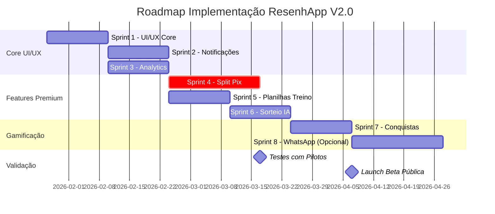

# 📋 PLANO MESTRE DE EXECUÇÃO - RESENHAPP V2.0 (R00)

> **"Think Smart, Think Uzz.Ai"**
>
> Documento consolidado de execução do projeto ResenhApp V2.0
> Baseado em toda documentação técnica e planejamento disponível

---

## 📑 SUMÁRIO EXECUTIVO

### Visão do Projeto

O **ResenhApp** (anteriormente Peladeiros) é uma plataforma SaaS de gestão esportiva focada inicialmente em peladas de futebol, com potencial expansão para múltiplas modalidades.

**Status Atual:**
- ✅ MVP funcional (100%)
- 🟡 Rebranding UzzAI em andamento (60%)
- 🔴 Bloqueio legal: Nome "Peladeiros" já existe → Migrar para "ResenhApp"
- ⏳ Migração para Supabase planejada

### Diferencial Competitivo

| Aspecto | Concorrentes | ResenhApp V2 |
|---------|--------------|--------------|
| **Pricing** | R$ 100/mês | R$ 30-50/mês (60% mais barato) |
| **Split Pix** | ❌ Manual | ✅ Automático (QR Code individual) |
| **Analytics** | ⚠️ Básico | ✅ Avançado com tendências |
| **UX/UI** | ⭐⭐⭐ | ⭐⭐⭐⭐⭐ (Design System UzzAI) |
| **Sorteio** | ❌ Aleatório | ✅ Inteligente por IA |
| **Free Tier** | ❌ Limitado | ✅ Generoso |

---

## 🎯 OBJETIVOS DO PLANO R00

### Objetivo Principal
Preparar e executar a implementação completa do ResenhApp V2.0 seguindo o roadmap de 8 sprints (14-16 semanas).

### Objetivos Específicos
1. ✅ Consolidar toda documentação em um plano mestre
2. ⏳ Preencher checklist de início completo
3. ⏳ Setup Supabase e ambiente de desenvolvimento
4. ⏳ Iniciar Sprint 1 (UI/UX Core)

---

## 📊 SITUAÇÃO ATUAL DO PROJETO

### MVP Funcional (100%)

**Features Implementadas:**
- ✅ Autenticação (NextAuth v5)
- ✅ Gestão de Grupos (CRUD completo)
- ✅ Gestão de Eventos (CRUD completo)
- ✅ Sistema de RSVP (confirmação, recusa, waitlist)
- ✅ Sorteio de Times (algoritmo aleatório)
- ✅ Ações de Jogo (gols, assistências, cartões)
- ✅ Sistema de Votação (MVP da partida)
- ✅ Rankings (artilharia, assistências, frequência)
- ✅ Financeiro Básico (wallets, charges, transactions)
- ✅ Planilhas de Treino (frontend completo, backend pendente)

**Stack Atual:**
- Frontend: Next.js 15 + React 19 + Tailwind + shadcn/ui
- Backend: Neon PostgreSQL + Next.js API Routes
- Auth: NextAuth v5
- Deploy: Vercel

### Rebranding UzzAI (60%)

**Concluído:**
- ✅ Configuração base (fonts, cores, CSS variables)
- ✅ Componentes base (Logo, Badge, Separator, SEO helper)
- ✅ Landing page completa (`/resenhafc`)
- ✅ 7 HTML demos criados
- ✅ Feature Planilhas de Treino (frontend)

**Pendente:**
- ⏳ Dashboard com identidade UzzAI
- ⏳ Páginas de autenticação
- ⏳ Páginas de grupos/eventos
- ⏳ Backend Planilhas de Treino

### Gaps Identificados

**UI/UX Críticas:**
- ❌ Sidebar com navegação hierárquica
- ❌ Sistema de notificações visual (dropdown + badge)
- ❌ Métricas com tendências (↑↓)
- ❌ Gráficos de atividade (semanal, mensal)
- ❌ Quick actions no dashboard
- ❌ Filtros e busca avançada
- ❌ Tooltips de ajuda contextual
- ❌ Loading states e skeletons
- ❌ Empty states melhorados

**Features Premium:**
- ❌ **Split Pix Automático** (Feature Premium #1)
- ❌ Sistema de notificações (backend + push)
- ❌ Analytics Dashboard avançado
- ❌ Sorteio inteligente por IA (balanceamento por skill)
- ❌ Integração WhatsApp Business API

---

## 🗄️ ARQUITETURA DE DADOS

### Decisão: Migração para Supabase

**Por que Supabase?**
- ✅ Auth nativo (elimina NextAuth)
- ✅ Realtime built-in (updates instantâneos)
- ✅ Storage integrado (avatars, fotos)
- ✅ Edge Functions (lógica serverless)
- ✅ RLS otimizado (segurança nativa)
- ✅ Free tier generoso

**Mudanças Principais:**
- `users` (BIGINT) → `auth.users` + `profiles` (UUID)
- `@neondatabase/serverless` → `@supabase/supabase-js`
- NextAuth v5 → Supabase Auth
- User IDs: BIGINT → UUID

**Migrations Prontas:**
1. `20260127000001_initial_schema.sql` - Extensions + Enums
2. `20260127000002_auth_profiles.sql` - Auth & User Types
3. `20260127000003_groups_and_events.sql` - Core System
4. `20260127000004_rls_policies.sql` - Row Level Security
5. `20260204000001_financial_system.sql` - Financeiro + Pix
6. `20260211000001_notifications.sql` - Notificações
7. `20260218000001_analytics.sql` - Analytics + Stats
8. `20260225000001_gamification.sql` - Gamificação

**Total:** 40+ tabelas, 100+ índices, RLS completo

---

## 🚀 ROADMAP DE IMPLEMENTAÇÃO (8 SPRINTS)

### Fase 1: Core UI/UX (4 semanas)

#### Sprint 1: UI/UX Core (2 semanas)
**Objetivo:** Implementar componentes base de UI/UX

**Tarefas:**
1. ✅ Criar Sidebar com navegação hierárquica
2. ✅ Criar Topbar com search e user profile
3. ✅ Implementar DashboardLayout
4. ✅ Criar MetricCard com TrendIndicator
5. ✅ Implementar LoadingSkeleton
6. ✅ Criar EmptyState components
7. ✅ Adicionar Tooltips contextuais
8. ✅ Implementar FilterBar e SearchBar

**Entregáveis:**
- Componentes UI base funcionais
- Layout aplicado nas páginas principais

#### Sprint 2: Sistema de Notificações (2 semanas)
**Objetivo:** Sistema completo de notificações

**Tarefas:**
1. ✅ Criar migrations (notifications, notification_preferences)
2. ✅ Implementar API routes de notificações
3. ✅ Criar NotificationDropdown component
4. ✅ Implementar NotificationBadge no Topbar
5. ✅ Criar página de central de notificações
6. ✅ Implementar preferências de notificação
7. ✅ Criar job de envio de notificações (lembretes)

**Entregáveis:**
- Sistema de notificações funcional
- Lembretes automáticos (2 dias antes do evento)
- Preferências configuráveis

---

### Fase 2: Features Premium (6 semanas)

#### Sprint 3: Analytics Dashboard (2 semanas)
**Objetivo:** Dashboard de analytics avançado

**Tarefas:**
1. ✅ Criar migrations (group_metrics, metric_trends)
2. ✅ Implementar API routes de analytics
3. ✅ Instalar Recharts e criar Chart components
4. ✅ Criar ActivityChart (gráfico de atividade)
5. ✅ Criar TrendChart (gráficos de linha)
6. ✅ Implementar FrequencyHeatmap
7. ✅ Criar página de analytics do grupo
8. ✅ Implementar job de cálculo de métricas

**Entregáveis:**
- Dashboard de analytics funcional
- Gráficos de atividade, frequência, revenue
- Tendências com comparação período anterior

#### Sprint 4: Split Pix Automático (3-4 semanas)
**Objetivo:** Feature Premium #1 - Split Pix

**Tarefas:**
1. ✅ Criar migrations (group_pix_config, pix_qr_codes)
2. ✅ Implementar biblioteca de geração Pix EMV
3. ✅ Criar API routes de configuração Pix
4. ✅ Criar API de geração de QR Codes
5. ✅ Implementar PixConfigForm (configuração grupo)
6. ✅ Criar PixQRCode component
7. ✅ Implementar PixPaymentStatus
8. ✅ Integrar com eventos (gerar QR após RSVP)
9. ✅ Criar página de gestão financeira melhorada

**Entregáveis:**
- Sistema de Split Pix funcional
- QR Codes individuais por jogador
- Tracking de pagamentos
- Configuração por grupo

**Riscos:**
- Validação de chave Pix pode ser complexa
- Geração de QR Code pode precisar biblioteca externa

#### Sprint 5: Planilhas de Treino (2 semanas)
**Objetivo:** Feature de planilhas táticas

**Tarefas:**
1. ✅ Criar migration (training_plans)
2. ✅ Implementar API routes de training
3. ✅ Integrar TacticalBoard component (já existe frontend)
4. ✅ Criar página de listagem de planilhas
5. ✅ Implementar salvamento em JSON no banco
6. ✅ Criar sistema de templates
7. ✅ Adicionar compartilhamento entre membros

**Entregáveis:**
- Sistema de planilhas táticas funcional
- Salvar/carregar jogadas
- Templates pré-definidos

---

### Fase 3: Gamificação + WhatsApp (4 semanas)

#### Sprint 6: Sorteio Inteligente por IA (2 semanas)
**Objetivo:** Melhorar algoritmo de sorteio

**Tarefas:**
1. ✅ Criar algoritmo de balanceamento por skill
2. ✅ Usar base_rating + histórico de gols/assists
3. ✅ Implementar otimização para evitar panelinhas
4. ✅ Criar configurações de "inteligência" do sorteio
5. ✅ Adicionar preview dos times antes de confirmar
6. ✅ Implementar sugestão de ajustes (swap)

**Entregáveis:**
- Sorteio balanceado automaticamente
- Configurações de estratégia (aleatório vs balanceado)
- Preview antes de confirmar

#### Sprint 7: Sistema de Conquistas (2 semanas)
**Objetivo:** Gamificação e badges

**Tarefas:**
1. ✅ Criar migrations (achievement_types, user_achievements)
2. ✅ Definir conquistas iniciais (primeira pelada, hat-trick, streak 5x, etc.)
3. ✅ Implementar API routes de achievements
4. ✅ Criar lógica de unlock automático (triggers/jobs)
5. ✅ Implementar AchievementBadge component
6. ✅ Criar página de conquistas do usuário
7. ✅ Adicionar notificação de conquista desbloqueada

**Entregáveis:**
- Sistema de conquistas funcional
- 10-15 conquistas iniciais
- Notificações de unlock
- Página de visualização

#### Sprint 8: Integração WhatsApp (Opcional - 2-3 semanas)
**Objetivo:** Notificações via WhatsApp Business API

**Tarefas:**
1. ✅ Configurar WhatsApp Business API
2. ✅ Criar API route de envio WhatsApp
3. ✅ Integrar com sistema de notificações
4. ✅ Criar templates de mensagens
5. ✅ Implementar opt-in/opt-out
6. ✅ Configurar webhooks para confirmação

**Entregáveis:**
- Notificações via WhatsApp funcionais
- Templates aprovados pela Meta
- Sistema de opt-in

**Riscos:**
- Custo da WhatsApp Business API (~R$ 500/mês para 1000 mensagens)
- Aprovação de templates pela Meta pode demorar

---

## 📅 CRONOGRAMA GERAL (14-16 SEMANAS)



**Datas Estimadas:**
- Início: 27/01/2026
- Sprint 1-3: 27/01 - 07/03 (6 semanas)
- Sprint 4-6: 08/03 - 02/05 (8 semanas)
- Sprint 7-8: 03/05 - 13/06 (6 semanas)
- **Launch Beta:** ~15/06/2026

**Marcos Importantes:**
- ✅ **24 Fev:** Início testes com pilotos
- ✅ **24 Mar:** Split Pix funcional (feature killer)
- ✅ **21 Abr:** Analytics completo
- ✅ **19 Mai:** Beta público

---

## 🛠️ STACK TECNOLÓGICA CONFIRMADA

### Frontend Stack

| Tecnologia | Versão | Propósito |
|------------|--------|-----------|
| **Next.js** | 15.0.3 | Framework React com App Router |
| **React** | 19.0.0 | UI Library |
| **TypeScript** | 5.6.3 | Type Safety |
| **Tailwind CSS** | 3.4.15 | Estilização |
| **Shadcn/ui** | latest | Component Library |
| **Zustand** | 5.0.1 | State Management |
| **@dnd-kit** | 6.3.1 | Drag and Drop (Kanban) |
| **Zod** | 3.23.8 | Schema Validation |
| **React Hook Form** | 7.53.2 | Form Handling |
| **Lucide React** | 0.460.0 | Icons |
| **Recharts** | 2.10.0 | Gráficos |

### Backend Stack

| Tecnologia | Versão | Propósito |
|------------|--------|-----------|
| **Supabase** | latest | BaaS (Auth + Database + Storage) |
| **PostgreSQL** | 15+ | Banco de dados relacional |
| **Edge Functions** | Deno | Lógica serverless |
| **Pydantic** | 2.0+ | Validação de dados (Python) |

### AI/ML Stack (Futuro)

| Tecnologia | Propósito |
|------------|-----------|
| **OpenAI API** | LLM (GPT-4o-mini) |
| **text-embedding-3-large** | Embeddings (3072 dims) |
| **Qdrant** | Vector Database |

### External Services

| Serviço | Propósito |
|---------|-----------|
| **Firebase FCM** | Push Notifications |
| **qrcode-pix** | Geração QR Code Pix |
| **Vercel** | Hosting + CI/CD |
| **WhatsApp Business API** | Notificações WhatsApp (opcional) |

---

## 📐 ARQUITETURA DE ALTO NÍVEL

### Diagrama de Camadas

```
┌──────────────────────────────────────────────────────────────────────┐
│                     RESENHAPP V2.0 ARCHITECTURE                       │
├──────────────────────────────────────────────────────────────────────┤
│                                                                        │
│  ┌──────────────────────────────────────────────────────────────────┐ │
│  │                    PRESENTATION LAYER                            │ │
│  │  ┌────────────┐  ┌────────────┐  ┌────────────┐                 │ │
│  │  │  Web App   │  │ Mobile App │  │  CLI Tool  │                 │ │
│  │  │ (Next.js)  │  │(Capacitor) │  │  (Python)  │                 │ │
│  │  └────────────┘  └────────────┘  └────────────┘                 │ │
│  └──────────────────────────────────────────────────────────────────┘ │
│                              │                                         │
│  ┌──────────────────────────▼──────────────────────────────────────┐ │
│  │                     API GATEWAY LAYER                            │ │
│  │  • Next.js API Routes (/api/*)                                   │ │
│  │  • Supabase Edge Functions                                       │ │
│  │  • Multi-tenant context injection                                │ │
│  │  • JWT validation (Supabase Auth)                               │ │
│  └──────────────────────────────────────────────────────────────────┘ │
│                              │                                         │
│  ┌──────────────────────────▼──────────────────────────────────────┐ │
│  │                   APPLICATION LAYER                              │ │
│  │                                                                   │ │
│  │  ┌──────────┐  ┌──────────┐  ┌──────────┐  ┌──────────┐        │ │
│  │  │  Gestão  │  │   ERP    │  │Financeiro│  │    IA    │        │ │
│  │  │ Interna  │  │ Comercial│  │  /Fiscal │  │  Engine  │        │ │
│  │  │          │  │          │  │          │  │          │        │ │
│  │  │• Projetos│  │• Vendas  │  │• Caixa   │  │• Agents  │        │ │
│  │  │• Sprints │  │• Estoque │  │• Contas  │  │• RAG     │        │ │
│  │  │• Reuniões│  │• PDV     │  │• DRE     │  │• Extract │        │ │
│  │  │• Tasks   │  │• Clientes│  │• NF-e    │  │• Enrich  │        │ │
│  │  │• ADRs    │  │• Produtos│  │• Budget  │  │• Validate│        │ │
│  │  └──────────┘  └──────────┘  └──────────┘  └──────────┘        │ │
│  └──────────────────────────────────────────────────────────────────┘ │
│                              │                                         │
│  ┌──────────────────────────▼──────────────────────────────────────┐ │
│  │                       DATA LAYER                                 │ │
│  │                                                                   │ │
│  │  ┌────────────────────────────────────────────────────────────┐ │ │
│  │  │            SUPABASE (PostgreSQL 15+)                       │ │ │
│  │  │  • Row Level Security (RLS)                                │ │ │
│  │  │  • Multi-tenant isolation (tenant_id)                      │ │ │
│  │  │  • 40+ tabelas                                             │ │ │
│  │  │  • Realtime subscriptions                                  │ │ │
│  │  └────────────────────────────────────────────────────────────┘ │ │
│  │                                                                   │ │
│  │  ┌────────────────────────────────────────────────────────────┐ │ │
│  │  │            SUPABASE STORAGE                                 │ │ │
│  │  │  • avatars (público)                                       │ │ │
│  │  │  • group-photos (público)                                  │ │ │
│  │  │  • venue-photos (público)                                  │ │ │
│  │  │  • receipts (privado)                                      │ │ │
│  │  └────────────────────────────────────────────────────────────┘ │ │
│  └──────────────────────────────────────────────────────────────────┘ │
│                                                                        │
└──────────────────────────────────────────────────────────────────────┘
```

---

## 🎨 DESIGN SYSTEM UZZAI

### Cores

```typescript
colors: {
  uzzai: {
    mint: '#4FFFB0',      // Verde menta vibrante (primária)
    silver: '#95A5B8',     // Prata suave (texto secundário)
    charcoal: '#1a1f26',   // Carvão escuro (background)
    slate: '#2a3142',      // Ardósia
    midnight: '#0f1419',   // Meia-noite
  },
  status: {
    success: '#10B981',
    warning: '#F59E0B',
    danger: '#EF4444',
    info: '#3B82F6',
  },
}
```

### Tipografia

```typescript
fontFamily: {
  sans: ['Inter', 'sans-serif'],        // Corpo
  display: ['Montserrat', 'sans-serif'], // Títulos
  mono: ['Fira Code', 'monospace'],     // Code
}
```

### Componentes Base

**Já Criados:**
- ✅ `UzzaiLogo` - Logo UzzAI
- ✅ `UzzaiBadge` - Badges (new, beta, premium, admin, dev)
- ✅ `GradientSeparator` - Separador com gradiente
- ✅ `SEO Helper` - Helper para metadados

**A Criar:**
- ⏳ `Sidebar` - Navegação hierárquica
- ⏳ `Topbar` - Header com search + notifications
- ⏳ `MetricCard` - Card de métrica com trend
- ⏳ `TrendIndicator` - Indicador visual (↑↓)
- ⏳ `ActivityChart` - Gráfico de atividade
- ⏳ `NotificationDropdown` - Dropdown de notificações

---

## 📋 CHECKLIST DE INÍCIO - STATUS

### Fase 1: Aprovação e Decisões

**Reunião de Aprovação:**
- [ ] Agendada para: ____/____/2026
- [ ] Participantes confirmados
- [ ] SUMARIO-EXECUTIVO-V2.md apresentado
- [ ] Roadmap aprovado
- [ ] Pricing definido: R$ _______ /mês
- [ ] Decisão WhatsApp: [ ] Agora | [ ] Q2 2026
- [ ] Pilotos confirmados: __________, __________, __________
- [ ] Data início Sprint 1: ____/____/2026

**Decisões Pendentes:**
- [ ] Pricing final (R$ 30, 40 ou 50/mês?)
- [ ] Investimento WhatsApp API (sim/não?)
- [ ] Biblioteca de gráficos (Recharts confirmado?)
- [ ] Estratégia de testes (unitários, E2E?)

---

### Fase 2: Setup Supabase

**Criar Projeto:**
- [ ] Conta Supabase criada
- [ ] Projeto "ResenhApp V2" criado
- [ ] Region: South America (São Paulo)
- [ ] Credenciais copiadas e salvas
- [ ] `.env.local` configurado

**Supabase CLI:**
- [ ] CLI instalado (`npm install -g supabase`)
- [ ] Login realizado (`supabase login`)
- [ ] Projeto inicializado (`supabase init`)
- [ ] Link com projeto remoto (`supabase link`)

**Migrations:**
- [ ] 8 migrations aplicadas (40+ tabelas)
- [ ] RLS habilitado e testado
- [ ] Seed data aplicado (opcional)
- [ ] Verificação de sucesso realizada

**Auth Providers:**
- [ ] Email/Password habilitado
- [ ] Email templates configurados
- [ ] Site URL configurado
- [ ] Redirect URLs configurados

**Storage Buckets:**
- [ ] `avatars` criado (público, 2 MB)
- [ ] `group-photos` criado (público, 5 MB)
- [ ] `venue-photos` criado (público, 5 MB)
- [ ] `receipts` criado (privado, 10 MB)
- [ ] Políticas de acesso configuradas

**Realtime:**
- [ ] Habilitado para `events`
- [ ] Habilitado para `event_attendance`
- [ ] Habilitado para `event_actions`
- [ ] Habilitado para `notifications`
- [ ] Habilitado para `teams`

---

### Fase 3: Setup do Projeto

**Repositório:**
- [ ] Branch `v2-development` criada
- [ ] Estrutura de pastas criada
- [ ] Push inicial feito

**Dependências:**
- [ ] `@supabase/supabase-js` instalado
- [ ] `@supabase/auth-helpers-nextjs` instalado
- [ ] `recharts` instalado
- [ ] `qrcode-pix` instalado
- [ ] `qrcode` instalado
- [ ] `firebase` instalado
- [ ] `firebase-admin` instalado
- [ ] Types instalados (`@types/qrcode`)

**Cliente Supabase:**
- [ ] `src/lib/supabase/server.ts` criado
- [ ] `src/lib/supabase/client.ts` criado
- [ ] `src/lib/supabase/auth-helpers.ts` criado
- [ ] Imports testados (sem erros)

**Middleware:**
- [ ] `src/middleware.ts` atualizado
- [ ] `src/lib/supabase/middleware.ts` criado
- [ ] Rotas públicas configuradas
- [ ] Redirecionamento funcionando

**Firebase:**
- [ ] Projeto Firebase criado
- [ ] App Web adicionado
- [ ] Cloud Messaging habilitado
- [ ] VAPID key gerado
- [ ] Service Account criado
- [ ] Variáveis adicionadas no `.env.local`

**Vercel:**
- [ ] Variáveis de ambiente adicionadas
- [ ] `vercel.json` criado
- [ ] `CRON_SECRET` gerado e adicionado
- [ ] Branch deployments configurados
- [ ] Deploy automático testado

---

### Fase 4: Componentes Base

**Design System:**
- [ ] Cores UzzAI adicionadas no `tailwind.config.ts`
- [ ] Gradientes configurados
- [ ] Fontes definidas

**Sidebar:**
- [ ] Arquivo `sidebar.tsx` criado
- [ ] Ícones importados (lucide-react)
- [ ] Navegação configurada
- [ ] Cores UzzAI aplicadas

**Topbar:**
- [ ] Arquivo `topbar.tsx` criado
- [ ] Search implementado
- [ ] Notificações com badge
- [ ] User profile dropdown

**Layout Base:**
- [ ] Layout criado
- [ ] Sidebar integrada
- [ ] Responsividade configurada

---

### Fase 5: Primeira Página

**Dashboard:**
- [ ] Página criada
- [ ] Dados carregando do Supabase
- [ ] Métricas exibindo
- [ ] Quick actions funcionando

**Componentes:**
- [ ] MetricCard criado
- [ ] Trends funcionando
- [ ] Cores UzzAI aplicadas

---

## 🎯 PRÓXIMOS PASSOS IMEDIATOS

### Esta Semana (22-26 Jan)

1. **Aprovação do Plano**
   - [ ] Agendar reunião de aprovação (30min)
   - [ ] Apresentar SUMARIO-EXECUTIVO-V2.md
   - [ ] Decidir pricing final
   - [ ] Decidir sobre WhatsApp API
   - [ ] Confirmar pilotos

2. **Setup Inicial**
   - [ ] Criar projeto no Supabase
   - [ ] Instalar Supabase CLI
   - [ ] Aplicar migrations
   - [ ] Configurar Storage buckets
   - [ ] Habilitar Realtime

3. **Preparação Código**
   - [ ] Criar branch `v2-development`
   - [ ] Instalar dependências novas
   - [ ] Configurar cliente Supabase
   - [ ] Atualizar middleware

### Próximas 2 Semanas (27 Jan - 07 Fev)

1. **Sprint 1: UI/UX Core**
   - [ ] Sidebar + Topbar + DashboardLayout
   - [ ] MetricCard + TrendIndicator
   - [ ] LoadingSkeleton + EmptyState
   - [ ] Tooltips + FilterBar + SearchBar

2. **Início Sprint 2: Notificações**
   - [ ] Migrations de notificações
   - [ ] API routes
   - [ ] NotificationDropdown component

---

## 📊 MÉTRICAS DE SUCESSO

### KPIs Técnicos

| Métrica | Target | Current |
|---------|--------|---------|
| **Lighthouse Score** | > 90 | N/A |
| **Uptime** | > 99.5% | N/A |
| **Page Load Time** | < 3s | N/A |
| **Zero Bugs Críticos** | ✅ | N/A |

### KPIs de Produto

| Métrica | 3 meses | 6 meses |
|---------|---------|---------|
| **Grupos Ativos** | 10 | 30 |
| **Conversão Premium** | 50% | 60% |
| **NPS** | > 50 | > 60 |
| **Churn Mensal** | < 10% | < 5% |

### KPIs de Receita

| Métrica | 3 meses | 6 meses | 12 meses |
|---------|---------|---------|----------|
| **MRR** | R$ 250 | R$ 900 | R$ 3.500 |
| **CAC** | < R$ 100 | < R$ 80 | < R$ 60 |
| **LTV** | R$ 300 | R$ 600 | R$ 1.200 |

---

## ⚠️ RISCOS E MITIGAÇÕES

### Riscos Críticos

| Risco | Impacto | Probabilidade | Mitigação |
|-------|---------|---------------|-----------|
| **Complexidade do Pix** | 🔴 Alto | 🟡 Média | MVP simples (QR estático), iterar |
| **Baixa adoção Premium** | 🔴 Alto | 🟡 Média | Validar com pilotos primeiro |
| **WhatsApp caro** | 🟡 Médio | 🟢 Alta | Tornar opcional, avaliar ROI |
| **Migração Supabase complexa** | 🔴 Alto | 🟡 Média | Testar em staging primeiro |

### Riscos Técnicos

| Risco | Impacto | Mitigação |
|-------|---------|-----------|
| Performance | 🟡 Médio | Caching, otimização de queries |
| Escalabilidade | 🟡 Médio | Monitorar uso, planejar upgrade |
| Bugs em produção | 🟡 Médio | Staging env, rollback strategy |

---

## 📚 DOCUMENTAÇÃO DISPONÍVEL

### Documentos Principais

| Documento | Descrição | Status |
|-----------|-----------|--------|
| **PLANOR00.md** | Plano mestre de execução (este documento) | ✅ Criado |
| **ARQUITETURA-COMPLETA-SISTEMA-V2.md** | Documentação técnica completa | ✅ Completo |
| **CHECKLIST-INICIO-V2.md** | Checklist detalhado de início | ✅ Completo |
| **DATABASE-ARCHITECTURE-SUPABASE-V2.md** | Arquitetura de BD Supabase | ✅ Completo |
| **DECISOES-TECNICAS-V2.md** | Decisões de stack e padrões | ✅ Completo |
| **SUMARIO-EXECUTIVO-V2.md** | Apresentação stakeholders | ✅ Completo |
| **PLANEJAMENTO-V2-INDEX.md** | Índice de documentação | ✅ Completo |

### Migrations SQL

| # | Migration | Descrição | Arquivo |
|---|-----------|-----------|---------|
| 1 | Initial Schema | Extensions + Enums | `20260127000001_initial_schema.sql` |
| 2 | Auth & Profiles | User Types + Multi-Groups | `20260127000002_auth_profiles.sql` |
| 3 | Groups & Events | Core System (11 tabelas) | `20260127000003_groups_and_events.sql` |
| 4 | RLS Policies | Row Level Security | `20260127000004_rls_policies.sql` |
| 5 | Financial | Pix + Wallets (6 tabelas) | `20260204000001_financial_system.sql` |
| 6 | Notifications | Push + Email (5 tabelas) | `20260211000001_notifications.sql` |
| 7 | Analytics | Stats + Leaderboards (5 tabelas) | `20260218000001_analytics.sql` |
| 8 | Gamification | Achievements + Badges (7 tabelas) | `20260225000001_gamification.sql` |

---

## 👥 EQUIPE E RESPONSABILIDADES

| Papel | Nome | Responsabilidade | Carga Atual |
|-------|------|------------------|-------------|
| **Product Owner** | Pedro Vitor Pagliarin | Visão do produto, priorização | 🟡 Média |
| **Tech Lead** | Luis Fernando Boff | Arquitetura técnica, código | 🟡 Média |
| **Comercial** | Vitor Reis Pirolli | Validação pilotos, pricing | 🟡 Média |
| **Branding** | Arthur Brandalise | Identidade visual, UX/UI | 🟢 Baixa |

---

## 🔗 LINKS ÚTEIS

### Documentação Externa

- [Next.js 15 Docs](https://nextjs.org/docs)
- [Supabase Docs](https://supabase.com/docs)
- [Supabase Auth](https://supabase.com/docs/guides/auth)
- [Supabase Database](https://supabase.com/docs/guides/database)
- [Supabase Storage](https://supabase.com/docs/guides/storage)
- [Supabase Realtime](https://supabase.com/docs/guides/realtime)
- [Recharts Documentation](https://recharts.org/)
- [shadcn/ui Components](https://ui.shadcn.com/)
- [Firebase Cloud Messaging](https://firebase.google.com/docs/cloud-messaging)
- [qrcode-pix npm](https://www.npmjs.com/package/qrcode-pix)

### Repositório

- **GitHub:** `uzzai/peladeiros-web` (renomear para `uzzai/resenhapp`)
- **Vercel:** [Link do projeto]
- **Supabase:** [Link do dashboard]

---

## 📝 NOTAS IMPORTANTES

### Mudanças Breaking (Migração Supabase)

⚠️ **User IDs:** BIGINT → UUID
- Requer migração de dados existentes
- Foreign keys precisam ser atualizadas
- Auth.users(id) é UUID no Supabase

⚠️ **Auth System:** NextAuth → Supabase Auth
- Sessões precisam ser recriadas
- Middleware precisa ser reescrito
- Logout/login flow diferente

⚠️ **Client Library:** @neondatabase → @supabase
- Sintaxe de queries diferente
- Métodos diferentes para CRUD
- RLS aplicado automaticamente

### Dados de Produção

Se houver dados em produção no Neon:
1. Exportar dados (pg_dump)
2. Transformar user IDs (BIGINT → UUID)
3. Importar no Supabase
4. Validar integridade
5. Testar RLS

---

## ✅ CRITÉRIOS DE SUCESSO

### Fase 1: Setup (Semana 1-2)
- [ ] Projeto Supabase criado e configurado
- [ ] 8 migrations aplicadas com sucesso
- [ ] Cliente Supabase funcionando
- [ ] Middleware de auth funcionando
- [ ] Firebase configurado

### Fase 2: Sprint 1 (Semana 3-4)
- [ ] Sidebar + Topbar implementados
- [ ] DashboardLayout aplicado
- [ ] Componentes base criados
- [ ] Layout responsivo funcionando

### Fase 3: Sprint 2 (Semana 5-6)
- [ ] Sistema de notificações funcional
- [ ] Lembretes automáticos funcionando
- [ ] Preferências configuráveis

### Fase 4: Sprint 4 (Semana 8-11)
- [ ] Split Pix funcional
- [ ] QR Codes gerando corretamente
- [ ] Tracking de pagamentos funcionando

---

## 🎬 CONCLUSÃO

Este documento consolida toda a documentação técnica e planejamento do ResenhApp V2.0 em um plano mestre de execução.

**Status Atual:**
- ✅ Documentação completa criada
- ✅ Arquitetura técnica definida
- ✅ Roadmap de 8 sprints planejado
- ✅ Stack tecnológica decidida
- ⏳ Aguardando aprovação e início

**Próximo Milestone:** Setup Supabase completo + Sprint 1 iniciado

---

**Criado por:** Claude Code (Anthropic)
**Data:** 2026-01-22
**Versão:** R00
**Status:** ✅ Pronto para Execução

🚀 **Bora codar!**

