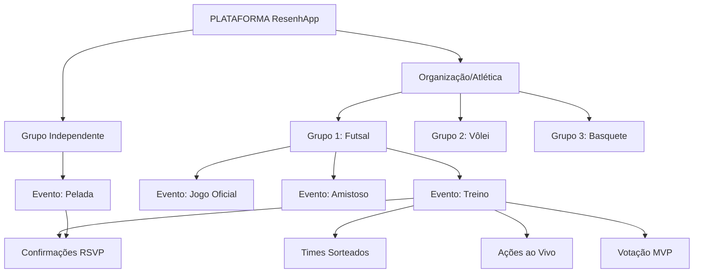
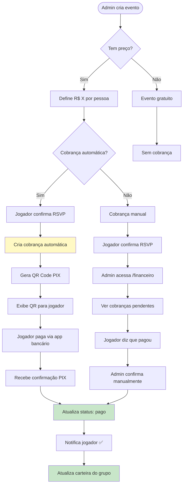
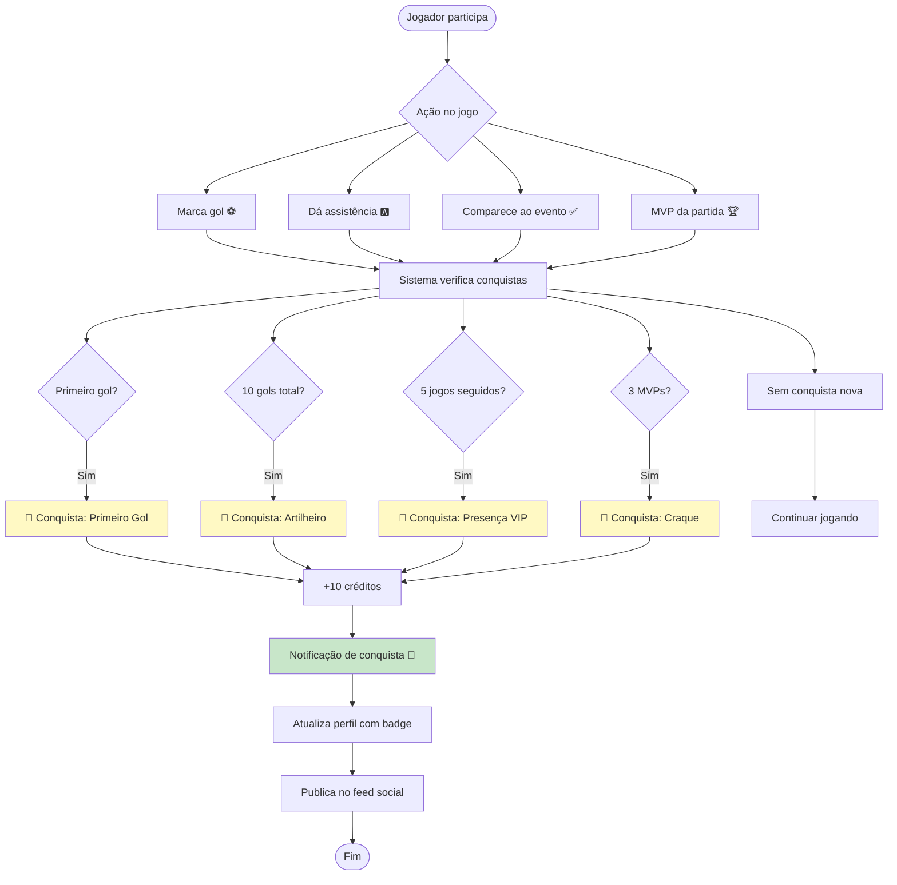
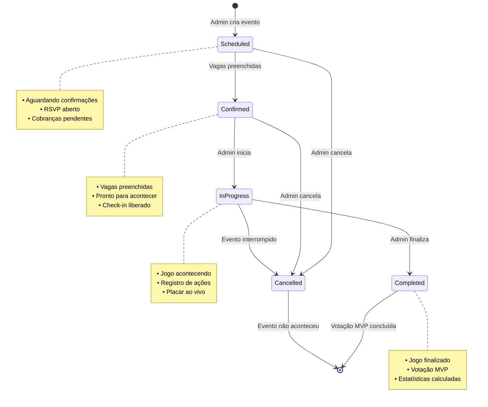
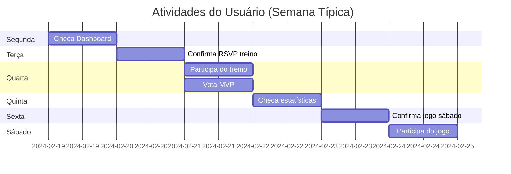

# 🗺️ Jornada do Usuário - Diagramas Visuais
## ResenhApp - Fluxos e Navegação

> **Data:** 2026-02-23
> **Propósito:** Visualização completa da jornada do usuário no ResenhApp

---

## 📊 Visão Geral da Arquitetura



---

## 🚀 Jornada 1: Onboarding - Novo Usuário

```mermaid
flowchart TD
    Start([Usuário abre app]) --> Landing[/]
    Landing --> SignUp[/auth/signup]
    SignUp --> Profile[/onboarding]
    Profile --> Choice{Escolha}

    Choice -->|Criar grupo| CreateGroup[/criar-grupo]
    Choice -->|Entrar em grupo| JoinGroup[/entrar-grupo]

    CreateGroup --> GroupType{Tipo}
    GroupType -->|Organização| OrgForm[Formulário Organização]
    GroupType -->|Grupo simples| GroupForm[Formulário Grupo]

    OrgForm --> Credits{Tem créditos?}
    Credits -->|Não| BuyCredits[/creditos/comprar]
    Credits -->|Sim| CreateSuccess[Grupo criado ✅]

    GroupForm --> Credits
    BuyCredits --> Credits

    JoinGroup --> InviteCode[Digite código]
    InviteCode --> JoinSuccess[Entrou no grupo ✅]

    CreateSuccess --> Dashboard[/dashboard]
    JoinSuccess --> Dashboard

    Dashboard --> UseApp[Usar aplicativo]

    style Start fill:#e1f5e1
    style Dashboard fill:#e3f2fd
    style CreateSuccess fill:#c8e6c9
    style JoinSuccess fill:#c8e6c9
```

---

## 🎯 Jornada 2: Jogador - Dia a Dia

```mermaid
flowchart TD
    Open([Abre app]) --> Dash[/dashboard]

    Dash --> Check{Verificar}
    Check --> Events[Próximos eventos]
    Check --> Notifs[Notificações 🔔]
    Check --> Stats[Minhas estatísticas]

    Events --> EventDetail[/eventos/123]
    EventDetail --> RSVP{Confirmar?}

    RSVP -->|Sim| CheckSpots{Tem vaga?}
    CheckSpots -->|Sim| Confirmed[✅ Confirmado]
    CheckSpots -->|Não| Waitlist[🟠 Lista de espera]

    Confirmed --> Payment{Tem cobrança?}
    Payment -->|Sim| PayPix[Ver QR Code PIX]
    Payment -->|Não| WaitEvent[Aguardar evento]

    PayPix --> PaymentDone[Pagamento realizado]
    PaymentDone --> WaitEvent
    Waitlist --> WaitEvent

    WaitEvent --> EventDay[Dia do evento]
    EventDay --> CheckIn[Admin faz check-in]
    CheckIn --> Play[Jogar ⚽]
    Play --> Live[Admin registra ações]

    Live --> Finish[Evento finaliza]
    Finish --> Vote[Votar no MVP]
    Vote --> ViewStats[Ver estatísticas]
    ViewStats --> Achievements{Ganhou conquista?}

    Achievements -->|Sim| Badge[🏆 Badge desbloqueado]
    Achievements -->|Não| End([Fim])
    Badge --> End

    Notifs --> NotifDetail[Detalhes da notificação]
    NotifDetail --> Action[Ação específica]

    style Open fill:#e1f5e1
    style Confirmed fill:#c8e6c9
    style Badge fill:#fff9c4
    style Play fill:#bbdefb
```

---

## 👔 Jornada 3: Admin - Gestão de Evento

```mermaid
flowchart TD
    Start([Admin acessa]) --> Dash[/dashboard]
    Dash --> Create[Criar Evento]

    Create --> Form[/eventos/novo]
    Form --> FillForm{Preencher}

    FillForm --> Type[Tipo: Treino/Jogo/Amistoso]
    FillForm --> DateTime[Data e hora]
    FillForm --> Venue[Local]
    FillForm --> MaxPlayers[Vagas]
    FillForm --> Price[Preço opcional]

    Type --> Submit[Criar evento]
    DateTime --> Submit
    Venue --> Submit
    MaxPlayers --> Submit
    Price --> Submit

    Submit --> EventCreated[✅ Evento criado]
    EventCreated --> Notify[Notifica membros do grupo]

    Notify --> WaitRSVP[Aguardar confirmações]
    WaitRSVP --> Manage[/eventos/123]

    Manage --> CheckRSVP{Gerenciar}
    CheckRSVP --> ViewList[Ver lista confirmados]
    CheckRSVP --> AddManual[Adicionar manual]
    CheckRSVP --> RemovePlayer[Remover jogador]

    ViewList --> EventDay[Dia do evento]
    AddManual --> EventDay
    RemovePlayer --> EventDay

    EventDay --> CheckInAll[Fazer check-in]
    CheckInAll --> DrawTeams{Sortear times?}

    DrawTeams -->|Sim| DrawConfig[Configurar sorteio]
    DrawConfig --> ExecuteDraw[Executar sorteio]
    ExecuteDraw --> TeamsReady[Times prontos]

    DrawTeams -->|Não| TeamsReady

    TeamsReady --> StartMatch[Iniciar partida]
    StartMatch --> Live[Modo ao vivo]

    Live --> RecordAction{Registrar ação}
    RecordAction --> Goal[⚽ Gol]
    RecordAction --> Assist[🅰️ Assistência]
    RecordAction --> Card[🟨🟥 Cartão]
    RecordAction --> Save[🧤 Defesa]

    Goal --> UpdateScore[Atualizar placar]
    Assist --> UpdateScore
    Card --> UpdateScore
    Save --> UpdateScore

    UpdateScore --> MoreActions{Mais ações?}
    MoreActions -->|Sim| RecordAction
    MoreActions -->|Não| FinishMatch[Finalizar partida]

    FinishMatch --> OpenVoting[Abrir votação MVP]
    OpenVoting --> WaitVotes[Aguardar votos]
    WaitVotes --> ClosedEvent[Evento concluído ✅]

    style Start fill:#e1f5e1
    style EventCreated fill:#c8e6c9
    style TeamsReady fill:#bbdefb
    style ClosedEvent fill:#c8e6c9
```

---

## 💰 Jornada 4: Fluxo Financeiro



---

## 🎮 Jornada 5: Gamificação



---

## 🧭 Mapa de Navegação Completo

```mermaid
graph TD
    Landing[/ Landing Page] --> Auth[/auth]
    Auth --> SignIn[/auth/signin]
    Auth --> SignUp[/auth/signup]

    SignUp --> Onboard[/onboarding]
    Onboard --> Dash[/dashboard]
    SignIn --> Dash

    Dash --> Nav{Navegação}

    Nav --> Events[/eventos]
    Events --> EventNew[/eventos/novo]
    Events --> EventDetail[/eventos/123]

    Nav --> Members[/membros]
    Members --> MemberDetail[/membros/456]

    Nav --> Modalities[/modalidades]
    Modalities --> ModalityDetail[/modalidades/789]

    Nav --> Finance[/financeiro]
    Finance --> ChargeDetail[/financeiro/cobranças/101]

    Nav --> Stats[/estatisticas]
    Nav --> Rankings[/rankings]
    Nav --> Attendance[/frequencia]
    Nav --> Settings[/configuracoes]
    Nav --> Credits[/creditos]

    Landing --> Feed[/feed]
    Feed --> PostDetail[/feed/post/123]

    Landing --> Profile[/perfil/user123]

    Dash --> CreateGroup[/criar-grupo]
    Dash --> JoinGroup[/entrar-grupo]

    style Dash fill:#e3f2fd
    style Nav fill:#fff9c4
```

---

## 🔄 Ciclo de Vida de um Evento



---

## 🎨 Interface - Estrutura de Páginas

### Layout Principal (Dashboard)

```
┌─────────────────────────────────────────────────────────────┐
│ [Logo] [Grupo: Futsal Paulistana ▼] | [🔍] [🔔 3] [👤]    │ ← Topbar
├─────────────────────────────────────────────────────────────┤
│ ┌──────────┐ ┌───────────────────────────────────────────┐ │
│ │ 🏠 Dash  │ │ 📊 Dashboard - Futsal Paulistana         │ │
│ │ 📅 Event │ │                                           │ │
│ │ 👥 Membr │ │ ┌──────────────────────────────────────┐ │ │
│ │ ⚽ Modal │ │ │ 📅 Próximos Eventos                  │ │ │
│ │ 💰 Finan │ │ │ • Treino - 24/02 às 20h (15/20)      │ │ │
│ │ 📊 Stats │ │ │ • Jogo - 26/02 às 19h (20/20) ✅     │ │ │
│ │ 🏆 Ranki │ │ │ • Amistoso - 28/02 às 18h (8/20)     │ │ │
│ │ ✅ Freq  │ │ └──────────────────────────────────────┘ │ │
│ │ ⚙️ Config│ │                                           │ │
│ └──────────┘ │ ┌──────────────────────────────────────┐ │ │
│   Sidebar    │ │ 📊 Suas Estatísticas                 │ │ │
│              │ │ • 12 jogos participados              │ │ │
│              │ │ • 8 gols marcados                    │ │ │
│              │ │ • 5 assistências                     │ │ │
│              │ │ • 90% taxa de presença               │ │ │
│              │ └──────────────────────────────────────┘ │ │
│              │                                           │ │
│              │ ┌──────────────────────────────────────┐ │ │
│              │ │ 💰 Cobranças Pendentes (2)           │ │ │
│              │ │ • Treino 20/02 - R$ 30,00            │ │ │
│              │ │ • Mensalidade Fev - R$ 50,00         │ │ │
│              │ └──────────────────────────────────────┘ │ │
│              └───────────────────────────────────────────┘ │
└─────────────────────────────────────────────────────────────┘
```

### Página de Evento

```
┌─────────────────────────────────────────────────────────────┐
│ 🏠 Dashboard > 📅 Eventos > Treino de Futsal - 24/02       │
├─────────────────────────────────────────────────────────────┤
│                                                             │
│ ⚽ Treino de Futsal                           [Editar ⚙️]  │
│ 📅 24/02/2026 às 20:00 | 📍 Arena Paulista                 │
│ 👥 15/20 vagas | 💰 R$ 30,00                                │
│                                                             │
│ ┌──────────────────────────────────────────────────────┐   │
│ │ [Confirmações] [Times] [Ao Vivo] [Estatísticas]     │   │
│ ├──────────────────────────────────────────────────────┤   │
│ │                                                      │   │
│ │ ✅ Confirmados (15)                                  │   │
│ │ [👤 João] [👤 Maria] [👤 Carlos] [👤 Ana]...        │   │
│ │                                                      │   │
│ │ 🟠 Lista de Espera (3)                              │   │
│ │ 1. [👤 Pedro]                                        │   │
│ │ 2. [👤 Lucas]                                        │   │
│ │ 3. [👤 Fernanda]                                     │   │
│ │                                                      │   │
│ │ [✅ Confirmar Presença]                              │   │
│ │                                                      │   │
│ └──────────────────────────────────────────────────────┘   │
└─────────────────────────────────────────────────────────────┘
```

---

## 📊 Métricas da Jornada

### Pontos de Conversão

```mermaid
funnel
    title Funil de Conversão - Novo Usuário
    "Visita Landing Page" : 100
    "Cria Conta" : 65
    "Completa Onboarding" : 50
    "Entra/Cria Grupo" : 40
    "Confirma Primeiro Evento" : 35
    "Participa do Evento" : 30
```

### Engajamento Semanal



---

## ✅ Checklist de UX

### Para Desenvolvedores

- [ ] Breadcrumbs claros em todas as páginas
- [ ] Estados de loading em todas as ações
- [ ] Mensagens de erro claras e acionáveis
- [ ] Feedback visual para ações bem-sucedidas
- [ ] Skeleton screens para carregamento
- [ ] Empty states com CTAs claros
- [ ] Mobile-first e responsivo
- [ ] Acessibilidade (WCAG 2.1 AA)
- [ ] Tooltips para conceitos complexos
- [ ] Confirmações antes de ações destrutivas

### Para Designers

- [ ] Ícones consistentes por toda a aplicação
- [ ] Paleta de cores definida e documentada
- [ ] Tipografia hierárquica clara
- [ ] Espaçamento consistente (8px grid)
- [ ] Estados hover/focus/active definidos
- [ ] Dark mode (opcional)
- [ ] Animações sutis e performáticas
- [ ] Layouts testados em mobile/tablet/desktop

---

## 📖 Documentos Relacionados

- [Análise de Ambiguidades](ANALISE-JORNADA-USUARIO-AMBIGUIDADES.md)
- [Guia de Nomenclatura](GUIA-NOMENCLATURA-REFERENCIA-RAPIDA.md)
- [Database Schema](../checkpoints/2026-02-17_resenhapp/08_DATABASE_SCHEMA_COMPLETE.md)

---

**Última atualização:** 2026-02-23
**Versão:** 1.0
